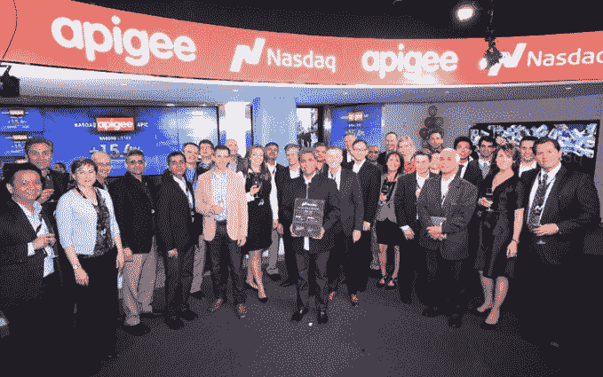

# Apigee 首个上市日收盘价格为每股 16.68 美元，较其 IPO 价格下跌 1.9%

> 原文：<https://web.archive.org/web/https://techcrunch.com/2015/04/24/apigee-closes-its-first-public-day-worth-16-68-per-share-down-1-9-percent-from-its-ipo-price/>

帮助组织构建和管理 API 连接器的公司 Apigee 今天早上以每股 17 美元的价格上市，在收盘于 16.68 美元之前短暂飙升至每股 20 美元，在正常交易的第一天下跌了 1.88%。下班后，公司很平淡。

据首席执行官[切特·卡普尔](https://web.archive.org/web/20230315095315/https://twitter.com/chetkapoor)称，该公司在首次公开募股中出售了 511.5 万股股票，筹集了 8700 万美元。它的交易代码为“ [APIC](https://web.archive.org/web/20230315095315/http://finance.yahoo.com/q?s=APIC) ”Apigee 的价值约为 5 亿美元。

作为一家公司，Apigee 的收入在增长，亏损在减少。在截至 2015 年 1 月的半年期间，该公司的收入为 3261 万美元，净亏损为 2680 万美元。在去年上半年，Apigee 的收入为 2340 万美元，亏损 3220 万美元。委婉地说，公司的利润率有所提高。

Apigee 向其 IPO 承销商提供了在 30 天内以每股 17.00 美元的 IPO 价格购买 767，250 股额外股票的选择权。然而，鉴于该公司目前低于该价格，尚不清楚银行是否会启动行权期权——以超过 1 美元的价格购买美元不是很好的单位经济学。

上市代表着 Apigee 漫长旅程的结束，该公司于 2004 年推出，上市前筹集了令人印象深刻的 1.73 亿美元。

首席执行官卡普尔认为，将公司上市能让他的组织在客户和合作伙伴中获得更高的可信度。从实际角度来看，它提供了大量可用于收购的现金。他还打算扩大销售和营销，并加大研发投入。

该公司采用混合许可订阅模式，其中 15%至 20%为许可，其余为订阅。它还从专业服务中额外获得公司总收入的 15%到 20%。

Apigee 的产品家族由三个产品组成:Apigee Edge(其用于 API 管理的旗舰产品)、Apigee Insights(其预测分析产品)和 Apigee Link(用于设备制造商创建物联网场景的 API 连接器)。

该公司通常与内部开发人员或 SAP、InfoSys 或埃森哲等全球合作伙伴合作实施。“客户希望向员工、合作伙伴和客户提供互联体验，”Kapoor 说。他以沃尔格林为例。

随着沃尔格林看到智能手机的使用越来越多，它也注意到其图片打印业务大大减少。它没有放弃这项业务，而是使用 Apigee 产品开发了一个照片打印 API，构建智能手机应用程序来利用这项新技术。根据 Kapoor 的说法，这一决定不仅挽救了其图片打印业务，Walgreens 还能够向渠道合作伙伴公开 API 并增加收入。

该公司拥有 400 名员工，总部位于圣何塞，在伦敦和印度班加罗尔设有办事处。