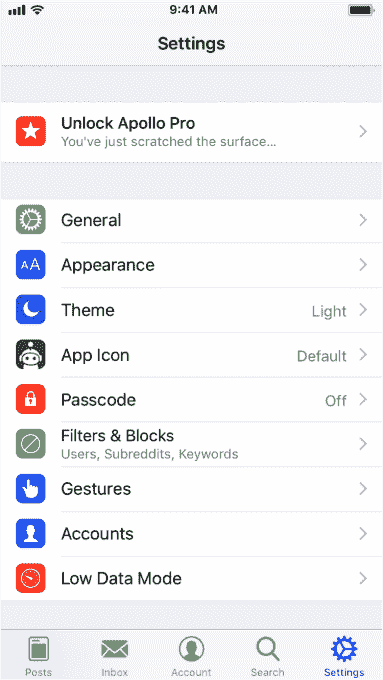
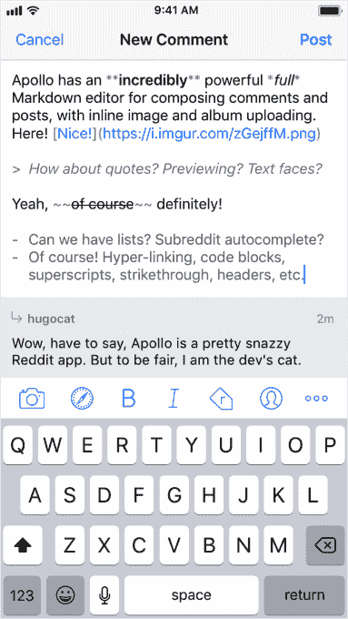

# Apollo for iOS 是你唯一需要的 Reddit 应用程序

> 原文：<https://web.archive.org/web/https://techcrunch.com/2017/10/27/apollo-for-ios-is-the-only-reddit-app-you-need/>

前苹果实习生克里斯蒂安·塞利格(Christian Selig)表示，他对用于浏览 Reddit 的 iOS 应用程序的选择不满意，所以他决定开发自己的应用程序。这位开发者本周推出了自己的 Reddit 客户端，名为 [Apollo](https://web.archive.org/web/20230324053913/https://apolloapp.io/) ，为 iPhone 或 iPad 提供了设计精美的浏览体验，以及可定制的手势、媒体浏览器、完整的 Markdown 写作编辑器和其他受 Reddit 用户反馈启发的功能。

“其他用于 iOS 的 Reddit 应用程序没有很好地遵循 iOS 设计准则，因此看起来很不合适，为用户创造了一种不熟悉的体验，与 iOS 生态系统的其他部分不能很好地融合，”Selig 解释了他为什么要开发一个新的 Reddit 应用程序。“它们也不能完全取代桌面网站，”他补充道。

通过 Apollo，他不仅希望提供一个更好的移动版 Reddit，还希望提供一个比通过网络浏览网站更好的版本。

关于 Apollo，你会注意到的第一件事是它的外观和感觉，它确实比当今市场上的其他一些 Reddit 客户端更符合苹果的设计。这是一个漂亮，干净和现代的应用程序，很容易导航。

该应用包括五个选项卡:帖子、收件箱、账户、搜索和设置，都可以从屏幕底部访问。

从主屏幕(帖子)上，你可以在扩展或压缩模式下浏览 Reddit 主页。前者是默认的，是查看帖子附带的图像和视频的更好体验，但如果你喜欢更密集的外观，你可以从屏幕右上角的“更多”按钮切换到紧凑模式。

在那里，你还可以按热门内容、收藏项目对订阅源进行分类，隐藏你读过的帖子，并分享项目。

该应用程序还包括自己的内置媒体浏览器，用于查看 Reddit 内容，以及来自 Imgur、Gfycat、Imgflip、XKCD、Streamable、YouTube、Vimeo 等来源的内容，当这些内容附加到 Reddit 帖子时。

在查看器中，您可以对内容投赞成票或反对票，轻按以查看评论，或访问更多功能，如将图像或 GIF 保存到您的设备，在 Safari 中打开内容，共享或保存项目，或轻按以查看用户的个人资料或子编辑。

这款应用程序中有许多小细节体现了其设计背后的深思熟虑。例如，当你阅读评论时，你会注意到在一个长的线程中，每缩进一行，评论旁边的行就有不同的颜色，这使得区分文章变得更容易。

当评论包含链接时，它们会在应用程序的 web 浏览器中打开，而不是启动 Safari。这样，您可以查看链接，然后点击“完成”以快速返回讨论。

这款应用也很好地利用了手势。

你可以轻扫帖子和评论来折叠它们，回复，投赞成票或反对票，然后保存。但是，在“设置”部分，您可以根据自己的喜好完全自定义这些手势，包括收件箱、个人资料帖子和个人资料评论的手势。

除了改变手势，Apollo 在其他方面也是高度可定制的。你可以选择亮主题或暗主题，甚至可以根据屏幕亮度或当地日落时间等因素将其配置为开启。(或者您可以按住导航条随时切换。)

你可以选择最喜欢的子编辑出现在应用程序的“跳转栏”(导航条)中。

你可以进入设置来配置更多的控制，比如过滤关键词、过滤子编辑和阻止用户。

你可以在应用程序中添加多个账户——这应该会吸引那些喜欢保持身份独立的人。

你甚至可以从十几个选择中改变默认的应用程序图标。

由于塞利格对苹果的熟悉，他在应用程序中很好地利用了最新的技术。除了内置在 Swift 4.0 中，它还广泛使用了 3D Touch，以及 Taptic 引擎、Safari 视图控制器，并实现了苹果在 iOS 11 中引入的 smart invert。

“尽管从根本上来说，它完全是用苹果技术构建的，以充分利用该平台，并在其上真正感到宾至如归，并立即为任何使用 iOS 的人所熟悉，”塞利格说。“简而言之，我的目标是让它看起来像是苹果开发了一款 Reddit 应用，所以我会认为它是一个真正伟大的 iOS 一等公民。”

虽然许多功能和定制会让 Reddit 的重度用户满意(到目前为止，[他们的反馈很大程度上是积极的](https://web.archive.org/web/20230324053913/https://www.reddit.com/r/apple/comments/787rtu/introducing_apollo_a_brand_new_reddit_experience/))，但该应用也吸引了那些不是 Reddit 核心基础的人，因为它有吸引力的设计，对媒体内容的强调和易用性。

[阿波罗](https://web.archive.org/web/20230324053913/https://apolloapp.io/)是一个[免费下载](https://web.archive.org/web/20230324053913/https://itunes.apple.com/app/id979274575)，但 2.99 美元的应用内购买将解锁额外的功能，包括使用 Markdown 编辑器提交帖子的能力(免费用户可以使用编辑器提交评论)，自动黑暗模式，定制手势的能力，改变应用图标等。

令人欣慰的是，这款应用没有充斥广告，但有一个内置的小费罐——这是应用开发者最近获准的一个选项。

这款应用显然是真正喜欢 Reddit 的人的心血之作。事实证明，这项工作已经进行了很长时间。

居住在加拿大哈利法克斯的塞利格表示，他从 2015 年 9 月毕业于达尔豪西大学(Dalhousie University)，当时他在那里学习计算机科学，之后就一直从事阿波罗计划的工作。在他作为企业 iOS 团队的 iOS 开发人员在苹果短暂实习后，他在前年兼职从事这项工作。

他说，他现在计划继续全职为阿波罗工作，但如果时间允许，可能会兼职做一些独立的承包工作。