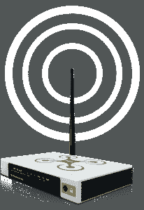

# ApolloShield 的新系统检测并发送不需要的无人机回家 

> 原文：<https://web.archive.org/web/https://techcrunch.com/2016/08/17/apollo-shield-launches-system-that-sends-unwanted-drones-home/>

最初注册为 Airfence Inc .的 ApolloShield 已经推出了一个反无人机系统，该系统可以检测到未经授权或不受欢迎的无人机，并迫使它们飞回家。

这家初创公司打算将其技术出售给有强烈安全需求的场所的所有者或管理者，如炼油厂、核设施、机场、监狱、体育场或酒店以及高净值个人或公众人物可能居住的建筑物。

联合创始人 Nimo Shkedy(首席执行官)和 Gilad Beeri(首席技术官)解释说，ApolloShield 系统包括一个安装在地面上的单元，其中包含一个无线电和天线。每个单位扫描一个区域进行无人机通讯。

将几个单位串在一起可以让用户保护任何大小的场地的整个周边。

来自系统的数据通过基于云的在线“命令中心”连接，用户可以手动查看或自动处理。

该系统不仅检测该区域是否有无人机，还检测无人机的类型以及该无人机的唯一 ID。这使得用户能够区分潜在的恶意无人机和欢迎飞行的无人机。

它还允许用户选择拦截无人机，或对其采取反措施，不迫使其降落，而是命令其回家。

这位首席执行官解释说，大多数无人机都有故障保护机制，以防止它们在半空中耗尽电池，所以如果无人机没有足够的剩余电量来飞回家，它仍然应该安全着陆。

史凯迪说阿波罗神盾类似于“天空的反病毒”该公司由 Y Combinator 和未透露姓名的天使投资人出资。迄今为止，它已经筹集了大约 50 万美元的资金。

在接下来的一年里，这家初创公司打算改进其系统，特别是跟上无人机技术的所有进步。这位首席执行官说，“我们打算成为最简单的，即插即用，不需要培训的系统。”

这家初创公司面临着来自无人机探测公司的竞争，如 [DeDrone](https://web.archive.org/web/20221207033413/http://www.dedrone.com/en/) ，以及反无人机技术提供商，包括 [DroneShield](https://web.archive.org/web/20221207033413/https://www.droneshield.com/) 、 [OpenWorks](https://web.archive.org/web/20221207033413/http://openworksengineering.com/skywall) ，或军事反无人机技术公司，如 [SRC Inc](https://web.archive.org/web/20221207033413/http://www.srcinc.com/what-we-do/ew/counter-uas.aspx) 。