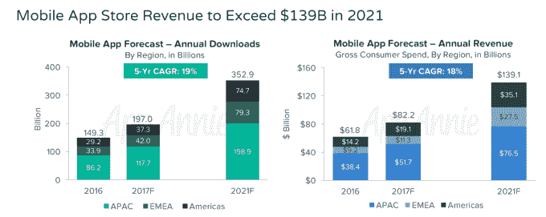
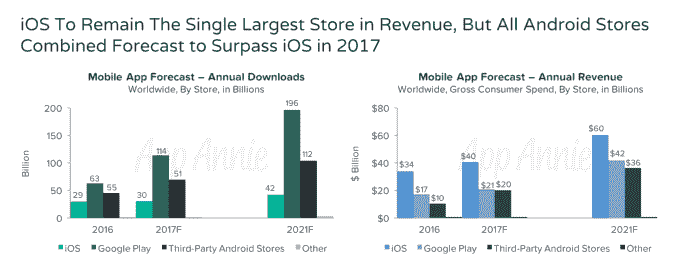
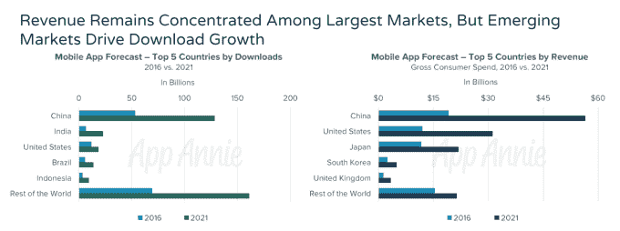
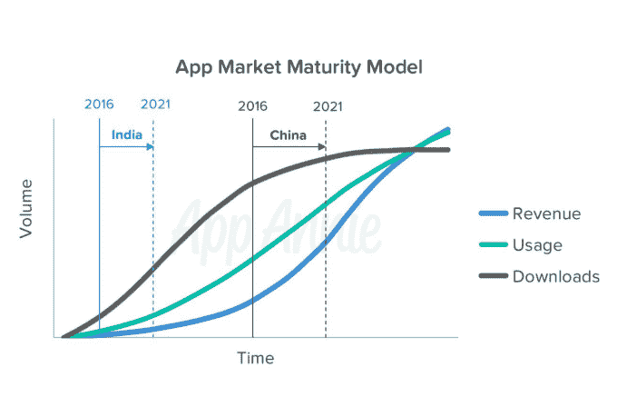

# App Annie: Android 今年的应用商店收入超过 iOS 

> 原文：<https://web.archive.org/web/https://techcrunch.com/2017/03/29/app-annie-android-to-top-ios-in-app-store-revenue-this-year/>

App Annie 今日发布的一份新报告显示，今年苹果将在移动应用创造的收入方面失去对安卓的领先地位。然而，该公司的估计是基于在其预测中包括第三方 Android 应用商店，而不仅仅是 Google Play。报告称，当苹果应用商店单独与谷歌 Play 竞争时，苹果预计将在 2021 年保持领先地位。

App Annie 预测，2021 年全球移动应用下载量将超过 3520 亿，所有应用商店的消费者总支出将超过 1390 亿美元。

iOS 应用商店将占这一支出的很大一部分，因为预计它在 2021 年将产生超过 600 亿美元的收入。Google Play 将产生 420 亿美元，第三方商店将产生 360 亿美元。

报告估计，这些第三方商店——包括腾讯、百度、小米、华为和其他公司提供的安卓应用市场——去年的收入为 100 亿美元，并将在 2017 年增长到 200 亿美元。

Android 应用市场正在增长，这在很大程度上要归功于中国和其他新兴市场的移动应用，特别是墨西哥、巴西和印度尼西亚。

这也会影响应用下载。到 2012 年，来自 Google Play 和其他地方的 Android 下载量将以 23%的年增长率达到 2999 亿次。

App Annie 还发现，应用程序下载在世界各国的分布更加均匀，但收入却是另一回事。

根据其数据，下载量排名前五的国家——中国、印度、美国、巴西和印度尼西亚——占去年下载量的 54 %,这在 2021 年不会有太大变化。

然而，收入排名前几位的国家——中国、美国、日本、韩国和英国——占 2016 年 app store 收入的 75%。预计到 2021 年，这一比例将增长到 85%。

该公司将这一转变归因于美国、日本和韩国等成熟市场现有智能手机用户在游戏和订阅方面的支出增加，尤其是中国这个日益成熟的市场。

报告指出，中国由于其庞大的人口和不断增长的中产阶级，在应用商店收入方面仍然发挥着关键作用，但其市场正在成熟。预计到 2021 年，大多数中国应用程序用户将习惯性使用，这将使收入增长得以持续，即使下载量可能会放缓。

从 2016 年到 2021 年，中国的下载量将以 19%的年增长率增长，而消费者支出将增长 24%，达到 565 亿美元。在大城市，中国智能手机市场的大部分已经饱和，这意味着大量增长将来自全国其他地区。

另一方面，印度仍处于应用市场成熟周期的早期阶段，并将在 2021 年前看到显著的下载和收入增长。到 2021 年，下载量将增长 28%，达到近 230 亿次，应用商店支出将增长 75%，达到 21 亿美元。

App Annie 说，尽管印度有所增长，但该地区的消费者支出将会下降，原因有多种，包括购买力更有限，以及更注重储蓄而不是游戏和娱乐支出的文化。它建议面向印度的应用开发者考虑其他收入模式，比如广告。