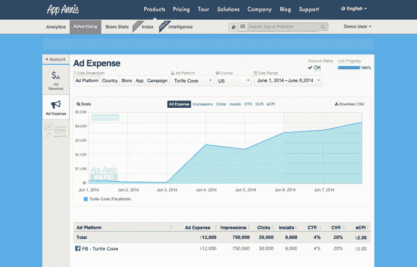

# App Annie 现在告诉出版商脸书的应用安装广告效果如何 

> 原文：<https://web.archive.org/web/https://techcrunch.com/2014/09/16/app-annie-now-tells-publishers-how-well-facebooks-app-install-ads-work/>

App Annie 是一家在 app store 淘金热期间销售 pick axes 的公司，它今天推出了针对脸书广告的广告分析，以此扩展其移动应用分析平台。这一变化将改善该公司今年春天早些时候推出的广告分析服务，允许应用发行商更好地确定他们在脸书的应用安装广告的表现，并将这些指标与其他广告网络进行比较。

该公司表示，具体来说，出版商将能够跟踪关键指标，包括点击率(点击率)、CVR(转化率)、eCPI(每次安装的有效成本)、安装次数等。

脸书的加入意味着 App Annie 现在支持大约 28 个移动广告平台，包括 AdMob、InMobi、iAd、Millennial Media、Chartboost 等顶级公司。

然而，尽管脸书可以访问点击者的丰富个人资料数据，App Annie 目前并不提供关于应用用户的人口统计信息——尽管该公司告诉 TechCrunch 这是一个“超级有趣”的领域，并希望随着时间的推移进入更多领域。但目前，它的重点是让出版商了解他们在各个渠道的移动广告活动，这样他们就可以看到哪个表现最好，让应用程序制造商在未来更好地分配营销资金，并根据需要进行其他调整。

App Annie 现在也在扩展对广告平台和网络服务长尾的支持，允许他们写入其 API。完成后，拥有 App Annie 广告分析帐户的应用程序发布者可以链接到 App Annie 中的广告平台和网络，然后他们可以链接他们的帐户并查看他们的信息。

App Annie 的全球企业传播副总裁马科斯·桑切斯解释说，在增加新服务时，该公司更大的价值在于“成为瑞士人”，包括支持脸书广告。

“尽管苹果不会提供一种方法来链接你的 Google Play 数据，但我们提供了一个中间地带来引入许多不同的网络，”他说。“这是关于将多个来源统一和集成到一个更大的平台上。”

对脸书广告分析的支持不收取额外费用，因为 App Annie 的核心应用分析和广告分析产品免费提供给其客户。相反，该公司继续通过其为企业使用而设计的[“智能”产品](https://web.archive.org/web/20221006173056/http://www.appannie.com/pricing/)创造收入，该产品提供更多数据和定制报告。

App Annie 如今在移动应用分析行业中处于独特的地位。它在应用分析方面的竞争对手，比如 Flurry 或 Onavo，已经被大公司收购(分别是[雅虎](https://web.archive.org/web/20221006173056/https://beta.techcrunch.com/2014/07/21/yahoo-is-buying-mobile-analytics-firm-flurry-for-north-of-200m/)和[脸书](https://web.archive.org/web/20221006173056/https://beta.techcrunch.com/2013/10/13/facebook-buys-mobile-analytics-company-onavo-and-finally-gets-its-office-in-israel/)，而许多新进入者主要专注于 [ASO](https://web.archive.org/web/20221006173056/https://beta.techcrunch.com/tag/aso/) (应用商店优化，即应用商店的 SEO)。当然，App Annie [早在 5 月份就收购了其最大的竞争对手 Distimo](https://web.archive.org/web/20221006173056/https://beta.techcrunch.com/2014/05/28/app-annie-acquires-competitor-distimo-raises-another-17-million-from-existing-investors/)，从而在这一领域获得了某种垄断地位。

但尽管有市场地位，该公司并没有自满，并继续为客户推出新功能，假设竞争的威胁总是指日可待。此外，在今天宣布的广告分析扩展发布之后，我们听说 App Annie 将在大约三到六个月内在分析领域推出另一个“大”功能。目前还不知道那是什么。

*更正:澄清了 API 用法，以说明数据未导入，但信息可用。*