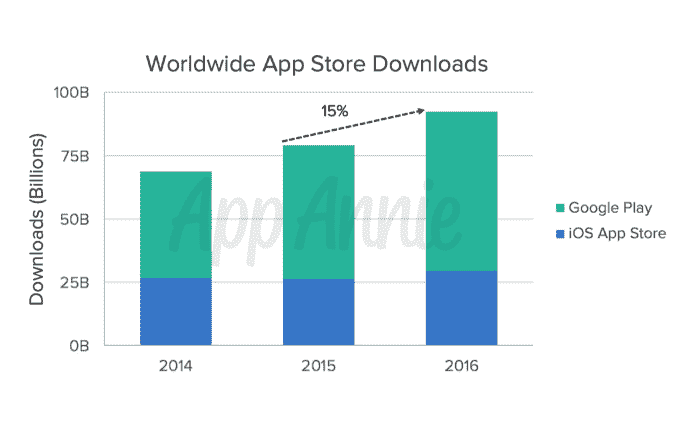
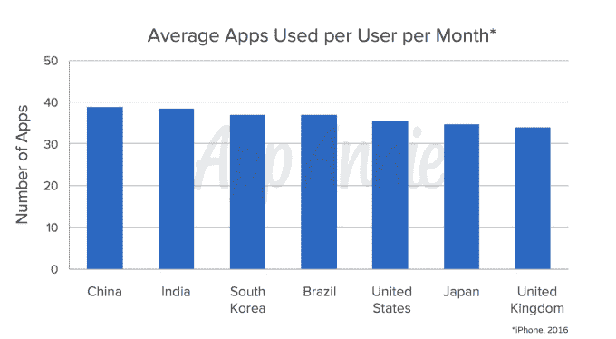
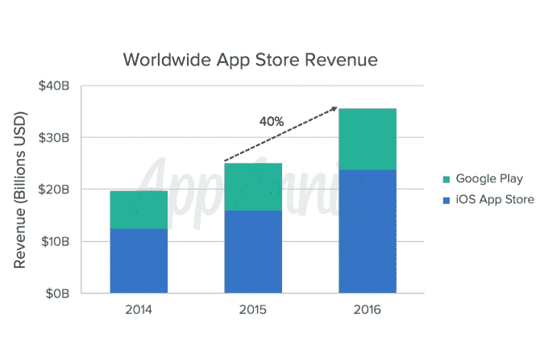

# 得益于中国 TechCrunch，2016 年应用下载量增长 15%，收入增长 40%

> 原文：<https://web.archive.org/web/https://techcrunch.com/2017/01/17/app-downloads-up-15-percent-in-2016-revenue-up-40-percent-thanks-to-china/>

应用智能公司 App Annie 今天发布的一份新的年终分析显示，应用行业正在持续增长，该分析发现，2016 年，应用下载量、花在应用上的时间和收入全面增长。全球下载量同比增长 15%，花在应用上的时间增长 25%，支付给开发者的收入增长 40%。

iOS 应用商店和 Google Play 的下载量与去年大致相同，增长了 130 亿次，达到 900 多亿次。由于中国的原因，今年 iOS 下载量的增幅超过了 2015 年。此外，非游戏应用比游戏对下载增长的贡献更大，特别是在 iOS 上的金融、旅游、照片和视频以及 Google Play 上的生产力、工具和社交等类别。

当然，下载量并不能说明全部情况，这也是 App Annie 调查用户使用应用的时间的原因。它发现，2016 年应用程序的总时间增加了超过 1500 亿小时，达到近 9000 亿小时。然而，这一分析只在 Android 设备上进行，不包括中国，所以这不是全貌。

值得将这一指标与竞争对手 Flurry 本月早些时候发布的另一份年终报告中的[进行比较。它的分析还发现，花在移动应用上的时间正在增加(它认为这一数字要高得多:在 iOS 和 Android 上为 69%)，它发现实际的应用*使用*——意思是会话(又名应用启动)——只增加了 11%。App Annie 将使用定义为“花在应用上的时间”，这在技术上是一个不同的指标。](https://web.archive.org/web/20230129230100/https://techcrunch.com/2017/01/12/the-mobile-app-gold-rush-may-be-over/)

此外，Flurry 的报告发现，在信息、社交、体育和商业等应用中增长的会话是以牺牲包括游戏在内的其他应用为代价的。

尽管两份报告得出了不同的数据，但总体趋势是相同的:用户在应用上花费的时间越来越多，游戏可能不是增长的领导者，至少在某些方面是如此。

App Annie 的报告还指出，在许多市场，用户每月都在推出大量应用程序——事实上，在美国、英国、中国、印度、日本、巴西和韩国等地，用户数量超过 30 个。这与前几年的数字大致相同。[尼尔森曾在 2015 年](https://web.archive.org/web/20230129230100/https://techcrunch.com/2015/06/11/time-spent-in-apps-up-63-percent-over-past-two-years-but-apps-used-monthly-shows-little-change/)表示，人们每月使用大约 26 或 27 款应用。然而，其他分析师之前已经注意到[只有五个非本地应用](https://web.archive.org/web/20230129230100/https://techcrunch.com/2015/06/22/consumers-spend-85-of-time-on-smartphones-in-apps-but-only-5-apps-see-heavy-use/)每月有大量使用。

App Annie 表示，2016 年也是 App Store 收入增长的好年景。通过 iOS 和 Android 应用商店，出版商获得了超过 350 亿美元的收入，增长了 40%——超过了 2015 年的增长率。当第三方 Android 商店被纳入分析时，收入增加到近 890 亿美元。

中国的影响力再次发挥了作用，贡献了 iOS 应用商店近一半的年增长。2016 年，这个国家也超过了所有其他国家，成为应用商店收入的主要来源。

中国应用商店的大部分收入来自游戏，去年角色扮演游戏尤其受欢迎。例如，《梦幻西游》自 2015 年上映以来已经获得了超过 8 亿美元的收入。中国的社交网络收入增幅也最大，腾讯的 QQ 消息应用贡献巨大。

在世界其他地方，游戏在为开发者赚钱方面并没有失去优势。该类别在 iOS 应用商店和 Google Play 上分别产生了 75%和 90%的收入。当然，Pokémon Go 的影响不容忽视——这款游戏在不到 2 个月的时间内就达到了 5 亿美元的消费者支出。截至 2016 年底，它的消费者支出达到了 9.5 亿美元以上，比有史以来一些最成功的游戏都快，包括《糖果粉碎》、《拼图与龙》和《部落冲突》。

整份报告还探讨了其他年终趋势，包括金融科技应用的受欢迎程度，视频流媒体的增长(YouTube 在美国和英国排名第一，但网飞带来了更多收入)，以及购物应用的使用增加。

App Annie 还指出，根据下载量，脸书获得了全球 5 个顶级应用中的 4 个。前五名依次是脸书、Messenger、WhatsApp、Instagram 和 Snapchat。这和尼尔森的榜单有点不同，它把 YouTube、谷歌地图和谷歌搜索都算进了前 5 名。按收入排名，App Annie 的榜单是:Spotify、LINE、网飞、Tinder 和 HBO Now。