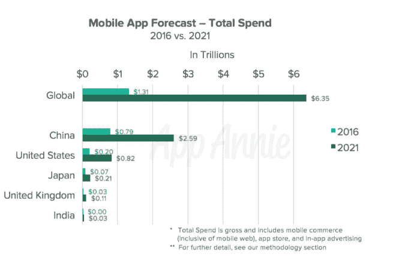
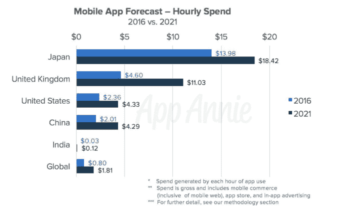
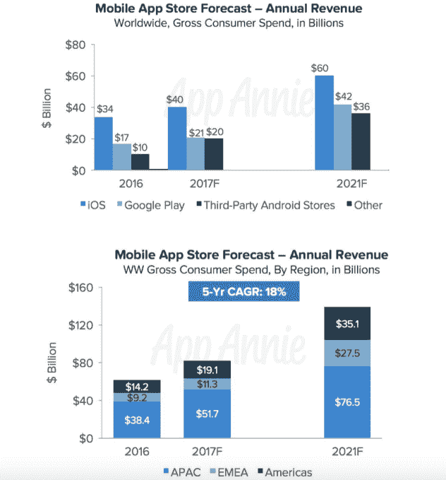

# 应用经济将在 2021 年增长至 6.3 万亿美元，用户群将增长近一倍，达到 63 亿人 

> 原文：<https://web.archive.org/web/https://techcrunch.com/2017/06/27/app-economy-to-grow-to-6-3-trillion-in-2021-user-base-to-nearly-double-to-6-3-billion/>

根据应用分析公司 App Annie 今天早上发布的一份新的[报告](https://web.archive.org/web/20221209132619/http://go.appannie.com/report-app-economy-forecast-part-two)，到 2021 年，全球应用经济将从去年的 1.3 万亿美元增长到 6.3 万亿美元。在同一时间段内，用户群将几乎翻一番，从 34 亿人使用应用程序增加到 63 亿人，而花在应用程序上的时间将从 2016 年的 1.6 万亿小时增加到 2021 年的 3.5 万亿小时。

该公司指出，这些数字不仅仅代表了通过应用商店产生的收入。它还考虑了其他形式的货币化，如应用内广告和移动商务。

今天，34 亿应用程序用户去年平均在所有三种货币化形式的应用程序上花费 379 美元，或每人每小时 0.80 美元。到 2021 年，这一数字将增长到每用户 1008 美元。

当然，这个数字在不同的市场有很大的差异。例如，在日本，用户平均每小时为每个用户创造 13.98 美元的收入，2016 年他们在应用上花费了超过 680 亿小时。与此同时，美国和中国每用户每小时的收入分别为 2.36 美元和 2.01 美元。

该报告预计，未来几年，实物交易向移动交易的转移将特别影响交易量的增长。App Annie 特别指出，阿里巴巴最近宣布，2017 财年，移动业务占其在中国零售市场产生的总交易额的 79%，比上一财年增长 65%。

该公司还认为，西方市场将落后于这一转变，包括消费者支出和广告支出向手机的转移。这是因为，在这里，我们仍然被银行、支付转移、食品购买等遗留系统所包裹，并且因为许多财富仍然集中在老年人口中，他们移动化的速度较慢。

该公司解释说，发展中市场不像这些遗留系统那样陷入困境，正在建设专为移动设备设计的基础设施。

移动商务被认为是应用经济增长的最大驱动力，到 2021 年，从每用户 344 美元增长到 946 美元。亚洲将增长最快，在 2021 年达到 3.2 万亿美元，其次是美洲，达到 1.7 万亿美元，然后是 EMEA(欧洲、中东和非洲)，将达到 1.0 万亿美元。

应用商店的消费者支出也将增长——到 2021 年将增长 18%，达到 1390 亿美元。在此期间，iOS 应用商店仍将是最大的单一商店，增长至超过 600 亿美元；然而，Google Play 结合第三方 Android marketplaces 有望在今年超越 iOS 应用商店，这在很大程度上要归功于中国。

在应用商店中，游戏将继续推动收入，从 2016 年的 500 亿美元增长到 2021 年的 1050 亿美元。然而，非游戏收入将增加两倍，从 2016 年的 115 亿美元增加到 2021 年的 340 亿美元以上，其中视频、音乐、约会、教育和生产力应用程序领先。

[gallery ids="1508670，1508669，1508659，1508671，1508667，1508666"]

*编者按:这篇报道的早期版本错误地将去年全球应用经济的价值描述为 13 亿美元。正确的数字是 1.3 万亿美元。*