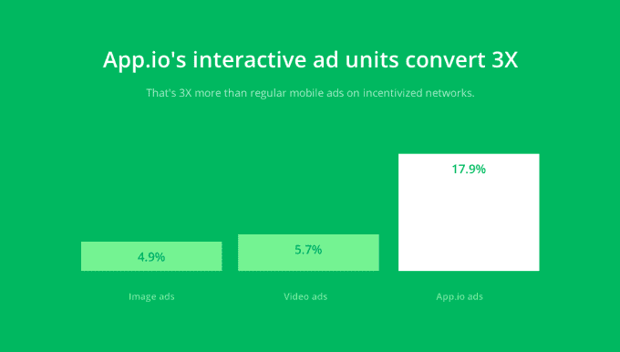

# App.io 将 iOS 应用转化为可播放的移动广告 

> 原文：<https://web.archive.org/web/https://techcrunch.com/2014/04/11/app-io-turns-ios-apps-into-playable-mobile-ads/>

初创公司 App.io 提供工具，允许 iOS 应用程序在浏览器中运行，以进行测试或演示，现在它已经采取了下一个合乎逻辑的步骤:将自己的技术带入移动广告领域。通过该公司新推出的移动广告产品，开发者可以创建广告单元，这些广告单元基本上是他们的移动应用程序或游戏的功能副本，消费者可以玩一段时间，然后必须下载原生应用程序才能继续。

这家公司，[以前叫 Kickfolio](https://web.archive.org/web/20230116205316/https://techcrunch.com/2012/12/07/kickfolio-brings-ios-applications-to-the-browser/) ，得到了[超过 100 万的种子基金](https://web.archive.org/web/20230116205316/https://techcrunch.com/2013/05/28/kickfolio-becomes-app-io-raises-1-million-to-bring-mobile-apps-to-the-browser-and-now-the-facebook-news-feed-too/)的支持，在过去的 18 个月里一直在开发它的技术，今天有超过 15000 名开发者在使用它的桌面浏览器产品。它的服务让人想起了更早的脸书收购的 Pieceable T7，但是 App.io 没有使用 Flash 在浏览器中呈现应用程序，而是使用 HTML5 技术。

迄今为止，App.io 的开发者客户已经通过桌面浏览器进行了超过 200 万次互动演示，尽管该公司拒绝对收入数字或增长发表评论，但该公司的商业开发主管 David Truong 指出，其[客户群](https://web.archive.org/web/20230116205316/https://app.io/showcase)包括“财富 500 强公司和价值 10 亿美元的初创公司”(这些客户都是 NDA 名下的，所以他不愿透露姓名。)

在公开推出移动应用广告产品之前，App.io 与一些早期客户合作测试该技术，目前其互动广告单元的展示次数已超过 20 万次。到目前为止，转化率一直很高——据报道比类似的广告单元高 3 到 5 倍(意味着富媒体或视频广告，也在 App.io 的合作伙伴广告网络上运行)。)

对自己测试技术感兴趣的开发人员将他们的模拟器版本上传到 App.io，并通过删除登录屏幕或教程等内容来优化移动广告体验。App.io 随后将审查广告并批准它，然后它将开始在合作广告网络上运行(也是在 NDA 之下，但有几个网络参与其中。)

该公司仍在探索如何向开发者收费，并正在考虑多种模式，包括 CPI(每次安装成本)、CPM(每千人成本)、CPCV(每转化观众成本)，甚至可能是基于用户 LTV(终身价值)的新模式。

“成本与视频广告非常相似——每个完整演示的成本，”Truong 解释道。“我们本质上是在创造行业标准，所以仍在试验广告单位成本。我们对收取 CPI 很感兴趣，但基于用户的高质量(终身价值)，”他继续说道。

“由于我们的基础设施和经济状况，我们能够以与当前广告产品(如视频或标准 CPI 活动)非常相似(有时甚至相同)的价格投放广告。Truong 说:“对于高质量用户来说，一个好的行业标准 CPI 成本可能在每次安装 2-3 美元之间。

这些广告都是 HTML5 和 [MRAID](https://web.archive.org/web/20230116205316/http://www.iab.net/mraid) 投诉，这意味着它们在技术上可以在任何 MRAID 投诉广告网络上运行——那些能够运行富媒体移动应用程序的广告网络，以防你不精通这里的所有广告网络行话。

对于消费者来说，广告体验开始时要么是横幅广告，要么是插页广告，点击后就会进入全屏游戏。用户可以在设定的时间内玩游戏，然后会出现一个全屏转换按钮，提示用户从 App Store 下载应用程序以继续玩游戏。如果他们想购买游戏，他们可以点击屏幕进入应用程序商店，并将应用程序安装到他们的移动设备上。

【YouTube http://www.youtube.com/watch?v=Nu9pt9QG4gA？feature = player _ 嵌入式]

App.io 表示，它跟踪整个广告漏斗，从印象、首次点击、互动时长、点击到应用商店、设备安装，以及未来的第 1、7 和 30 天留存指标和群组 LTV。

Truong 说，移动广告目前仅限于 iOS，并针对 iPhones 和 iPads 进行了优化。但它们将来可以很容易地在 Android 上运行，因为它们是 HTML5 流媒体技术。“这就像把 App Store 链接改成 Google Play 链接一样简单，”他指出。

感兴趣的开发者被邀请试用这些广告。更多信息在 App.io 博客[这里](https://web.archive.org/web/20230116205316/http://blog.app.io/introducing-app-io-ads-your-game-becomes-the-ad/)。