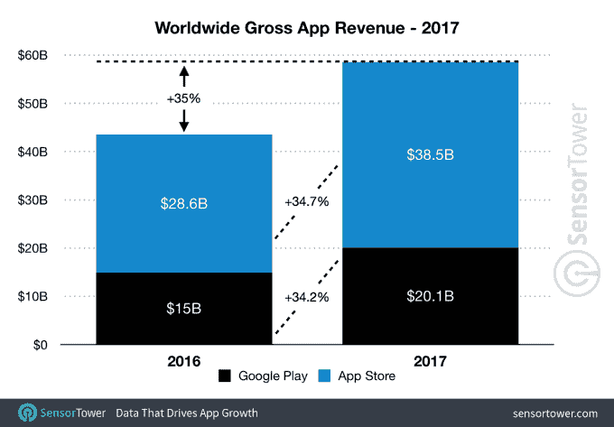
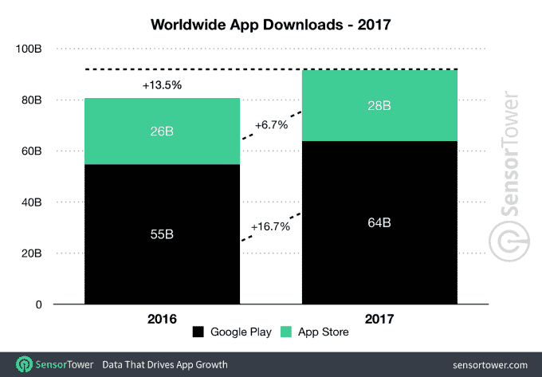

# 2017 年，应用收入增长 35%，达到 600 亿美元 

> 原文：<https://web.archive.org/web/https://techcrunch.com/2018/01/05/app-revenue-climbed-35-percent-to-60-billion-in-2017/>

根据应用情报公司 Sensor Tower 今天发布的一份新报告[显示，2017 年全球应用收入增长了 35%，达到近 600 亿美元，该报告衡量了苹果 App Store 和 Google Play 的付费应用、订阅和应用内购买。然而，报告发现，苹果是收入最多的公司，几乎是 Google Play 的两倍。](https://web.archive.org/web/20221129084248/https://sensortower.com/blog/app-revenue-and-downloads-2017)

具体来说，Sensor Tower 去年的应用商店收入为 385 亿美元，而 Google Play 的支出估计为 201 亿美元。与 2016 年相比，App Store 增长了 34.7%，而 Google Play 增长了 34.2%。

2017 年，这两个应用市场的总额为 587 亿美元，比 2016 年的 435 亿美元增长了约 35%。

传感器塔的数字与苹果自己的数字一致，[昨天](https://web.archive.org/web/20221129084248/https://beta.techcrunch.com/2018/01/04/apple-in-good-cheer-over-a-billion-dollar-christmas-and-new-years-on-the-app-store/)宣布。苹果周四表示，它在 App Store 上创造了破纪录的假日季，收入超过 10 亿美元，并指出 [iOS 开发者在 2017 年](https://web.archive.org/web/20221129084248/https://www.apple.com/newsroom/2018/01/app-store-kicks-off-2018-with-record-breaking-holiday-season/)赚了 265 亿美元，比去年增长了 30%以上。

265 亿美元是支付给开发者的钱——在苹果削减 30%之后。Sensor Tower 的报告调查了苹果降价前*的预计总支出，其调查结果与实际数字相差不到 1%。*

部分收入增长可能是由于手机在新兴市场的增长，以及苹果对应用内订阅的新支持。但苹果没有提供收入来源的详细信息。相反，它试图[将增长与](https://web.archive.org/web/20221129084248/https://www.apple.com/newsroom/2018/01/app-store-kicks-off-2018-with-record-breaking-holiday-season/)诸如[应用程序商店的大改造](https://web.archive.org/web/20221129084248/https://beta.techcrunch.com/2017/09/19/apples-huge-app-store-makeover-arrives-today-in-ios-11/)和新的 AR 应用程序(如 Pokémon Go)联系起来。当然，这些事情有所帮助，但在这个规模上，更多的是发展中市场的繁荣，如中国和印度，这有助于攀升。

例如，中国在 2016 年[就超过了美国的应用商店收入](https://web.archive.org/web/20221129084248/https://beta.techcrunch.com/2016/10/20/china-overtakes-the-u-s-in-ios-app-store-revenue/)；App Annie 最近将 2017 年第三季度创纪录的应用收入和下载量归功于几个新兴市场，包括中国、印度和其他东南亚国家，特别是越南和印度尼西亚。

与新兴市场对应用商店的影响相关，应用商店和 Google Play 的首次应用安装量也有所上升。该报告发现，2017 年全球首次应用安装量增长至 915 亿，比 2016 年的 807 亿增长了约 13.5%。

虽然多项研究发现，如今大多数美国消费者平均每月下载零个应用，但这一增长率表明，这些新兴市场有很大的新下载潜力。

这在 Sensor Tower 的数据中也可以看到。它发现 Google Play 应用程序下载的增长率远远高于 App Store，分别为 16.7%和 6.7%。这是因为 Android 在发展中市场的采用率更高。

总体而言，Google Play 的首次安装量为 640 亿次，而 App Store 的首次安装量为 280 亿次。

[gallery ids="1583147，1583146"]

该报告最后深入研究了移动游戏收入，该收入同比增长 30%，估计达到 483 亿美元，占所有应用收入的近 82%。游戏下载在 Google Play 上更受欢迎，在估计的 355 亿次下载中占了 272 亿次(77%)。

更多细节在[这里](https://web.archive.org/web/20221129084248/https://sensortower.com/blog/app-revenue-and-downloads-2017)传感器塔的网站上。