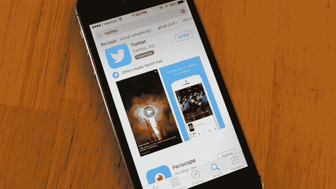

# 苹果应用商店获得更智能的搜索引擎 

> 原文：<https://web.archive.org/web/http://techcrunch.com/2015/11/13/app-store-search-just-got-smarter/>

许多移动应用开发者和行业观察家最近注意到苹果应用商店的搜索算法返回结果的方式发生了重大变化。开发者表示，在 11 月 3 日开始的一系列转变之后，应用搜索结果现在似乎比前几个月更加智能，相关性也高得多——尤其是在热门搜索结果中。

苹果正在不断努力改进其算法，因为应用程序的排名和显示方式对应用程序商店的整体成功起着重要作用。如果苹果向消费者推荐那些毫无意义或与其他应用相比体验不佳的应用，用户可能会对苹果的建议，甚至是应用本身产生戒心。

然而，过去许多 App Store 算法都专注于改变应用程序在其排行榜上的排名方式，这意味着应用程序商店整体上按类别排名的免费、付费和总收入最高的应用程序。

这一新变化更加关注当用户键入关键词来查找应用程序时，应用程序如何返回——这正成为在拥挤的应用程序商店中查找应用程序的一种更常见的方式，该商店拥有超过 100 万个移动应用程序。根据研究，[至少一半的 iOS 应用](https://web.archive.org/web/20230128092258/https://techcrunch.com/2014/10/03/roughly-half-of-users-are-finding-apps-via-app-store-search-says-study/)是通过搜索找到的。

尽管之前在搜索方面也有其他变化，但许多人认为这是迄今为止最显著的变化之一。

移动增长咨询公司 Analytica 的创始人丹·赫尔德解释说:“我认为这无疑代表了过去变化的一个重大转变，我认为苹果只是改变了某些变量的权重，如关键词输入，或者你在标题中有哪些关键词。”。

事实上，他补充说，这一变化可能标志着苹果公司试图开始开发自己版本的 PageRank 算法。

“这是他们试图了解不同应用程序之间的排名，”他解释道，并指出，当然，PageRank 要复杂得多。“我认为这是朝着那个方向前进的一次尝试……第一步可能是将你的排名与你的竞争对手进行比较，”Held 说。

## 什么变了

根据多个消息来源，包括跟踪自己排名的开发者，以及应用商店分析公司，始于 11 月 3 日的变化包括几项调整。应用程序现在在搜索结果中根据应用程序的上下文关键字组合进行排名，包括部分关键字匹配，以及竞争对手的品牌名称和其他匹配。

据我们所知，这也是 App Store 首次根据不在标题或“关键词”栏中的关键词对应用进行排名。

对于搜索自己的应用名称的开发者来说，这一变化意味着他们现在将看到一些以前没有出现的竞争应用，以及一个整体扩展的匹配列表。

起初，搜索结果似乎更倾向于历史下载量，这意味着免费应用的排名高于付费应用。然而，继 11 月 3 日的最初调整之后，苹果本周又进行了一次大规模调整，进一步提高了搜索结果的相关性。

## 更广泛、更相关的结果

如果你使用搜索关键词“Twitter”作为算法智能的测试，你会在 11 月 3 日之后看到比过去更多的相关结果，但像 Tweetbot 这样受欢迎的付费应用程序不在列表中。但是随着这一更新的变化，搜索结果再次得到改善。不仅 Tweetbot 出现了(正如 Launch Center Pro 开发者大卫·巴纳德(David Barnard)昨天发现的那样，它在搜索结果中飙升至第四位)，其他知名的 Twitter 应用程序如 Twitterrific(第五位)也在列表中排名更高，而 Instagram 最终从前 10 名中消失。

Tweetbot 自己的开发者，Tapbots 的保罗·阿达德也看到了同样的事情，他还指出，他现在看到许多竞争应用程序出现在搜索词“tweetbot”中，甚至那些没有使用“tweetbot”作为关键词之一的应用程序。搜索他的公司名称“Tapbots”，也会返回一个“大得多”的列表。

他表示，这种调整产生了显著的影响。“[它]给我们带来了巨大的变化。哈达德说:“我们从基本上不存在的‘推特’搜索引擎变成了排名第四的应用。

## 不太强调手动输入的关键字

这些变化甚至可以在更多的小众应用中观察到。一名开发者，Splash Math 的 Mithun Jhawar 说，在 11 月 3 日的改变后，他的应用程序增加了 70 个短语，这些短语在他的应用程序的元数据中没有直接提到。

除了在引入竞争对手和类似应用程序列表方面做得更好，还有一个新的建议功能，它考虑到了应用程序的“本质”，包括应用程序的主要功能， [appFigures](https://web.archive.org/web/20230128092258/https://appfigures.com/) 首席执行官 Ariel Michaeli 证实。他说，此外，人们越来越重视页面组件。

然而，Michaeli 指出，这些变化只与应用程序在搜索结果中的排名有关。

“我们还没有看到这种影响对排行榜的影响，”他说。"这是有道理的，因为这两种算法在相当长的一段时间里是分开的."

应用营销公司 [Fiksu](https://web.archive.org/web/20230128092258/https://www.fiksu.com/) ，也追踪了排行榜，也证实了这一点。苹果没有回应置评请求。

从高层次来看，这些变化表明，苹果越来越不重视开发者在 iTunes Connect 中手动输入的关键词，iTunes Connect 允许他们管理自己的应用程序，并将它们提交给 iOS 应用商店。

话虽如此，但现在说这是苹果试图为其应用商店生成自己版本的谷歌 PageRank 算法还为时过早。

虽然该算法无疑更加智能，但它似乎没有考虑到使用情况等指标，应用程序是否曾在 App Store 上出现过等细节，来自更广泛网络的链接(如正面评论或媒体提及)，或其他可以增加复杂性和帮助更好的 surface 应用程序的东西。

不过，尽管最近这一变化的规模确实引人注目，但要从应用下载量和由此产生的收入方面正确分析其影响还为时过早。