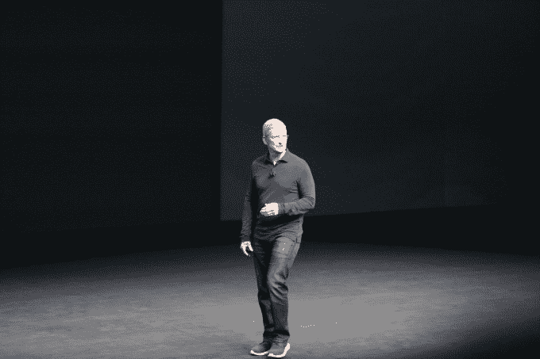

# App Store 下载量达到 1400 亿次，同比增长 106%

> 原文：<https://web.archive.org/web/https://techcrunch.com/2016/09/07/app-store-sees-140-billion-downloads-106-year-over-year-growth/>

# App Store 下载量达到 1400 亿次，同比增长 106%

苹果首席执行官蒂姆·库克今天早上在 iPhone 新闻发布会的开幕式上简要介绍了 App Store 的最新情况，指出苹果的应用程序市场目前已经有 1400 亿个应用程序被下载。他还吹捧该店在过去两个月中同比增长了 106%，这是一个有趣的数字，但没有更详细地解释原因。

然而，原因可能是 pokémon Go——一个应用程序的异类，也是移动设备上有史以来最受欢迎的游戏之一。上个月,[的游戏安装量超过了 1 亿次,](https://web.archive.org/web/20230326030634/https://techcrunch.com/2016/08/01/pokemon-go-passed-100-million-installs-over-the-weekend/)[的日收入超过了 1000 万美元。今天，苹果](https://web.archive.org/web/20230326030634/https://www.appannie.com/insights/mobile-strategy/pokemon-go-an-opportunity-not-a-threat/)[透露](https://web.archive.org/web/20230326030634/https://techcrunch.com/2016/09/07/pokemon-go-the-hottest-game-on-the-planet-is-coming-to-the-apple-watch/)已经超过 5 亿次下载，即将登陆 Apple Watch。

库克补充说，App Store“收入是我们最接近的竞争对手的两倍”，称其增长“超出了图表”

他还说，该商店是世界上最受欢迎的游戏平台。库克支持这种说法，他指出现在 App Store 上有 50 万款游戏。

当然，这一切都导致了一个大笑话:苹果的应用商店终于通过一款全新的游戏“超级马里奥快跑”获得了世界上有史以来最受欢迎的游戏之一，任天堂的马里奥