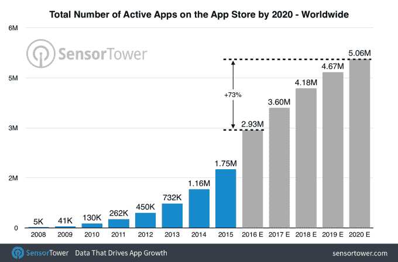
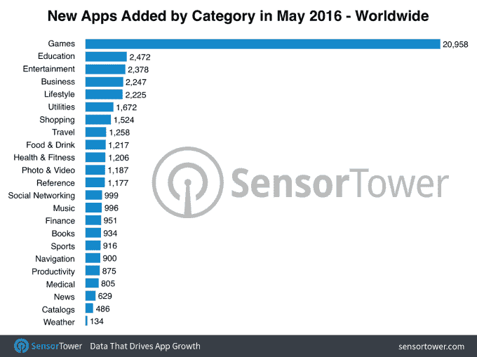

# 应用程序商店到 2020 年将达到 500 万个应用程序，游戏引领潮流

> 原文：<https://web.archive.org/web/https://techcrunch.com/2016/08/10/app-store-to-reach-5-million-apps-by-2020-with-games-leading-the-way/>

苹果应用商店没有显示出放缓的迹象，尽管人们似乎将他们经常使用的应用数量限制在少数几个。但是开发者一直在开发，所以应用程序不断出现。根据应用情报公司[Sensor Tower](https://web.archive.org/web/20230315025631/https://sensortower.com/blog/app-store-growth-forecast-2020)今天早上发布的新分析，应用商店的规模预计将在未来四年内翻一番以上，到 2020 年将达到 500 万个应用。

该公司表示，这将使其目录比 2016 年底的预期增加 73%(或 293 万)。

Sensor Tower 的预测基于 App Store 从 2008 年推出到现在的历史数据，具体来说，是每个时期结束时全球活跃应用的数量，而不是已发布应用的总数。

当 App Store 在 2008 年首次亮相时，到第一年年底，它已经增长到 5000 个应用程序，并且从那以后一直保持爆炸式增长。到 2015 年底，它达到了 175 万个应用程序，今天在全球托管了 200 万个应用程序。Sensor Tower 预测，未来四年将增加 2.13 个应用，到 2020 年底将达到 506 万个活跃应用。

新游戏推动了 App Store 的增长，因为它们很受欢迎，也因为游戏制造商必须经常发布新游戏来吸引用户。毕竟，游戏通常不会无限期地玩下去，尽管一些游戏已经被证明有更长的持久力——比如《糖果粉碎记》、《部落冲突》，或者——十有八九——神奇宝贝 Go。

根据新的报告，今年 5 月发布了 48，231 个新应用，其中 43%(近 21，000 个)是游戏。这远远超过了其他活跃类别，包括教育(2472 个新应用)、娱乐(2378 个应用)、商业(2247 个应用)和生活(2225 个应用)。

然而，随着 App Store 的持续增长，苹果面临的挑战是确保可以找到新的应用。

该公司终于开始认真解决这个问题，在接下来的几周内，通过在应用商店推出一系列的改变。首先，苹果正在其应用商店搜索中实施广告，这将允许开发者针对特定的应用名称或关键词竞价排名。搜索广告将成为应用在不断增长的店面中被发现的重要方式，特别是考虑到苹果公司表示，今天超过 65%的应用是从搜索查询中下载的。

苹果公司也将改造店面本身，为每个用户提供个性化服务。今年秋天，它的“特色”部分将不再推荐你已经安装的应用，只推荐新的。它还带回了类别标签，并引入了一种通过 3D 触摸快捷方式与朋友分享应用程序的新方式。

尽管如此，即使应用程序发现得到改进，一个更大的挑战是让人们真正下载并使用他们已经安装的应用程序。comScore 之前的分析表明，人们每月下载的新应用如此之少，以至于平均为零。然而，应用营销公司 [Tune](https://web.archive.org/web/20230315025631/http://tune.com/) 最近对该研究提出质疑，称实际数字接近每月 1.5 个应用。

报告称，75%的美国用户每月至少下载一个应用程序，青少年每月下载 6.3 个应用程序。该公司称，其数据是基于近 5000 万美国人的实测安装数据。

尽管如此，当谈到使用应用程序时，人们倾向于坚持使用大公司的应用程序，而不是独立开发者。

例如，[根据 SurveyMonkey](https://web.archive.org/web/20230315025631/https://techcrunch.com/2016/07/28/surveymonkey-study-finds-social-media-apps-ruled-mobile-in-first-half-of-2016/) 的数据，今年上半年最常用的五个应用分别是脸书、YouTube、Messenger、谷歌地图和 Play Store。下载量最多的是 Messenger、Snapchat、Instagram 和游戏 Color Switch。此外，40%最常用的应用程序是预装在设备上的。这意味着开发者不仅要与商店中的其他应用程序竞争——这个数字将在几年内达到 500 万——还要与那些从第一天起就已经安装在你手机上的应用程序竞争。