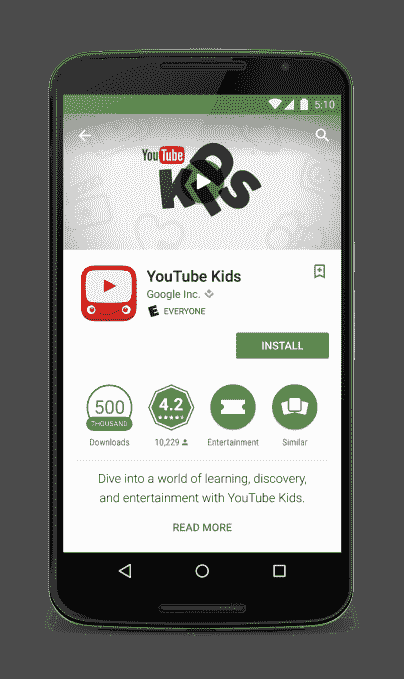
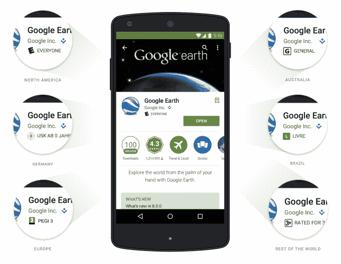

# Google Play 上提交的应用程序现在由工作人员审核，将包括基于年龄的评级

> 原文：<https://web.archive.org/web/https://techcrunch.com/2015/03/17/app-submissions-on-google-play-now-reviewed-by-staff-will-include-age-based-ratings/>

Google Play 是谷歌的 Android 应用程序市场，目前覆盖 190 多个国家的 10 亿人，它允许开发者无需冗长的审查过程就能立即发布他们的移动应用程序，这在历史上与竞争对手苹果公司有所区别。然而，谷歌今天披露，从几个月前开始，它开始让一个内部审查团队在发布前分析应用程序是否违反政策。展望未来，在应用程序在 Google Play 上线之前，人类评论者将继续亲自动手操作应用程序。

此外，谷歌宣布在 Google Play 上推出新的基于年龄的游戏和应用评级系统，该系统将利用特定地区官方评级机构提供的评分标准，如美国的娱乐软件评级委员会( [ESRB](https://web.archive.org/web/20230405144818/http://en.wikipedia.org/wiki/Entertainment_Software_Rating_Board) )

据 Google Play 业务开发总监 Purnima Kochikar 称，谷歌已经努力实施新的应用审查系统超过半年了。她说，这个想法是想办法在过程的早期抓住违反[政策](https://web.archive.org/web/20230405144818/https://play.google.com/about/developer-content-policy.html)的人，而不增加应用发布过程的摩擦和延迟。在这一点上，谷歌似乎是成功的——新系统实际上在几个月前就上线了，而且没有任何投诉。今天，尽管增加了人工审查人员，Android 应用程序仍能在几小时内获得批准，而不是几天。

“我们在所有应用和游戏发布前就开始审查它们——这是 100%推出的，”Kochikcar 说。“开发商还没有注意到这一变化。”

谷歌的应用审查团队之所以能够如此快速地处理应用提交，是因为该系统还包括一个自动化元素。在应用程序审查人员看到应用程序之前，谷歌使用软件对应用程序进行预分析，以发现病毒和恶意软件以及其他内容违规行为。例如，其图像分析系统能够自动检测包含性内容的应用程序，以及侵犯其他应用程序版权的应用程序。

谷歌不想详细说明它在自动化方面的能力，但指出它可以识别出一些不仅仅是包含恶意软件的违规行为。

“我们一直在试图找出机器如何学习更多东西，”Kochikar 解释道。“所以今天机器能抓到什么，机器就抓什么。无论我们需要人类做什么，人类都会去做。”

尽管谷歌目前在审查应用程序时使用的机器辅助流程比苹果更多，但 Kochikar 承认，就人为因素而言，谷歌的系统可能不如“竞争对手”的系统“强大”。也就是说，谷歌试图在能够更早发现违规行为和不影响应用程序发布到其 Android 应用程序市场所需时间之间取得平衡。

谷歌表示，新系统还意味着开发者现在可以更详细地看到他们应用的发布状态，并快速了解应用是否被拒绝或暂停以及原因。在[开发者控制台](https://web.archive.org/web/20230405144818/http://play.google.com/apps/publish/)中，应用创建者将看到他们应用的最新发布状态，允许他们轻松修复问题，并在纠正轻微违规后重新提交应用。

## 新的基于年龄的评级

此外，谷歌还宣布了另一项影响深远的变化，将影响全球所有 Google Play 开发者:为应用和游戏添加基于年龄的评级系统。从 5 月份开始，开发者必须在提交之前完成一份关于他们应用程序的内容问卷，该问卷旨在帮助识别不良内容，并返回最合适的评级。

由于分级系统因地区而异，谷歌在国际年龄分级联盟(IARC)及其参与机构的帮助下致力于这一实施，包括娱乐软件分级委员会(ESRB)、泛欧游戏信息(PEGI)、澳大利亚分级委员会、Unterhaltungssoftware selbstkontrole(USK)和 Classifica o indicati va(ClassInd)。谷歌指出，那些没有专门评级机构的地区将包括一个更通用的评级。

这意味着，在美国，Google Play 游戏将拥有与盒装软件相同的评级，如“每个人(E)、“青少年(T)、“成熟(M)”等。其他国家的评级将反映其当地组织或监管机构使用的评级。Google Play 的家长控制功能将被更新，以阻止这些新的分级类别。

在今天之前，谷歌上的应用评级有些问题，因为开发者可以自己分配评级。然而，随着新的基于年龄的评级，开发者不能在不返回并再次接受问卷并编辑他们的答案的情况下覆盖评级。此外，谷歌表示，它也将审查新流程产生的评级，以确保开发者不会试图在问卷上撒谎，以调整他们的应用程序或游戏的评级。

最初，新系统推出时将有一个宽限期，但到了下个月底，它将成为新应用程序提交和更新的阻碍性要求。谷歌指出，那些保持“未评级”的应用程序可能会在某些地区或针对特定用户被屏蔽。