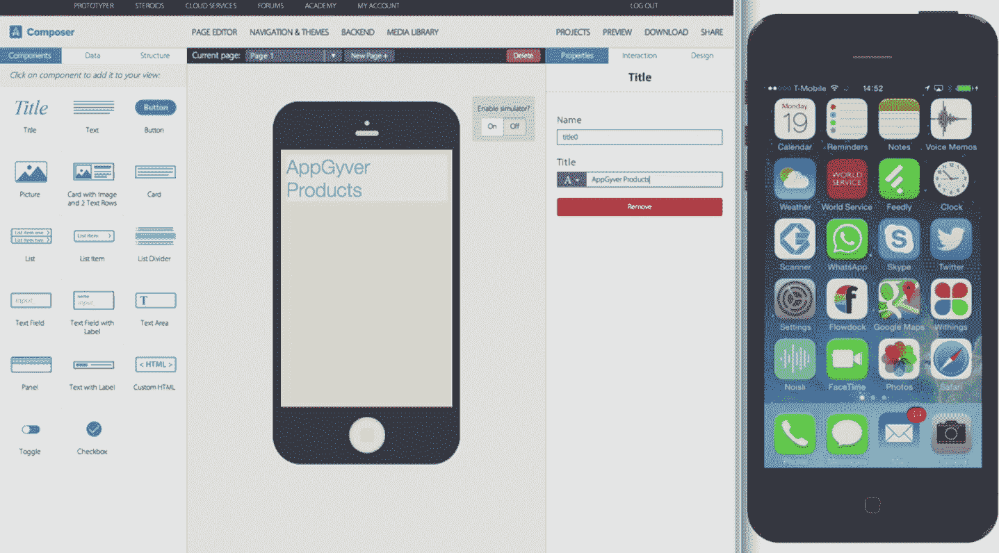

# AppGyver 推出 Composer，这是一款用于构建 HTML5 应用的拖放工具 

> 原文：<https://web.archive.org/web/https://techcrunch.com/2014/05/22/appgyver-launches-composer-a-drag-and-drop-tool-for-building-html5-apps/>

# AppGyver 推出了 Composer，这是一款用于构建 HTML5 应用程序的拖放工具

到目前为止， [AppGyver](https://web.archive.org/web/20230129073850/http://www.appgyver.com/) 最出名的是它的[应用原型工具](https://web.archive.org/web/20230129073850/https://techcrunch.com/2013/03/01/pitching-app-ideas-appgyver-delivers-mobile-app-prototypes-in-minutes-no-technical-know-how-needed/)和 Steroid.js，一个基于命令行的快速构建 HTML5 应用的工具。如今，该公司正在将这些想法与 [Composer](https://web.archive.org/web/20230129073850/http://www.appgyver.com/composer) 的公开测试版结合起来，这是一款拖放式 HTML5 应用构建器，可以处理来自任何 REST API 的数据，并与脸书的 Parse、[build . io](https://web.archive.org/web/20230129073850/https://www.built.io/)和和服实验室等流行的后端服务和工具集成。

该公司将这项服务瞄准了希望快速启动移动混合应用程序的开发人员。

http://player.vimeo.com/video/80436716

过去几天，我一直在测试这项服务，它已经处于私人测试阶段有一段时间了，它的界面确实非常容易使用，大部分内容一目了然。虽然它遇到了大多数像这样的可视化编辑器遇到的同样的问题，因为你有时想做系统无法适应的事情，但工具列表足够详尽，至少可以让你快速创建一个应用程序的工作原型。

从那里，您可以随时导出您的应用程序，并在一个更加成熟的 HTML5 开发环境中使用它。这些应用基于谷歌的 [AngularJS](https://web.archive.org/web/20230129073850/https://angularjs.org/) 、Ionic HTML5 混合应用框架和 PhoneGap，以及 AppGyver 自己的类固醇，后者构成了大部分服务的基础。

该服务的一个很好的功能是，你可以为你的应用程序生成一个二维码，从 [AppGyver 的移动应用程序](https://web.archive.org/web/20230129073850/https://itunes.apple.com/us/app/appgyver-scanner/id575076515?mt=8)中扫描它，然后在手机上实时查看你在开发中所做的所有更改。

到目前为止，该公司的用户已经用其现有工具创建了大约 1 万个移动应用程序。Composer 特性可能会将其服务带给更广泛的用户，包括那些不一定认为自己是开发人员的用户。

随着这次发布，AppGyver 进入了一个日益拥挤的拖拽式应用开发者的领域。它们在质量和深度上有很大的不同，但这绝对是一个新来者很难脱颖而出的领域。然而，AppGyver 的工具在复杂性(很大程度上得益于其后端集成)和易用性之间找到了恰当的平衡。

作曲家将在测试期免费提供，该公司预计测试期至少会持续到今年第三季度。即使在那之后，该公司将继续提供免费层。