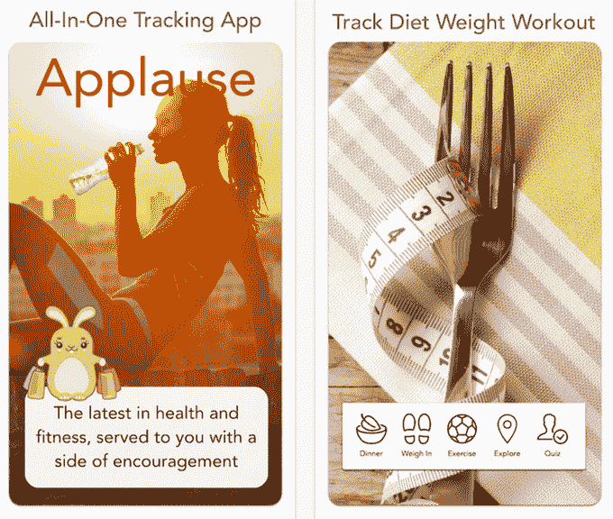

# Salesforce 首席执行官为其改进的减肥应用程序 筹集了 76.5 万美元

> 原文：<https://web.archive.org/web/https://techcrunch.com/2014/11/26/applause-raises-765k-from-salesforce-ceo-for-its-revamped-weight-loss-app/>

如果你担心在假期浪费你的饮食——或者，也许，考虑制定一个新年决心“吃得健康”(你知道，又一次)——一个叫做[鼓掌](https://web.archive.org/web/20230319215702/http://www.getapplause.com/)的应用程序，现在由 Salesforce 首席执行官马克·贝尼奥夫(Marc Benioff)提供种子资金，可能会有所帮助。这家初创公司旨在向市场推出一种更轻量级的食物和活动跟踪服务，并结合虚拟支持小组，为你提供来自像你一样的其他人的反馈和鼓励。

然而，这款应用本身并不新鲜。据联合创始人兼首席执行官难近母·潘迪称，在 2014 年初去 Salesforce.com 之前，他花了几年时间研究这个项目——正如你可能已经猜到的，这就是他最终获得天使投资的原因。

最初，他是在引导这个应用程序，然后叫做 FitFrnd。但最初的概念更类似于“健身脸书”，包括各种社交功能，包括交友、新闻订阅、喜欢和评论，以及其他旨在帮助它传播的社交机制。

然而，他发现，人们不希望*让*添加他们的朋友和家人来见证他们的减肥过程——他们希望保持一定的私密性。

潘迪在 Salesforce 工作时，实际上放弃了这款应用一段时间，直到他有了一个新想法:他可以借鉴慧俪轻体及其支持团体的想法，并将其转化为一种应用格式。

用户可以享受到来自同舟共济的其他人的半匿名支持和鼓励，而不是以你的名字来标识。虽然 Secret 和 Whisper 等一些匿名分享应用程序可能会导致人们说一些令人讨厌的事情或钓鱼，但 Pandey 认为匿名对于像他这样的应用程序是有意义的，用户可以分享关于他们自己、他们的进步和挫折的个人、情感和潜在的尴尬事情。

他现在将这款应用更名为[掌声](https://web.archive.org/web/20230319215702/http://www.getapplause.com/)，筹集了种子资金，并回来积极开发它。

新应用程序将于 1 月 1 日发布，正好赶上每个人的决心。(然而目前的版本是[现在在 App Store 上线](https://web.archive.org/web/20230319215702/https://itunes.apple.com/us/app/lose-weight-applause-best/id522850347?mt=8))。

在更新的版本中，plateau 将提供计步器、健康测试、博客内容、称重和简化的膳食跟踪器，您只需指出膳食是健康的(绿色)、正常的(黄色)还是不健康的(红色)。同样的红/黄/绿系统也经常用于专注于对抗儿童肥胖的减肥项目，因为它使用起来更简单，而且仍然让你感觉你做得有多好。

即将推出的膳食查找功能也利用了来自 [Locu](https://web.archive.org/web/20230319215702/http://www.locu.com/) 的菜单数据，帮助你快速跟踪你最喜爱的膳食以及它们对当地餐馆的营养影响。

**需要改进设计**

从概念上讲，结合虚拟支持团体的简化减肥/节食应用程序是一个好主意，但缺乏掌声的地方是它的设计。它的应用程序商店截图不能帮助新用户很好地理解应用程序是如何工作的，并且给人以幼稚的印象。与此同时，该应用程序本身的设计非常粗糙和不均衡，甚至看起来很过时——这证明了在重新推出之前重新命名时重复使用的旧代码喝彩。

不幸的是，健康追踪器/移动教练的市场已经充满竞争，包括来自 MyFitnessPal 和 Lose It 等老牌公司的大牌，加上像 [Human](https://web.archive.org/web/20230319215702/https://itunes.apple.com/us/app/human-activity-calorie-tracker/id692721875?mt=8) 这样设计良好的新人，以及像[努姆·蔻驰](https://web.archive.org/web/20230319215702/https://itunes.apple.com/us/app/noom-coach-weight-loss/id634598719?mt=8)、 [Lift](https://web.archive.org/web/20230319215702/https://itunes.apple.com/us/app/lift-your-daily-coach/id530911645?mt=8) 或 [Lifesum](https://web.archive.org/web/20230319215702/https://itunes.apple.com/us/app/lifesum-lifestyle-tracker/id286906691?mt=8) 这样的简单记录工具和激励器，以及几十种其他[和](https://web.archive.org/web/20230319215702/https://itunes.apple.com/WebObjects/MZStore.woa/wa/viewRoom?fcId=888423714&genreIdString=6013&mediaTypeString=Mobile+Software+Applications)。

与其他的相比，掌声缺乏设计就像一个疼痛的拇指突出。但有了额外的资金，掌声可能会纠正这一点。我们会看到…但它需要尽快采取行动。这些应用程序将在几周内大受欢迎。

由马克·贝尼奥夫(Marc Benioff)领导的 plateau 拥有 76.5 万美元的种子资金。迄今为止，该应用程序在 App Store 上已有 423，000 次下载。