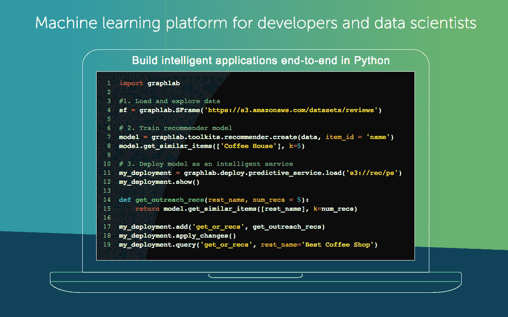

# 苹果收购机器学习公司

> 原文：<https://web.archive.org/web/https://techcrunch.com/2016/08/05/apple-acquires-turi-a-machine-learning-company/>

# 苹果收购机器学习公司 Turi

有传言称苹果已经收购了 Turi，一家自称为“开发者和数据科学家的机器学习平台”的公司。

我们向苹果公司求证，果然——我们得到了他们在确认收购时给出的标准答复，但没有说太多其他内容:

> “苹果不时收购较小的科技公司，我们一般不会讨论我们的目的或计划。”

苹果公司拒绝就交易的财务条款发表评论，但 Geekwire 暗示交易金额超过 2 亿美元。

这不是苹果在人工智能/机器学习领域的第一次收购。早在 2015 年 9 月，它就收购了专门从事机器学习和图像识别的公司 [Perceptio](https://web.archive.org/web/20230227201352/https://techcrunch.com/2015/10/05/apple-perceptio/) 。

除了机器学习产品，Turi 还举办了数据科学峰会，这是一个为期两天的会议，顾名思义，主要关注数据科学。

Turi 之前被称为“Dato”(在此之前为“GraphLab”)，但在商标纠纷后于今年 7 月更名。

Turi 开始联系客户，让他们知道他们的产品将在 7 月底停产，这是发生收购的第一个迹象。与此同时，Turi 自己的博客[不再加载](https://web.archive.org/web/20230227201352/http://blog.turi.com/)。

我们听说 Turi 的团队将留在西雅图，而不是搬到苹果公司的总部。