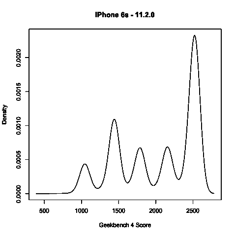

# 苹果公司解释了为什么人们说他们用旧电池的 iPhones 运行“更慢”

> 原文：<https://web.archive.org/web/https://techcrunch.com/2017/12/20/apple-addresses-why-people-are-saying-their-iphones-with-older-batteries-are-running-slower/>

由于 Reddit 上的一篇帖子和 T4 灵长类动物实验室约翰·普尔发布的对 T2 后续基准测试的松散解读，“苹果压制旧 iPhones”的迷因再次抬头。

和往常一样，要点是苹果非常小气，试图通过降低旧手机的运行速度来迫使客户升级手机。

一如既往，答案是否定的。苹果这样做不仅愚蠢，而且目光短浅，如果这是真的，很可能会导致政府和法律性质的纠纷，这是任何像苹果这样的公司都不希望发生的。

取而代之的是，苹果将注意力集中在平滑非常高且快速的功率消耗峰值上，这可能会导致旧电池出现问题。

当我询问人们在测试使用旧电池的 iPhones 时看到的功率分布时，苹果公司提供了以下声明:

> 我们的目标是为客户提供最佳体验，包括整体性能和延长设备寿命。在寒冷条件下，锂离子电池供应峰值电流需求的能力下降，电池电量较低，或者随着时间的推移而老化，这可能导致设备意外关机以保护其电子组件。
> 
> 去年，我们为 iPhone 6、iPhone 6s 和 iPhone SE 发布了一项功能，仅在需要时平滑瞬时峰值，以防止设备在这些条件下意外关机。我们现在已经将该功能扩展到装有 iOS 11.2 的 iPhone 7，并计划在未来添加对其他产品的支持。

Poole 的基准测试显示的简短版本是苹果去年推出的功率曲线平滑算法的结果，该算法用于缓解 iPhone 关机问题。我[写到这里](https://web.archive.org/web/20230331072006/https://techcrunch.com/2017/02/23/apple-says-ios-10-2-1-has-reduced-unexpected-iphone-6s-shutdown-issues-by-80/)；你可以读完再回来。

基本上，iPhones 的处理器功率达到峰值，电池无法供电，手机关闭。苹果随后在所有 iPhones 上添加了电源管理，通过限制电池可用电量或在几个周期内分散电源请求来“平滑”这些峰值。这一点在 Poole 文章中的图表中清晰可见:

此外，需要澄清的是，普尔的图表似乎是准确的——苹果也没有说这种情况不会发生。

一些更换了旧电池的用户也表示，他们在更换电池后看到了性能指标的提高。是啊。当然了。随着电池老化，它们也会停止工作。句号。

这个年龄不仅仅是几年或充电周期，例如，热量是电池的一个巨大的致命因素。如果你的 iPhone 经常被放在阳光下或者变得很热，那么你的电池就会很快没电。

随着电池老化，iOS 将主动检查其响应能力和有效性。当它无法为处理器提供达到峰值*功率*所需的所有功率时，请求将被分散到几个周期中。

请记住，基准测试是对系统性能水平的*人工*测试，对系统来说*看起来*像波峰和波谷，这将触发这种效应。换句话说，当你运行基准测试时，你总是会触发这个，但是当你像平常一样使用你的 iPhone 时，你肯定不会总是触发这个效果。

随着时间的推移，苹果将继续在更多设备上添加这种平滑功能，以避免关机问题、冻结和其他问题。

需要注意的是，这是锂离子化学的问题，不是苹果的问题。随着时间的推移，电池会变得很糟糕。这是为了让你的手机工作更长时间，问题更少，而不是让你离开它。

去年，苹果还为用户添加了一个通知，当电池进入非常糟糕的状态时，但它对此非常保守，所以它可能不会触发，直到 iOS 觉得应该开始限制电池的最大功耗。仅供参考。

基本上，如果您的手机很冷，电池电量低或电池老化，它将无法提供峰值电流。句号。

我认为这里有一个论点，许多人永远不会看到这种情况发生。它仅在电池需要最大功率时适用，例如，当您使用 iPhone 做一些紧张的事情时，如玩游戏或使用 3D 应用程序。但是很明显，一些人看到了这个限制器的普遍触发。

这不会影响你设备的平均性能，而且是断然不会节流的；它限制了峰值需求，不允许它们过高——并且将工作分散到多个周期，而不是一个周期。

## 然而…

我认为这里可以争论的一件事是，在给人们太多信息和没有足够信息之间要取得平衡。如果你给用户足够多的绳子，他们会吊死自己，也就是说，过早更换电池或更换不需要更换的手机。

但是，作为一个透明度问题，我认为除了非常公开地说他们正在进行这种电源管理(他们现在已经进行了两次)，这里可能有一种途径可以更积极和透明地告诉用户他们的电池何时直接影响他们 iPhone 的峰值性能。

“我认为，由于电池磨损而经历明显变慢的用户会希望苹果在这个问题上更加透明，”普尔说。“通知用户电池需要维修是减少用户顾虑并帮助他们解决这个问题的简单方法。"

大致而言，我认为可以改进的三点如下:

*   苹果应该检查算法开始平滑性能峰值的时间和他们被通知由于电池老化性能受到影响的时间之间的差距是否太大。如果一个人注意到(看起来他们确实注意到了，考虑到关于这个的讨论线索和社会活动)他们的手机运行变慢了，那么他们需要知道为什么。
*   iOS 会告诉你你的电池已经没电的时间点目前是非常，*非常*保守的。也许这可以设置得更激进一些。然后，当然，用户会抱怨苹果在电池更换上攫取现金，但人类仍将是人类。
*   很明显，人们不明白用旧电池保护 iPhone 会直接影响性能。也许这是苹果信息传递的失败，或者是我(和其他记者)没有尽可能清楚地解释它的失败。

我认为，在很大程度上，如果苹果公司通过用户实际使用的设备与用户直接对话，本周引发的争议本可以大大缓解。我知道这些事情很难(我可以说“做吧”，但实际上并不需要做)，但这种对话并不总是通过第三方进行。