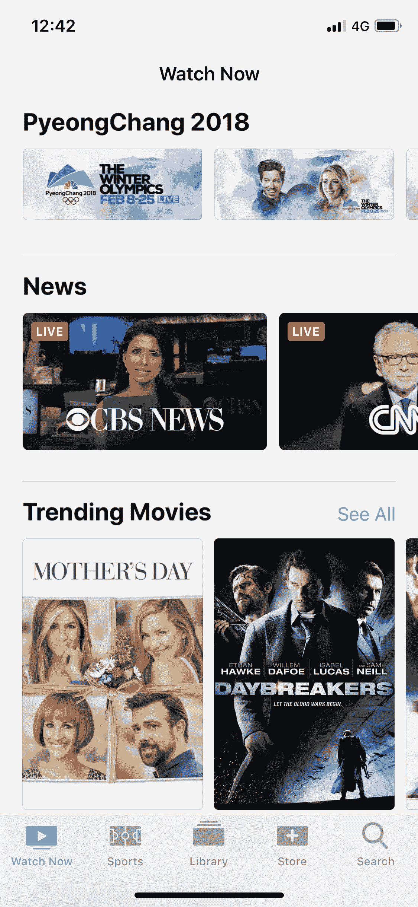

# 苹果为 iOS 和 Apple TV 电视应用程序增加了新闻直播频道 

> 原文：<https://web.archive.org/web/https://techcrunch.com/2018/02/09/apple-adds-live-news-channels-to-tv-app-for-ios-and-apple-tv/>

# 苹果为 iOS 和 Apple TV 的电视应用程序添加了直播新闻频道

在 9 月份对该功能进行了测试后，苹果公司在 iPhone、iPad 和 Apple TV 上的电视应用程序中增加了对直播新闻的支持——9 to 5 MAC[首先发现了新的部分。目前，它非常有限，因为它只支持美国用户的少数几个频道。](https://web.archive.org/web/20221024042621/https://9to5mac.com/2018/02/08/apple-tv-news-section/)

如果你运行的是最新版本的 iOS 和 tvOS，这个功能现在应该是活动的。我在我的 iPhone 上运行的是 iOS 11.2.5，新部分无需任何额外更新即可使用。

在主“立即观看”选项卡上，如果你滚动浏览“下一个”队列和热门推荐，会有一个新的“新闻”部分。它有六个不同的直播流——CBS 新闻、CNN、福克斯新闻频道、切达、美国消费者新闻与商业频道和彭博。

如果你点击这些图标中的一个，它就会在这些应用程序中启动实时流。电视应用程序使用深度链接直接进入直播流。

如果你还没有应用程序，你的设备会问你是否要从应用程序商店下载应用程序。这项新功能应该会推动这六家公司的下载量。

一旦你在你的设备上安装了这些应用程序，你就可以问 Siri“嘿，Siri，我们来看彭博吧”，这样你就不必一开始就打开电视应用程序了。让我们期待苹果公司将这一现场新闻功能带到其他国家。

