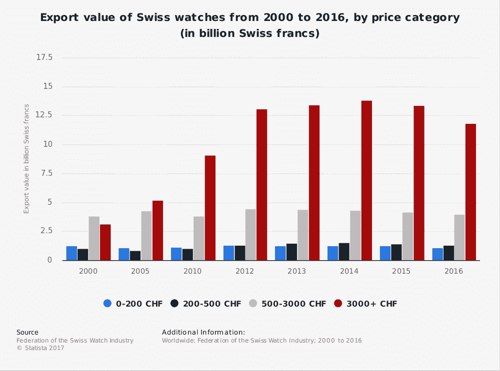

# 苹果和安卓正在摧毁瑞士手表行业

> 原文：<https://web.archive.org/web/https://techcrunch.com/2018/02/13/apple-and-android-are-destroying-the-swiss-watch-industry/>

# 苹果和安卓正在摧毁瑞士钟表业

2017 年第四季度——基本上是在最后一个假期——市场研究公司[科纳仕公司](https://web.archive.org/web/20230302090417/https://www.canalys.com/newsroom/18-million-apple-watches-ship-2017-54-2016)发现[购买苹果手表的人比瑞士手表多。准确地说，是两百万多。](https://web.archive.org/web/20230302090417/https://techcrunch.com/2018/02/06/apple-watch-shipments-jumped-in-2017-according-to-analysts/) [Brian Heater](https://web.archive.org/web/20230302090417/https://techcrunch.com/2018/02/06/apple-watch-shipments-jumped-in-2017-according-to-analysts/) 有更多的数据，但是这个消息对在侏罗山山坡上吃圣雅克烤鸡的人来说是个问题。

这些数字是基于市场数据的估计，但它们仍然指向一种趋势。2016 年，苹果在 Q1 售出了 150 万块手表，而瑞士的销量为 590 万块。在 2017 年 9 月推出 Apple Watch 3 之前，这两个季度的情况大致相同，正好赶上假日购物。新手机和新手表的同时推出意味着升级者的完美风暴，推动苹果手表的总销量超过了瑞士手表的销量。

这种转变并不意味着苹果将保持领先地位——他们有一种产品，而瑞士有数千种产品——但在这种情况下，将单个公司的产量与整个行业的产量进行比较就能说明问题。

我们都互相提醒，戴手表已经过时了。

“我用手机查看时间，”随着手机变得越来越普遍，我们说了将近十年。与此同时，手表制造商放弃了低端市场，开始向高端消费者——鉴赏家——销售手表。

看一下这张图表:

中低端手表的销售停滞不前，而真正的摇钱树——为超级富豪打造的昂贵手表——从 2014 年的高点缓慢下跌。中端手表的价格可能在 500 美元至 3000 美元之间(我甚至会把许多 1 万美元的手表归入中端类别)。与此同时，中国的购买量也在下降，因为相当于奢侈的法律减少了送给腐败官员的昂贵礼物的数量。截至 2017 年 12 月，销售额有所上升[，但不要指望当前的下滑会有太大的提升。](https://web.archive.org/web/20230302090417/https://www.bloomberg.com/news/articles/2017-12-22/november-s-swiss-watch-exports-show-that-china-is-once-again-red-hot)

作为一个机械爱好者——我花了几年时间写了一本关于手表的书——我带着沮丧和一丝幸灾乐祸的心情看待这些趋势。正如我一再说过的，这是瑞士钟表业自找的。虽然小制造商声称年复一年有大量的数字和巨大的成功，但它们正在被 T2 吞噬，而几乎每一个主要的手表品牌都在四处寻找外部买家。向越来越不感兴趣的公众大量生产机械表是没有钱的。

随着时间的流逝，事情会发生变化。曾经强大的瑞士公司将会在他们积累的桂冠的重压下沉没，苹果将会转移到嵌入式大脑植入上，将手表抛在身后。在一场持续了 40 多年的战斗之后，结果将是一个死气沉沉的瑞士工业迎合一个已经发展的世界。