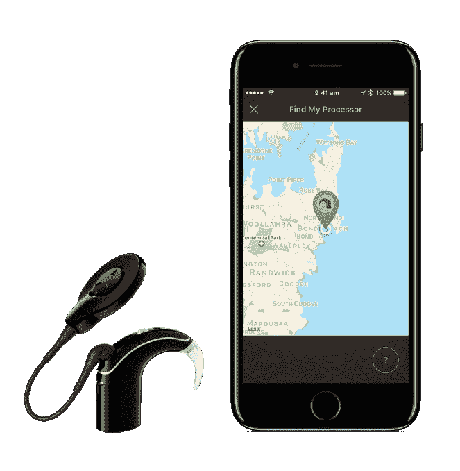

# 苹果和耳蜗合作推出第一个为 iPhone 制造的植入物

> 原文：<https://web.archive.org/web/https://techcrunch.com/2017/07/26/apple-and-cochlear-team-up-to-roll-out-the-first-hearing-aid-implant-made-for-the-iphone/>

# 苹果和耳蜗合作推出第一个为 iPhone 制造的植入物

苹果公司与澳大利亚的耳蜗公司合作，为 iPhone 用户带来第一个为 iPhone 制造的人工耳蜗。

耳蜗的 Nucleus 7 声音处理器于 6 月份获得美国美国食品药品监督管理局的批准，现在可以直接将声音从兼容的 iPhone、iPad 或 iPod touch 传输到声音处理器。

该设备还允许那些通过手术植入植入物的人控制和定制他们 iPhone 的声音。

已经有其他植入物和助听器使用 iOS 应用程序来控制声音和其他功能，Nucleus 自己的[应用程序](https://web.archive.org/web/20230314080619/https://itunes.apple.com/us/app/nucleus-smart/id1210236531?mt=8)可以下载来做同样的事情。然而，耳蜗的最新处理器由手机本身控制，不需要下载应用程序。

超过 5000 万美国人因为这样或那样的原因经历过某种程度的听力损失。苹果公司看到了听力损失的问题，并花了几年时间在公司内部开发助听器项目。

苹果公司很快开发了一个协议，免费提供给助听器和植入设备制造商使用。

“我们希望看到一些东西可以在世界上变得无处不在，”苹果公司全球无障碍政策和倡议高级经理莎拉·赫林格告诉 TechCrunch。“我们希望每个人都使用我们的技术，并说‘哇，我的 iPhone 是我使用过的最好的技术’……随着我们操作系统的每一次迭代，我们的目标是添加新的辅助功能，以便扩大我们对世界各地人们的支持。”

访问您的人工耳蜗的控制设置相对容易。那些获得新的 Nucleus 7 声音处理器或其他为 iPhone 制造的助听器的人只需进入他们的 iPhone 设置，点击“常规”，然后点击“辅助功能”向下移动屏幕，您会看到不同设备的列表，您会看到“听力设备”点击它，然后设备就会像蓝牙设备一样出现在蓝牙设置中。该植入物将与您的 iPhone 配对。

就像耳机或其他支持蓝牙的设备一样，一旦植入物被配对，就可以使用 iPhone 的音量控制来控制它。例如，当一个电话打进来时，你可以在你植入的音量设置下听到那个电话。

新的 Nucleus 7 电池续航时间更长，体积更小，重量比其前身 Nucleus 6 声音处理器轻 24%，非常适合听力损失的儿童。

耳蜗首席执行官克里斯·史密斯在一份声明中说:“Nucleus 7 声音处理器的批准对听力损失者来说是一个转折点，为他们打电话、听高质量立体声音乐、看视频以及将 FaceTime 通话直接传输到他们的人工耳蜗打开了大门。”“这款新的声音处理器建立在我们的长期承诺之上，即帮助更多的听力损失者与他人交流，过上充实的生活。”