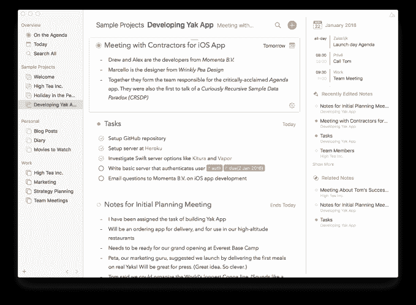
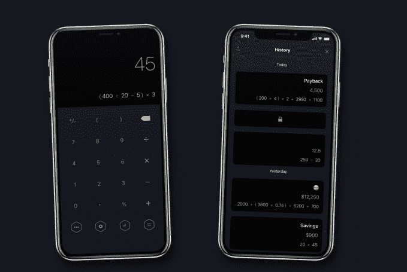
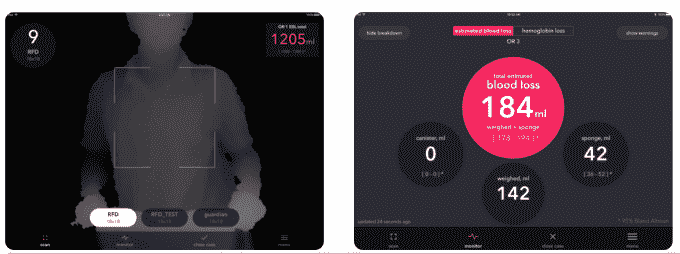
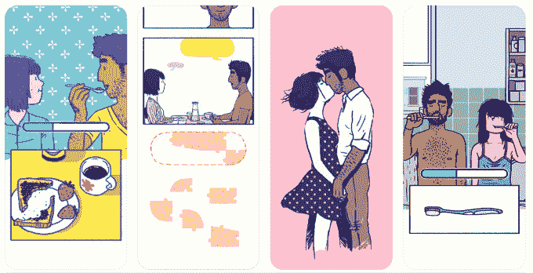

# 苹果宣布了一组非常国际化的苹果设计奖获奖者

> 原文：<https://web.archive.org/web/https://techcrunch.com/2018/06/04/apple-announces-a-very-international-group-of-apple-design-award-winners/>

6 月 4 日星期一下午，苹果在圣何塞举行的全球开发者大会上，在舞台上颁发了年度苹果设计奖。该奖项现已进入第 21 个年头，旨在突出那些为高质量设计树立基准的应用程序，考虑用户界面和用户体验、原创性等因素，以及代表苹果希望在其应用商店中看到更多应用程序类型的其他因素。

其他应用程序开发人员经常通过查看设计奖获得者的名单来了解苹果重视的应用程序和设计的类型。

今年，获奖者是国际人群——尽管美国是苹果最大的市场之一，但只有一名获奖者来自美国。

这位美国获奖者也有点不寻常——它不是一款面向消费者的应用或游戏，而是一款为医疗行业打造的应用或游戏。

其他几个展示高质量的游戏开发具有美丽的艺术品和音乐。

其他人仍然以有趣的方式重新思考我们的标准工具，如笔记应用程序、语言翻译器和计算器。

获奖者的完整名单如下:

[议程](https://web.archive.org/web/20230324220435/https://geo.itunes.apple.com/us/app/agenda-a-new-take-on-notes/id1287445660)(荷兰)

Agenda 是一款用于 Mac 和 iOS 的极简笔记应用程序，采用独特的方法将笔记组织成时间线，使其能够同时跟踪任务的过去、现在和未来。该应用程序还包括精美的笔记和排版，以及经过深思熟虑的导航设计元素，搜索和支持 iCloud 同步和切换。

关于 Agenda 的有趣之处还在于它的[网站](https://web.archive.org/web/20230324220435/https://agenda.com/)突出了独立的 Mac 应用下载。Mac App Store 下载链接被埋在页面底部。

班迪马尔(芬兰)

Bandimal 是一个为孩子们设计的可爱的音乐作曲家，用动物代替乐器。孩子们可以在不知道音符、和弦和乐谱的情况下，通过动物来更换乐器、设置鼓循环和创作旋律。

[Calzy 3](https://web.archive.org/web/20230324220435/https://itunes.apple.com/us/app/calzy-3/id623690732?mt=8) (印度)

Calzy 3 是一个智能的现代计算器应用程序，增加了一个独特的书签功能，用于保存计算结果以供将来参考。它还以周到的方式集成了许多苹果技术，包括在其他应用程序中共享结果的拖放、iMessage 集成、用于查找书签的 Spotlight 搜索、iCloud 同步和切换。

[翻译匡威](https://web.archive.org/web/20230324220435/https://itunes.apple.com/us/app/itranslate-converse/id1241264761?mt=8)(奥)

虽然谷歌翻译是实时翻译应用程序中最知名的，但下载量约为 8000 万次的 iTranslate Converse 提供了一个设计更简单的应用程序，能够自动检测正确的语言，即使在嘈杂的房间里。该应用程序支持 38 种语言，离线工作，使用 3D 触摸，可以在 iPhone 和 Apple Watch 上工作。

在 Apple Watch Series 3 上，你可以在没有 iPhone 的情况下使用该应用程序。

[Triton 海绵](https://web.archive.org/web/20230324220435/https://itunes.apple.com/us/app/triton-sponge/id1156546367?mt=8)(美国)

Gauss Surgical 的 Triton Sponge 是一款致力于一项非常特殊任务的应用程序，用于医疗手术室跟踪失血量，通过手术海绵和吸滤罐上收集的数据进行估计。虽然 Triton Sponge 不是面向消费者的应用程序，但它需要管理一项非常关键甚至是救命的任务。这是通过使用 iOS 技术实现的，包括核心图像、检测海绵的相机深度图、核心 ML 和执行失血量计算的机器学习。该应用程序还能够检测重复的海绵，即使它们以不同的方向举在相机前面。Triton 海绵通过了 FDA 认证，符合 HIPAA 标准。

佛罗伦萨(澳洲)

《佛罗伦萨》是一部互动图形小说，出自[纪念碑谷](https://web.archive.org/web/20230324220435/https://techcrunch.com/tag/monument-valley/)山脉的设计师王合喜，这是一部[半游戏/半漫画的作品，讲述了一个关于爱情和关系的故事](https://web.archive.org/web/20230324220435/https://techcrunch.com/2018/02/14/florence-app-review/)。玩家/读者跟随弗洛伦斯和克里斯相遇、约会、坠入爱河并同居。它展示了手绘艺术和原创音乐，同时向你展示了佛罗伦萨在经历初恋时的生活。

[Playdead 的内幕](https://web.archive.org/web/20230324220435/https://itunes.apple.com/us/app/playdeads-inside/id1201642309?mt=8)(丹麦)

这款屡获殊荣的益智冒险平台游戏来自 Limbo 背后的团队，包括华丽的艺术和动画，但具有更黑暗甚至令人恐惧的基调。你扮演一个无名的男孩，探索一个单色的、可怕的世界，一路上解决难题。(令人毛骨悚然的)声音设计也很突出，当玩家戴上耳机时，可以很好地沉浸在世界中。这款应用可以在 iPhone、iPad 和 Apple TV 上运行，在 App Store 上有 10，000 个五星评价。

[奥拓的奥德赛](https://web.archive.org/web/20230324220435/https://itunes.apple.com/app/altos-odyssey/id1182456409?mt=8)(加拿大)

流行的奥拓冒险的后续产品奥拓奥德赛带来了类似的魔法，但却让玩家进行无休止的沙盘旅行，而不是滑雪。这款游戏利用了 3D 触觉和触觉，以及金属优化的艺术作品和设计，以及其他身临其境的配乐，就像它的前身一样。

[霜冻](https://web.archive.org/web/20230324220435/https://itunes.apple.com/app/apple-store/id1234617736?pt=1902467&mt=8)(奥地利)

这款自由形式的益智游戏让玩家绘制路径，引导成群结队的精灵回到他们的家园星球。它既美丽又——多亏了它的配乐——令人平静。Frost 使用金属技术来创建其流畅的动画，并利用多点触摸等其他技术。这是该团队的第二次胜利，之前他们的游戏 Blek 赢了。

奥德马尔(土耳其)

历时四年制作的 Oddmar 是一个手绘的维京主题侧滚轮，看起来几乎像是一部电影而不是游戏。故事聚焦于主角奥德玛，试图救赎自己，配得上在瓦尔哈拉的一席之地。该游戏针对触摸控制进行了优化，支持游戏控制器，利用金属，包括受传统瑞典音乐影响的配乐，这些音乐实际上是在瑞典的一个小工作室录制的。

所有获胜者都将获得一个可以发光的实心铝制奖杯(如上图),以及大量苹果纪念品，包括精心设计的 iMac Pro、iPad Pro、iPhone X、AirPods、MacBook Pro 15”以及苹果 iOS 应用商店的曝光率。

你可以在这里观看获胜者的重播。

【T2