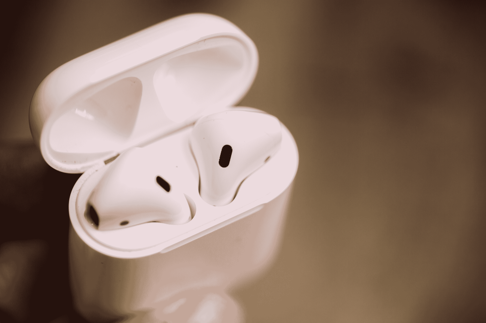

# 苹果发布 AirPods 无线充电外壳

> 原文：<https://web.archive.org/web/https://techcrunch.com/2017/09/12/apple-announces-a-wireless-charging-case-for-the-airpods/>

# 苹果发布 AirPods 无线充电盒

苹果在 iPhone 7 的发布会上宣布了 AirPods。一年后，该公司已经在更新它的无线耳塞——至少是它的外壳。即使 AirPods 在大多数商店仍然缺货，该公司刚刚宣布了一个新的可选充电外壳。

AirPods 外壳仍然有效，看起来或多或少还是老样子。但是指示灯现在在外壳外面，这样你就可以检查电池的状态，而不必打开外壳。这是为什么呢？因为你可以把它放在 AirPower 无线充电板上，然后忘记它。

之前的 AirPods 外壳也有一个 LED，但它位于外壳内部。它在充电时呈橙色闪烁，充电完成后呈稳定绿色。它看起来像这样:

如果你试图将 AirPods 与 Android 手机或 PC 配对，你必须按下外壳背面的配对按钮，直到 LED 闪烁。配对过程现在不那么尴尬了，因为你不必在摆弄手机的同时打开外壳。

在苹果设备上，你不会遇到同样的问题，因为你只需打开外壳，将它与手机配对一次。然后它会自动与你所有的苹果设备配对。

AirPower 充电器将于明年推出，所以不要指望现在就能买到这款可选的 AirPods 保护套。