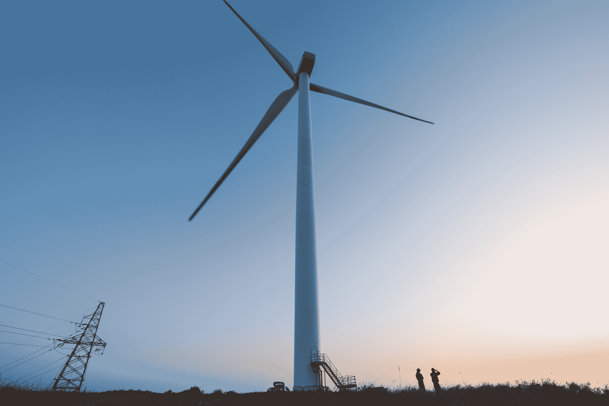

# 苹果宣布在中国设立清洁能源基金 

> 原文：<https://web.archive.org/web/https://techcrunch.com/2018/07/13/apple-announces-clean-energy-fund-in-china/>

# 苹果宣布在中国设立清洁能源基金

苹果公司宣布了一项新的投资基金，以促进中国清洁能源的使用。该公司不只是试图改变自己的办公室和设施。苹果还与供应商合作，全面扩大清洁能源的使用。

特别是对于这笔基金，苹果和 10 家供应商将在未来四年投资 3 亿美元。总体而言，该公司预计将资助多个清洁能源项目，在中国生产 10 亿瓦的可再生能源。

苹果不会自己管理基金。该公司正与德意志银行旗下的 DWS 集团合作。DWS 也将参与该基金。

该公司几年前开始致力于可再生能源项目。今年早些时候，苹果[声称](https://web.archive.org/web/20221025222232/https://techcrunch.com/2018/04/09/apple-says-its-global-facilities-are-now-powered-by-100-percent-clean-energy/)其 100%的办公室、零售店、数据中心和苹果拥有的设施现在都由可再生能源供电。

说到供应商，苹果还没到那一步。该公司早在 2015 年就与 23 个制造合作伙伴启动了供应商清洁能源计划，并定期分享[的更新](https://web.archive.org/web/20221025222232/https://www.apple.com/ru/environment/pdf/Apple_Supplier_Clean_Energy_Program_Update_April_2018.pdf)——富士康似乎到目前为止还没有。

到 2020 年，苹果及其供应商希望生产 40 亿瓦的清洁能源。老实说，这对地球来说是个好消息。

