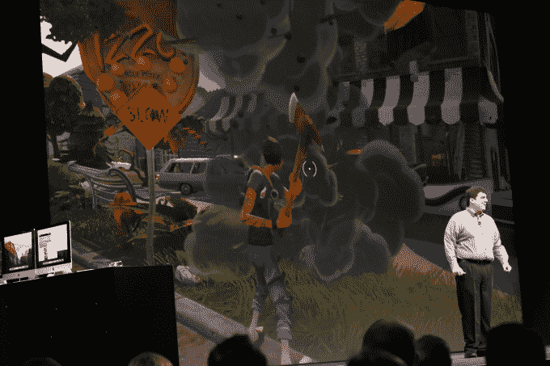

# 苹果宣布 Mac OS X 10.11 El Capitan 

> 原文：<https://web.archive.org/web/https://techcrunch.com/2015/06/08/apple-announces-mac-os-x-10-11-el-capitan/>

在旧金山举行的全球开发者大会上，苹果公司刚刚宣布了其桌面操作系统的最新版本。

苹果高级副总裁克雷格·费德里吉(Craig Federighi)登台亮相，重点介绍了对 Spotlight、操作系统内置应用程序和窗口管理功能的升级。

Federighi 首先在 Mail 中演示了几个手势，包括邮箱式的滑动来删除或标记为新的。然后他转向 Safari，展示了用户如何能够在浏览器中固定标签，在界面左侧给它们一个专用槽，并在浏览器重新打开时预加载它们。

继续讨论更多漂亮的特性，Federighi 展示了 Spotlight 是如何随着自然语言处理而更新的。你可以搜索“显示所有我忽略的菲尔的邮件”，它会分析你的句子，为你显示 Mac 应用程序中的正确内容。

El Capitan 还采用了一些 windows 用户可能很熟悉的 Windows 管理特性。例如，将窗口拖动到桌面的两侧会自动填充屏幕的这一侧，节省了调整窗口大小以填充未使用空间的时间。

Federighi 宣布 OS X 将包含 Metal API，该 API 允许在 iOS 设备上实现更快的图形性能。苹果声称它将使桌面渲染性能提高 10 倍，并在舞台上展示了 Epic 游戏，以展示低级图形编程的优势。

苹果表示，它已经在 OS X 上获得了一些主要的支持，2K Games，暴雪，Unreal 和 Unity 将 API 集成到了他们的渲染引擎中。

Mac OS X 10.11 沿袭了去年发布的“约塞米蒂”(Yosemite)，它将 iOS 7 和 8 的外观带到了桌面上，并与 iPhone 和 iPad 紧密集成，具有“切换”和“连续性”等功能

El Capitan 的开发者测试版今天推出，但其他人将有机会在 7 月份推出公共测试版时尝试该操作系统。

