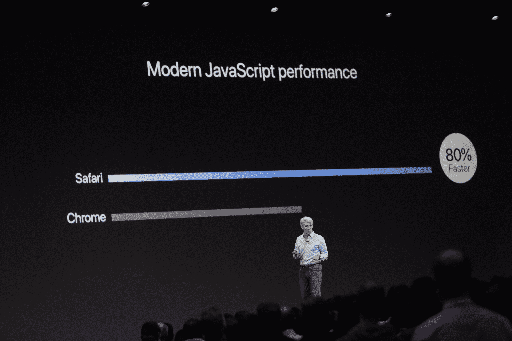
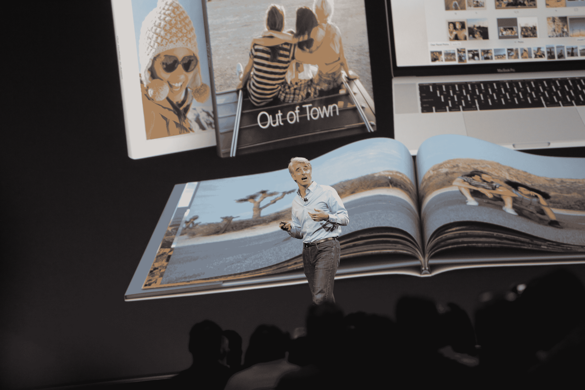
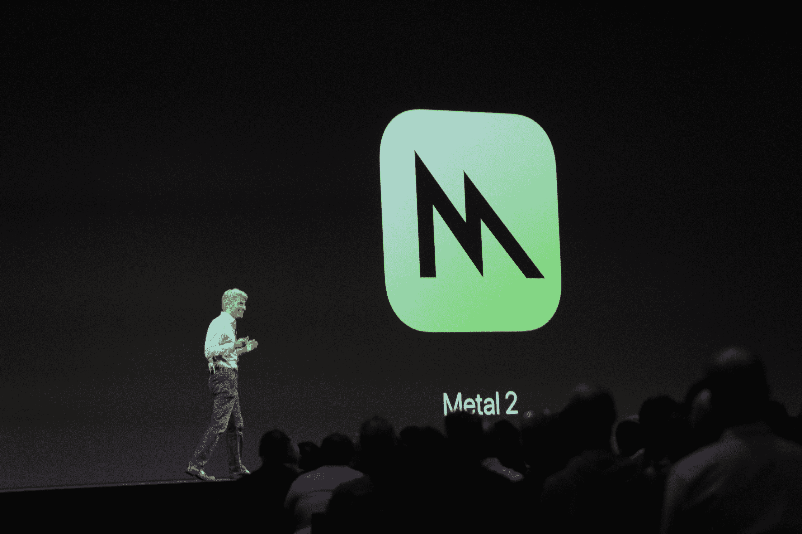
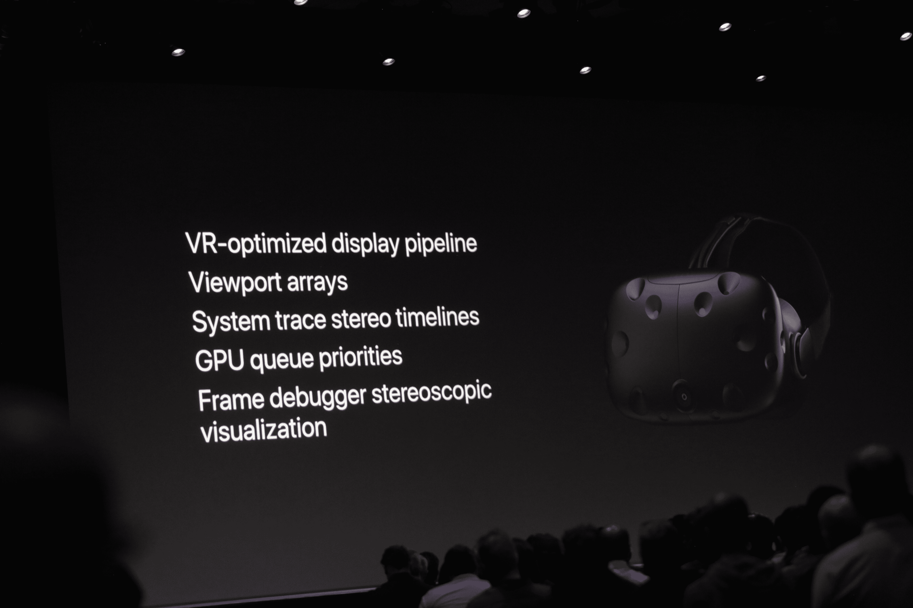

# 苹果宣布 macOS High Sierra 

> 原文：<https://web.archive.org/web/https://techcrunch.com/2017/06/05/apple-announces-macos-high-sierra/>

正如预期的那样，苹果今天发布了下一版本的 macOS，你可能仍然会提到 OS X 的桌面操作系统。10.13 版本将采用“macOS High Sierra”的名称，并包括新功能，如改进的文件系统和对照片和邮件等核心 macOS 应用程序的更新。开发者测试版现已对开发者开放；消费者可以注册一个将于 6 月下旬上线的公开测试版。

在今天的发布会之前，几乎没有任何泄露，可能是因为这个团队并没有真的想在这次发布中重新发明轮子。苹果公司的克雷格·费德里吉(Craig Federighi)今天指出，该团队希望用最后一年来完善 macOS Sierra。Federighi 指出，High Sierra 完全是关于为新技术提供基础的深度技术。

High Sierra 的新功能是 Safari 的升级版，苹果称这将是最快的网络浏览器，特别是在 JavaScript 性能方面。不过，也许更重要的是，Safari 现在还阻止自动播放视频，并将使用机器学习来识别追踪器并隔离跨网站追踪器，这样广告商就无法轻松地跨网站追踪你。

Federighi 指出，内置的邮件应用程序现在使用更少的空间来存储邮件，照片也获得了重大更新，现在可以更好地利用各种机器学习技术来更好地识别人脸和改进排序。该公司还向第三方应用程序开放其相册打印服务(鉴于谷歌的相册仅在几周前推出，这是一个有趣的时机)。

但这次发布主要是关于基本面的。例如，macOS 上的默认文件系统现在是苹果文件系统(APFS)。例如，它是一个 64 位系统，内置崩溃保护和即时文件和目录克隆。这是苹果已经用于 iOS 和 tvOS 的相同文件系统。

MacOS 还支持 HEVC 作为默认视频容器，它将取代 H.264。这将在新 MAC 上进行硬件加速，并集成到 Final Cut 等应用程序中。在图形方面，苹果还宣布了其图形渲染框架的第二个版本 Metal 2。这里的重点主要是图形速度，但它现在也可以用来加速 GPU 上的机器学习工作负载。此外，Metal 2 现在可以访问外部图形，使用带 AMD 显卡的雷电 3 外壳，现在可供开发者使用。

Metal 也在获得 VR 支持。该公司正在与 Steam、Unity 和 Unreal 合作，为 Mac 提供更好的虚拟现实支持(当然，这只是因为新的 Mac 硬件现在配备了改进的显卡来驱动这种虚拟现实体验)。

去年 9 月，之前版本的 macOS 以“Sierra”的名字上线。那次发布的亮点是在桌面上增加了 Siri。我不知道有多少人使用它，但是那些使用它的人肯定会发现它很有用。其他新功能包括应用程序以标签形式打开新窗口的能力(就像你在浏览器中一样)，在桌面上支持 Apple Pay，在附近的 Apple Watch 的帮助下免提解锁，以及对 macOS 上几乎所有默认应用程序的更新，如信息和照片。