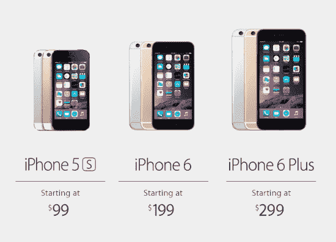

# 苹果发布两款新 iPhone:iPhone 6 和 iPhone 6 Plus 

> 原文：<https://web.archive.org/web/https://techcrunch.com/2014/09/09/apple-announces-two-new-iphones-iphone-6-and-iphone-6-plus/>

# 苹果发布两款新 iPhone:iPhone 6 和 iPhone 6 Plus

就在这里。

经过几个月的疯狂猜测(以及异常多的明显泄露)，新 iPhone 已经到来。事实上，*两款新 iPhone 已经上市——iPhone 6 和 iPhone 6 Plus。*

就在我们说话的时候，苹果公司正在宣布新设备，礼堂里坐满了从史蒂芬·弗莱和奥兹医生到超级明星，如我们自己的[现场博客达雷尔·埃瑟林顿和马修·潘扎里诺。](https://web.archive.org/web/20221205122806/https://beta.techcrunch.com/2014/09/09/apple-iphone-event-liveblog/)

奇怪的是，宣布会在库比蒂诺的弗林特中心举行。这是一个苹果公司已经超过 15 年没有使用的发布会场所，但它也是苹果公司 1984 年发布第一代 Mac 电脑和 1998 年发布第一代 iMac 电脑的地方。

这条新闻在我们写这篇文章的第一秒就被打破了，所以当他们进来的时候更新页面。

**以下是我们目前所知的:**

*   两款手机都配有“Retina HD”显示屏；iPhone 6 的尺寸为 4.7 英寸(1334×750)，而 iPhone 6 Plus 的尺寸为 5.5 英寸(1920×1080)。
*   显示器正面的玻璃现在弯曲成机身，而不是以前所有型号的平边
*   苹果表示，这是“他们有史以来最薄的手机”，分别为 6.9 毫米和 7.1 毫米。
*   这两款手机都由苹果新的 A8 处理器驱动，苹果声称在处理能力上比 A7 至少快 25%，在图形渲染能力上快 50%。
*   苹果声称全面大幅提高了电池寿命；我们抓取了一张表格的截图，对比了 5S、6 和 6 Plus 在不同情况下的电池续航时间— [点击此处](https://web.archive.org/web/20221205122806/https://beta.techcrunch.com/wp-content/uploads/2014/09/battery.png)。
*   两款手机都有金色、银色和“太空灰”三种颜色
*   这两款手机都支持 802.11ac WiFi，这是一种相对较新的 WiFi 技术，理论上可以达到最大值。大约 1 Gbps 的传输速度
*   VoLTE(LTE 语音)支持允许在 LTE 网络上同时传输语音/数据，同时大幅提高语音质量。
*   两款手机的后置摄像头都将保持 5S 的 800 万像素，尽管苹果公司声称它们在不增加像素的情况下提高了图像质量
*   后置摄像头现在可以以 240fps 的速度拍摄超慢动作视频
*   两款手机现在都有“相位检测”自动对焦[，类似于大多数单反相机使用的](https://web.archive.org/web/20221205122806/https://beta.techcrunch.com/2014/09/09/apples-new-iphones-get-dslr-like-camera-features/)，允许更快的照片对焦。
*   6 Plus 将具有光学图像稳定功能，理论上可以帮助相机抵消手抖动带来的少量模糊
*   苹果将采用 NFC 的古老传闻终于成真了！两款手机都将内置 NFC 功能，支持移动支付。苹果宣布麦当劳、全食超市、迪士尼、Panera、丝芙兰(当然还有苹果自己)将支持该设备的一键支付，尽管“Apple Pay”要到 10 月份才会推出。
*   16GB 的 iPhone 6 合约价为 199 美元(64GB 为 299 美元，128GB 为 399 美元)，而 16GB 的 iPhone 6 Plus 合约价为 299 美元(64GB 为 399 美元，128GB 为 499 美元)
*   预购将于 9 月 12 日开始，9 月 19 日上市。

