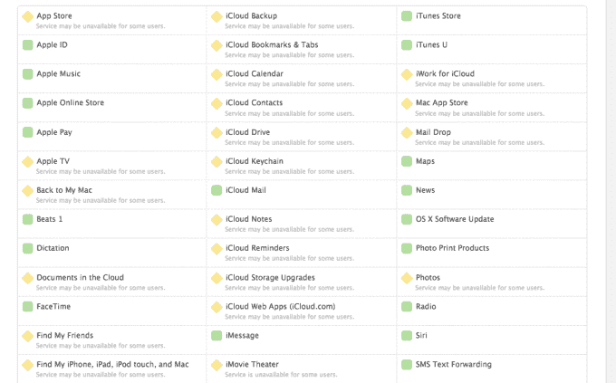
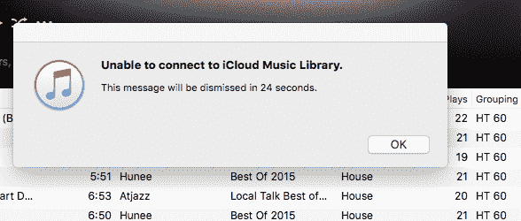

# 苹果应用商店关闭 

> 原文：<https://web.archive.org/web/https://techcrunch.com/2016/06/02/apple-app-store-goes-down/>

苹果应用商店，无论是手机还是桌面，似乎都遇到了一些技术难题。

据报道，大约在美国东部时间下午 3:30 开始停机[，苹果的支持网站](https://web.archive.org/web/20230129223257/http://www.idownloadblog.com/2016/06/02/app-store-down/)[证实了停机](https://web.archive.org/web/20230129223257/https://www.apple.com/support/systemstatus/)。

起初，只是应用程序商店出现故障，不允许用户下载新应用程序或通过商店进行搜索。试图在 App Store 上冲浪的用户会立即被告知“iTunes Store 目前无法处理购买。”

人们还报告说 Apple Music iCloud 功能已经关闭。

然而，现在看来，苹果的许多其他服务都遇到了麻烦，包括苹果音乐、照片、苹果电视、云中查找我的 iPhone 和 iTunes，以及许多 iCloud 服务(备份、书签和标签、日历、通讯录、驱动器、钥匙链、备忘录、提醒等)。

换句话说，现在可能不是在你的电脑或 iPhone 上做任何繁重工作(软件更新、重置、备份)的时候。

基于推特的[，最普遍的问题似乎与应用商店和苹果音乐有关。](https://web.archive.org/web/20230129223257/https://twitter.com/search?f=tweets&vertical=default&q=app%20store%20down&src=typd)

苹果支持人员在推特上表示，他们已经意识到这个问题:

[//platform . Twitter . com/widgets . js](//web.archive.org/web/20230129223257/https://platform.twitter.com/widgets.js)

我们已经联系了苹果，并将随着事情的进展更新这个故事。

美国东部时间下午 5:30 更新:苹果的一些服务已经恢复。然而，App Store 仍然处于关闭状态。

美国东部时间下午 7:45 更新:应用程序商店似乎已经恢复了。