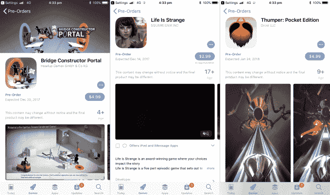

# 苹果应用商店现在允许你在发布 TechCrunch 之前预购 iOS 应用和游戏

> 原文：<https://web.archive.org/web/https://techcrunch.com/2017/12/12/apple-app-store-ios-pre-order-apps/>

# 苹果的应用商店现在允许你在 iOS 应用和游戏发布前预购

苹果已经悄悄地允许开发者们可以预购他们的应用。

这是一个基本功能——正如 Android 狂热分子会指出的那样——但无论如何这是 App Store 所缺少的一个功能。

即将推出的应用程序现在将被允许在发布前 90 天和发布前两天在 App Store 中列出。这适用于新的应用程序，而不是现有应用程序的更新。

一旦应用程序发布，如果用户点击预购按钮，它将自动下载到用户的设备上。在应用程序有价格的情况下，就像游戏中常见的那样，只有当应用程序可供下载时，才会向客户收费。在发布日期到来之前，用户可以自由取消他们的预购。

最感兴趣的可能是来自公司的直接面向用户的营销——苹果正在给开发者提供特殊的品牌帮助——但应用程序也可以在 App Store 游戏标签下的新“预购”部分找到。这款软件在美国有售，但似乎还没有登陆英国和其他全球市场的应用商店。

一年多前，苹果允许用户注册，以便在应用商店有新应用时得到通知。

自动处理下载更有意义，特别是考虑到用户最近收到的大量通知，此外，这确实为企业提前营销他们即将推出的应用和服务打开了大门。