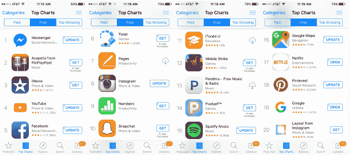
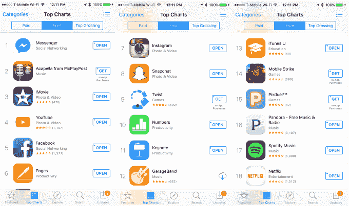
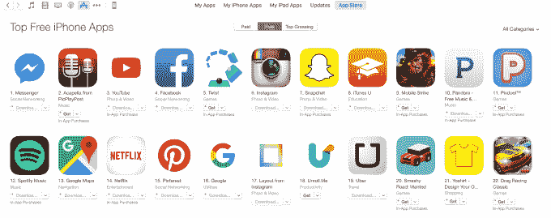

# 苹果似乎在 iPhone 应用商店的排行榜上推广自己的应用程序 

> 原文：<https://web.archive.org/web/https://techcrunch.com/2015/11/16/apple-appears-to-be-promoting-its-own-apps-in-the-iphone-app-stores-top-charts/>

苹果似乎正在利用其 iPhone 应用商店的 Top Charts 部分来推广自己的应用程序，方法是将 Numbers、Keynote、Pages、iMovie 和 iTunes U 等应用程序放在比它们通常排名更高的位置。当在 iPhone 上查看时，这些应用程序混合显示在 iPhone 上的前 20 个免费应用程序中，但当从桌面版本的应用程序商店中查看时，它们要么根本不在前 20 名中，要么位于不同的位置。

当然，这种差异可能与苹果应用商店排名算法中的一个错误有关，但如果真是这样的话，这是一个持续的问题。

除了苹果之外，这似乎并没有影响到大多数其他顶级应用的相对排名。也就是说，Facebook Messenger 仍然是 App Store 的第一名，其次是 PicPlayPost 的新人 Acapella，然后是 YouTube 和脸书。

然而，在桌面版本的商店中，一款名为 Twist 的游戏的排名高于 Instagram 和 Snapchat，而在 iPhone 6s 版本的应用商店中，Twist 立即显示在这两个应用程序之后，即使是在同时查看这两个图表的情况下。

同样有趣的是，热门免费排行榜似乎因设备而异。例如，我与另一位 TechCrunch 作者在同一时间比较了运行最新版本 iOS 的 iPhone 5s 和 iPhone 6s 的排名，发现我们在各自的手机上有两个不同版本的 App Store 免费排行榜。

在 5s 和 6s 上，iMovie 排名第三，但在 5s 页面上排名第七，而在 6s 页面上排名第六。数字在 5s 上是 9 号，但在 6s 上是 10 号。iTunes U 在 5s 上排名第 11，但在 6s 上排名第 13。

**iPhone 5s (iOS 9.1):**

**iPhone 6s (iOS 9.1):**

**Mac OS X (El Capitan)台式机:**

app store 优化公司 Sensor Tower [上周开始调查](https://web.archive.org/web/20230130231911/https://sensortower.com/blog/apple-app-store-top-free-charts-behavior)这种奇怪的行为。

根据最初的[调查结果](https://web.archive.org/web/20230130231911/https://sensortower.com/blog/apple-app-store-top-free-charts-behavior)，苹果的应用程序似乎随机出现在 iPhone 上的 App Store 应用程序中，有时甚至会在安装到最终用户的设备上后仍然列在排行榜的前列。当该公司注意到自己的排名数据与 App Store 本身显示的数据不匹配时，就对这种行为发出了警告。

根据 Sensor Tower 的数据，只有 GarageBand 和 iTunes U 应该排在前 10 名，但苹果的生产力套件应用或 iMovie 除外。

Sensor Tower 首先在运行最新版本 iOS (9.1)的几款手机上测试了 App Store，现在也在 iPhone 6 和 iPad mini 上测试了这一功能，并遇到了相同的差异。此外，他们也注意到这个问题不会影响苹果电脑上的 iTunes 应用商店。

然而，Sensor Tower 发现，运行旧版本 iOS 软件(8.3)的 iPhone 不会出现与其他设备相同的问题。

这个问题很奇怪，因为它不可能总是被复制。例如，AppFigures 首席执行官 Ariel Michaeli 告诉我们，他在自己的 iPhone 和台式机上看到了同样的排行榜。

没有苹果的官方确认(尚未提供任何评论)，你不能正式将此归因于苹果对 Top Charts 排名的直接、手动操纵。可能是个 bug。

也就是说，值得指出的是，这不是苹果自己的应用程序第一次“神奇地”出现在一些设备的排行榜上，而不是其他设备。例如，[一位 Twitter 用户在 5 月份](https://web.archive.org/web/20230130231911/https://twitter.com/MikeBeas/status/602139306392690688)碰巧在他的 iPhone 4 和 iPhone 6 上发现了类似的奇怪现象。他声称，当在两台设备上并排查看 App Store 时，Keynote、GarageBand、Numbers 和 Apple Store 没有出现在 iPhone 4 的排行榜上，但出现在 iPhone 6 上。

过去几年，苹果也曾利用其应用商店更明目张胆地推广自己的应用。例如，[当用户在 App Store 上搜索“电影”、“短信”、“网络”或“Siri”等相关术语时，它曾经开始返回自己的股票应用程序](https://web.archive.org/web/20230130231911/http://9to5mac.com/2013/10/31/apple-promoting-its-own-stock-ios-apps-for-popular-app-store-search-queries/)，如 iTunes Store、Messages、Safari 甚至 Siri。当搜索 iCloud 这个词时，它还会将用户指向 I cloud。

如果目前的排名操纵是手动进行的，那么它应该是特定于设备的——拥有 6s 或 6s Plus 等新 iphone 的用户可能会被提示安装苹果的应用程序，因为他们会转向 App Store 的排行榜，以在他们的新手机中装满应用程序。

然而，对于第三方开发者来说，这里的问题是这种操纵(或者说是故障)是否会影响他们自己的排名。如果苹果将自己的应用程序插入顶级排名，它可能会将开发者的应用程序完全挤出排行榜，或者进一步下滑，这取决于设备或最终用户。

苹果一直有特定设备的图表，例如在比较 iphone 和 iPads 时，但我们没有看到同一设备的两个不同型号之间的特定设备图表，例如两个 iphone。