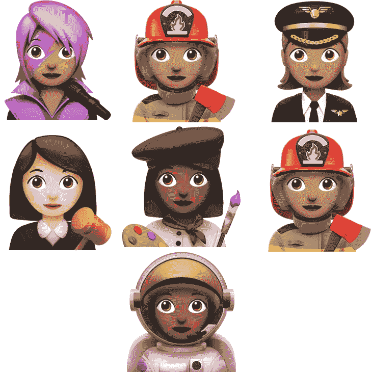

# 苹果带回了桃子屁股表情符号 

> 原文：<https://web.archive.org/web/https://techcrunch.com/2016/11/15/apple-brings-back-the-peach-butt-emoji/>

# 苹果带回了桃屁股表情符号

没人能碰桃屁股表情符号，苹果也不行。几周前，苹果放弃了 iOS 10.2 的第一个 iOS 测试版，其中有几十个新的和重新设计的表情符号。这个世界需要更多的表情符号，我完全支持。但苹果也意外地重新设计了桃子表情符号，有点太字面化了——[看起来不太像屁股](https://web.archive.org/web/20221128192524/https://beta.techcrunch.com/2016/11/01/apple-give-me-back-my-emoji/)。冷静点，没必要抓干草叉。苹果[发布了一个新的 beta 版，上面有一个看起来像屁股的桃子表情符号。](https://web.archive.org/web/20221128192524/http://thenextweb.com/apple/2016/11/15/apple-emoji-sexting/)

正如你在上面的图片中看到的，新的桃子表情符号看起来*更像一个屁股*。苹果不仅仅是回滚到旧的表情符号设计。该公司再次致电其表情符号设计师，要求他们重新绘制桃子表情符号。

表情符号意外地成为一种有自己一套规则的通用视觉语言。人们现在一直使用表情符号来给他们的信息添加情感和个性。有时候，一个桃子可以变得比一个普通的桃子更有意义。TechCrunch 的 Devin Coldewey 写了一首关于桃子表情符号的颂歌，很好地总结了为什么保持桃子的屁股很重要。

苹果昨天发布了 iOS 10.2 beta 3，它仍然只对开发者和公众测试者开放。你可以期待 iOS 10.2 的最终版本在未来几周内推出，其中包含大量新的表情符号。

我最喜欢的是新职业。教师、宇航员、焊工、程序员、商业工作者、农民、科学家、厨师、学生、机械师、医生/卫生工作者等都有男性和女性表情符号

但是 [Unicode 协会](https://web.archive.org/web/20221128192524/https://en.wikipedia.org/wiki/Unicode)也在不断更新以跟上新的手势表情符号。将会有一个手指交叉的表情符号，一个耸肩的表情符号和一个 facepalm 表情符号。你的朋友们也需要更新他们的 iPhones，然后你们才能互相发送宇航员表情符号。

