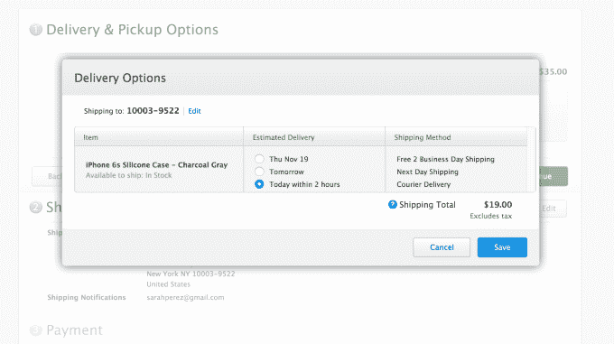

# 苹果通过扩大 Postmates 合作伙伴关系 TechCrunch 为纽约带来当日送达服务

> 原文：<https://web.archive.org/web/https://techcrunch.com/2015/11/17/apple-brings-same-day-delivery-to-new-york-through-expanded-postmates-partnership/>

# 苹果通过扩大 Postmates 合作伙伴关系将当日送达带到纽约

今年早些时候，[苹果开始通过其苹果商店移动应用程序提供其产品和配件的当天交付](https://web.archive.org/web/20221206014640/https://beta.techcrunch.com/2015/05/27/postmates-is-working-with-apple-to-offer-same-day-delivery/)，随后[凭借其与交付服务](https://web.archive.org/web/20221206014640/https://beta.techcrunch.com/2015/06/05/in-partnership-with-postmates-apple-expands-same-day-delivery-to-its-web-store/)[邮局](https://web.archive.org/web/20221206014640/http://www.postmates.com/)的合作，将该选项扩展到其在线网络商店。然而，当时，苹果商店的送货仅限于旧金山湾区的特定邮政编码。现在，位于纽约市的人也可以通过快递选择当天送达。

MacRumors 首先发现了这种扩张，他指出，曼哈顿的大部分地区都提供当天送达服务，包括在测试新选项时检查的大约 43 个邮政编码中的 37 个。报道称，在因伍德和华盛顿高地等北部社区的更有限区域也有这种服务。

我们已经确认，苹果送货服务在纽约的苹果网站和移动应用程序上都是实时的。

和以前一样，消费者可以在网上以及苹果商店移动应用程序中订购产品，然后选择“快递”选项，这需要额外支付 19 美元——这是一种固定费用。根据苹果公司的[文件](https://web.archive.org/web/20221206014640/http://www.apple.com/shop/help/shipping_delivery)，快递是一种当天送达的选择，保证在 2 小时内送达，在营业时间内为特定邮政编码的特定商品送达。

有传言称，纽约是苹果商店支持这项送货服务的下一个城市。本月，一些苹果顾客甚至被零售人员告知，Postmates 快递将“很快”送达纽约市:

最初的苹果合作伙伴关系对这家总部位于旧金山的初创公司来说是一个显著的胜利。向纽约的扩张似乎表明，早期的试验非常成功，足以让该公司在自己的在线和移动应用程序中进一步推出当天送达选项。

这种合作关系在未来仍有扩大的潜力。如今，Postmates 在[的许多美国主要城市](https://web.archive.org/web/20221206014640/https://postmates.com/)开展业务，当然，其中大多数城市在 Postmates 送货基地附近都有苹果专卖店。