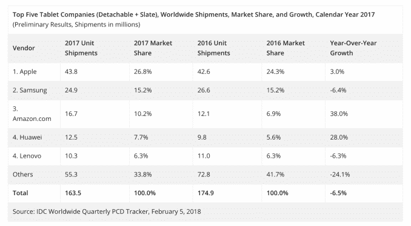

# 随着销量再次下滑，苹果继续主导平板电脑市场

> 原文：<https://web.archive.org/web/https://techcrunch.com/2018/02/06/apple-continues-to-dominant-the-tablet-market/>

# 随着销量再次下滑，苹果继续主导平板电脑市场

[比特币和加密不是唯一下降的东西](https://web.archive.org/web/20230406084054/https://techcrunch.com/2018/02/01/why-is-bitcoins-price-down/)，根据新的数据，2017 年平板设备的销量再次下降。

[来自分析公司 IDC](https://web.archive.org/web/20230406084054/https://www.idc.com/getdoc.jsp?containerId=prUS43549518) 的数据显示，去年平板电脑的整体出货量下降了 6.5%，至 1.635 亿台。这低于 2016 年的 1.749 亿，当时的年降幅为两位数。

尽管整体需求下降，苹果公司仍设法将其出货量从 4260 万部增长到 4380 万部，使其市场份额从一年前的 24%上升到 27%。三星(第二)和联想(并列第四)的销售额下降，但亚马逊(第三)和联想(也是第四)出现增长。

在显示苹果有多么占主导地位的过程中，“其他人”占据了 34%的市场份额，只有三星和(大约)亚马逊在 2017 年获得了两位数的市场份额。

IDC 发现，虽然传统平板电脑的出货量下降，但可拆卸平板电脑的出货量同比增长了 1.2%。事实上，在 2017 年最后一个季度-假期期间-可拆卸件增长了 10%，达到 650 万件。相比之下，本季度平板电脑的销量为 4310 万部，苹果占据了其中 27%的份额。