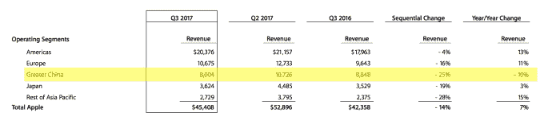

# 苹果继续在中国苦苦挣扎，收入下降 10%

> 原文：<https://web.archive.org/web/https://techcrunch.com/2017/08/01/apple-continues-to-struggle-in-china-as-revenue-drops-10/>

# 苹果收入下降 10%，继续在中国苦苦挣扎

苹果公司本季度表现相当不错——股价在数小时后上涨了 4 %,收入为 454 亿美元，每股收益为 1.67 美元。

但该公司的业绩中有一个黑点——那就是在大中华区的表现。

苹果本季度从大中华区获得了略高于 80 亿美元的收入，不到两年前在 Q2 2015 年的一半。与去年同期相比下降了 10 %,与上一季度相比下降了 25%。相比之下，美洲的收入同比增长 13%，仅比上一季度下降 4%。

大中华区也是唯一一个同比负增长的地区。

至少苹果似乎意识到了这个问题，并正在着手解决。几周前，[公司任命了大中华区的第一位董事总经理，他将直接向首席执行官蒂姆·库克和首席运营官·杰夫·威廉姆斯汇报。](https://web.archive.org/web/20221208211005/https://beta.techcrunch.com/2017/07/18/apple-appoints-first-managing-director-of-its-china-business/)

中国曾经是苹果的一个亮点，也是该公司增长最快的地区。Q2 2015 年奥运会从中国获得了 168 亿美元的收入。两年后，该公司现在的利润还不到这个数字的一半。

在财报电话会议上，苹果首席执行官蒂姆·库克(Tim Cook)解释说，香港继续拖累整个大中华区的收入，他们从大陆看到的情况更令人鼓舞。库克还表示，他认为微信和其他消息服务的流行是一件好事，可以让潜在的新客户更容易转向 iOS，因为该平台可以在 iPhone 和用户的旧手机上运行。