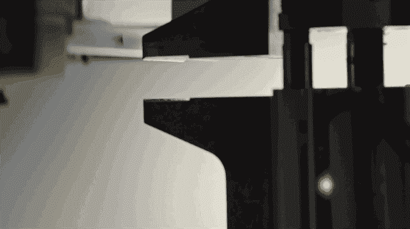

# 苹果公司创造了 Liam，一个拆解二手 iPhones 的机器人

> 原文：<https://web.archive.org/web/http://techcrunch.com/2016/03/21/apple-creates-robot-to-rip-apart-iphones/>

# 苹果公司创造了利亚姆，一个拆解二手 iPhones 的机器人

苹果公司开始了今天的主题演讲，强调了他们对再利用、减少和回收的贡献。作为其中的一部分，该公司透露，它制造了利亚姆，一个专门设计的机器人，可以拆开你的 iPhone，以便在铃声响起时可以回收。

莉萨·杰克森(Lisa Jackson)是苹果公司负责环境、政策和社会倡议的 SVP，她在舞台上展示了利亚姆，这是全世界安卓粉丝羡慕的对象:这是一个专门设计用来拆卸 iPhones 的工业机器人。利亚姆在拆解手机之前会检测手机中的各种部件，然后将残骸和各个部件送到加工厂进行回收。

具体来说，苹果强调 Liam 从电池中回收了钴和锂，从相机中回收了金和铜，从逻辑板和铝外壳中回收了银和铂。

拿着，愚蠢的小 SIM 托盘。Muuhahahaha 哈哈。

让苹果公司让回收变得性感，并给它的 iPhone 碎纸机起个名字，但现在你有了:世界上第一个回收机器人，它如此可爱，你会想把它拴在皮带上，在公园里到处炫耀。