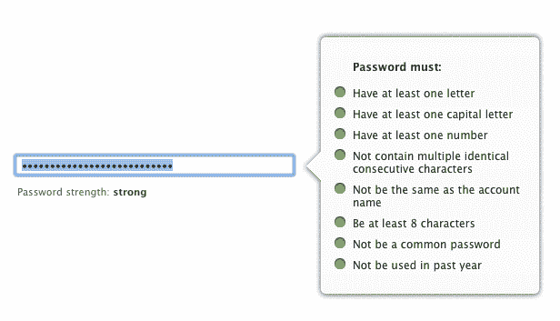

# 苹果否认名人照片泄露事件破坏了其系统

> 原文：<https://web.archive.org/web/https://techcrunch.com/2014/09/02/apple-denies-any-breach-of-its-systems-in-celebrity-photo-hacking/>

# 苹果否认名人照片泄露事件破坏了其系统

苹果发布了一份官方声明，以回应其 iCloud 存储系统可能是[最近泄露大量裸体或私人名人照片](https://web.archive.org/web/20230315124007/https://techcrunch.com/2014/09/01/heres-what-we-know-so-far-about-the-celebrity-photo-hack/)的幕后黑手的指控，受害者包括詹妮弗·劳伦斯。在声明中，苹果否认其系统存在任何漏洞，但承认名人账户被攻击者利用标准的网络钓鱼技术猜测用户名、密码和安全问题的答案。

苹果声明全文:

> 加州库比蒂诺——我们想提供一些关于某些名人照片被盗的最新调查。当我们得知盗窃事件时，我们非常愤怒，并立即动员苹果公司的工程师来寻找源头。我们客户的隐私和安全对我们来说至关重要。经过 40 多个小时的调查，我们发现某些名人的帐户受到了针对用户名、密码和安全问题的有针对性的攻击，这种做法在互联网上已经变得非常普遍。我们调查的案例中，没有一起是由苹果系统(包括 iCloud 或 Find my iPhone)的任何漏洞造成的。我们将继续与执法部门合作，帮助确认涉案罪犯。
> 
> 为了防止这种类型的攻击，我们建议所有用户始终使用强密码并启用两步验证。这两个问题都可以在我们 http://support.apple.com/kb/ht4232.的网站上找到

苹果做出的区分很明显——某些 iCloud 账户可能被访问过，但这并不是由于苹果安全系统或云服务的任何系统缺陷造成的。取而代之的是，用于访问有问题的账户的技术是相同的，这使得任何在线账户都容易受到攻击；这些包括研究目标的个人资料，猜测密码和安全问题的答案，可能还要在多个选项中寻找，直到找到正确的选项。

苹果对密码创建的建议。

正如苹果提到的，防止这种攻击漏洞的解决方法包括选择强密码(如使用随机密码生成器创建的密码)和启用双因素认证，这是 iCloud 上的一个选项。用户还可以使用 1Password 和其他密码管理服务，这使得使用与个人信息无关的复杂密码变得更加容易，并且鼓励定期循环使用登录凭据。