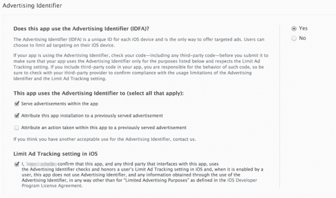
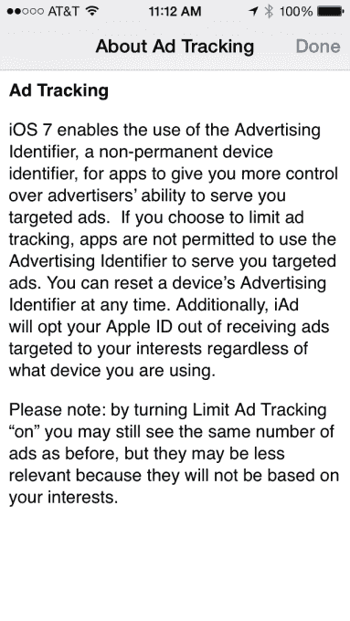

# 苹果开发者现在必须同意广告标识符规则，否则将面临被应用商店拒绝的风险 

> 原文：<https://web.archive.org/web/https://techcrunch.com/2014/04/11/apple-developers-must-now-agree-to-ad-identifier-rules-or-risk-app-store-rejection/>

苹果刚刚更新了 iTunes Connect 的一个部分，这是移动开发者用来在 iTunes 应用商店上分发和更新他们的应用程序的服务，用新的语言详细说明了广告标识符(IDFA)可以和不可以如何使用，并要求开发者通过勾选一个框来遵守这些规则。

尽管苹果[在 2 月](https://web.archive.org/web/20221209234215/https://beta.techcrunch.com/2014/02/03/apples-latest-crackdown-apps-pulling-the-advertising-identifier-but-not-showing-ads-are-being-rejected-from-app-store/)开始拒绝一些使用唯一标识符但不显示广告的应用程序，但这一变化现在正式化了这一过程——这意味着苹果现在可以拒绝任何不符合要求的应用程序。

作为背景，苹果在整个 2013 年一直在向开发者发出信号，是时候转向 IDFA 作为 iOS 应用程序中首选的广告跟踪选项了。

这种变化已经来了很长时间，在最初阶段被称为 UDID 的唯一标识符被淘汰后，第一个[在 2011 年宣布](https://web.archive.org/web/20221209234215/https://beta.techcrunch.com/2011/08/19/apple-ios-5-phasing-out-udid/)。出于多种原因，包括隐私问题和不断变化的监管环境，UDID 不再是苹果希望开发者唯一识别苹果设备和应用的最终用户或跟踪他们活动的方式。

虽然 UDID 和其他跟踪方法的意图是提供在某些方面类似于 cookie 在网络上工作的功能，但问题是，与 cookie 不同，用户无法通过选择退出功能或重置他们的标识符来收回对他们数据的控制——这与从你的计算机上删除 cookie 的目的基本相同。

虽然随着 UDID 的逐步淘汰，出现了许多由第三方创造的其他跟踪方法，但苹果的 IDFA(广告标识符)现在是唯一的官方方法，iTunes Connect 中的新文本表明了这一点。

具体来说，该部分建议应用程序开发人员，IDFA 是“提供定向广告的唯一途径”，并提供了他们也必须检查的三个用例(如果有的话):

*   > 在 app 内投放广告

*   > 将此应用安装归因于之前提供的广告

*   > 将在该应用内采取的动作归因于先前提供的广告

此外，开发人员必须勾选一个复选框，确认他们的应用程序*以及与应用程序交互的任何第三方*使用广告标识符，并遵守最终用户在 iOS 中的“限制广告跟踪”设置。

该设置使用户能够控制广告商是否可以向他们提供针对他们兴趣的广告，并可以通过在 iOS 的设置应用程序中进入“*设置—>隐私—>广告—>重置广告标识符*”随时重置。广义来说，这就是 iOS 相当于擦你的 cookies。

这些变化最终是为了尊重用户在移动设备上的隐私选择，但也在一定程度上受到了政府对 iOS 开发者如何收集、存储和使用消费者数据加强审查的推动。但是，即使自从 iOS 6 推出 IDFA[，围绕它的使用规则还是模糊不清。虽然它是为应用程序发行商而不是广告商设计的，但许多广告商一直在访问 IDFA 并将其传递给广告网络以进行跟踪，而包括开发者自己在内的其他人可能已经出于多种目的存储了广告跟踪数据，包括重新定位活动和建立用户档案。](https://web.archive.org/web/20221209234215/https://apsalar.com/blog/2012/06/apples-new-advertising-id/)

苹果用修改后的语言表达的意思是，即使是访问该应用的第三方也需要请求 IDFA 来提供广告或统计安装次数。

然而，不太清楚的是开发者是否可以像最近推出的[开放 IDFA](https://web.archive.org/web/20221209234215/https://github.com/ylechelle/OpenIDFA) 一样使用另一个标识符(或代替)IDFA。这个[标识符解决了 IDFA 解决方案单独忽略的几个与广告相关的用例](https://web.archive.org/web/20221209234215/https://beta.techcrunch.com/2014/02/07/openidfa-a-solution-to-idfa-related-app-store-rejections-debuts/)，同时也平衡了用户隐私的需求。(内置的过期功能可以防止行业中普遍存在的长期跟踪，这种跟踪侵犯了用户隐私。)

苹果大规模执行这些新规则的能力也存在问题。充其量，这种语言是对开发者的一种警告，如果你决定故意绕过这些规则，在某个时候，如果不是立即，苹果有权拒绝或从 App Store 中撤出你的应用程序。