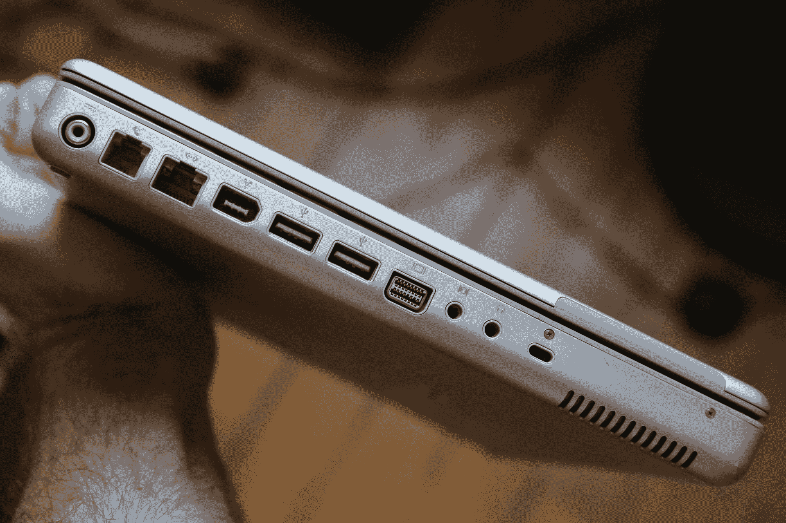

# 苹果加速未来不是背叛 

> 原文：<https://web.archive.org/web/https://techcrunch.com/2015/03/11/apple-expediting-the-future-is-no-betrayal/>

苹果新的 [MacBook](https://web.archive.org/web/20221005205635/https://beta.techcrunch.com/2015/03/09/apple-introduces-a-reinvented-macbook-air/#tmhmdj:cUYr) 将输入和输出限制在一个 USB-C 端口和一个简单的 3.5 毫米音频输入/输出插孔，这被一些人描述为对消费者具有对抗性的[举措。批评者指出，单一端口，以及使用英特尔酷睿 M 芯片组进行电源管理和无风扇主板设计所固有的性能限制，是投诉的原因，在某些情况下，也是导致](https://web.archive.org/web/20221005205635/https://beta.techcrunch.com/2015/03/10/apples-latest-betrayal/)[几乎不成熟的原因](https://web.archive.org/web/20221005205635/https://twitter.com/mj_pants/status/575358724627259393)。

但事实上，新款 MacBook 就是未来，提前交付，没有过高的成本，头顶上闪烁着明亮的霓虹灯“可选”标志。

新的 MacBook 是一个从里到外，从上到下的工程展示。这并不意味着它是苹果产品线中针对任何特定消费者的最佳电脑:它是为特定受众设计的，旨在预测该受众在未来几年的增长。在许多方面，苹果的新 MacBook 将吸引同样的人群，他们可以将 iPad 作为他们的主要电脑，从 iPad 推出以来的累计成功以及个人电脑行业的总体趋势来看，这是一个很好的赌注。

换句话说，Core M 处理器并没有隐藏起来——苹果并没有宣称这款电脑是一款强大的媒体编辑工具。相反，它是一台快速、轻便的日常机器。这是瞪羚，不是犀牛。如果你想要一只犀牛，苹果公司也有很多这样的产品——新款 13 英寸视网膜 MacBook Pro Force Touch 就是一个最好的例子。

12 英寸的 MacBook 在苹果的笔记本电脑阵容中甚至没有占据独特的价位。你可以买到目前的 MacBook Air，起价较低，价格在 1300 美元以上，更新的内部部件也在周一的活动中首次亮相。如果 1299 美元的 MacBook 是在这个价格范围内寻找便携式苹果 OS X 电脑的人的唯一游戏，如果它提供了在今天的计算和计算机配件环境中提供的端口加载，那么这些抱怨中的一些可能是有效的——但它不是，它们不是。

作为一个已经[实际接触、持有和使用过](https://web.archive.org/web/20221005205635/https://beta.techcrunch.com/2015/03/09/hands-on-with-the-all-new-ultra-thin-macbook-with-retina-display/)新款 MacBook 的人，我可以亲自证明这样一个事实，这是一款完全实现的设备，并且它提供了显著的优势来换取其感知的权衡。与任何购买决定一样，潜在买家将不得不根据自己的使用习惯来权衡该设备的特殊优势和劣势；这又是一件不值得生气的事情。

苹果在产品设计方面的主要优势是能够智能地在早期和晚期采用新技术，这取决于它认为新技术何时能为用户提供最大价值。像 NFC 这样的一些东西在推出和可用一段时间后才出现，但在特定环境下会及时被大规模采用，而触控 ID 和 Thunderbolt 等其他功能会让竞争对手争先恐后地追赶。USB-C 的转变就像后面的例子一样，是一种推动，是伴随其推出的端口减少的一部分。

看看我心爱的 12 英寸 G4 PowerBook:见证它提供的众多端口。机器的左侧就像月球坑坑洼洼的表面，右侧主要是一个光盘驱动器(它的重量也是新 MacBook 的两倍多，而且它有一个风扇:男孩它曾经有过风扇)。然而，今天大多数人甚至不能说出这些端口的名字，更不用说找到一种有价值的方式来使用它们了。

与苹果公司推向市场的任何产品一样，新款 MacBook 的最终考验将是它如何满足日常用户的需求。许多人认为笔记本电脑可能无法处理一些任务，如照片编辑，即使是更普通的计算机用户也需要这些任务，但这只是基于对 Core M 的人工测试的猜测，该测试[给出了关于处理器在真空中如何在纸上运行的数字](https://web.archive.org/web/20221005205635/http://www.digitaltrends.com/computing/intel-core-m-5y70-broadwell-tested-benchmarked/)[。](https://web.archive.org/web/20221005205635/http://www.digitaltrends.com/computing/intel-core-m-5y70-broadwell-tested-benchmarked/)英特尔的睿频加速技术不一定能很好地与这些基准测试工具配合使用，而且虚拟化测试从来都不是现实世界使用的良好替代品。

全新的 MacBook 代表了个人电脑的范式转变，但苹果并没有把任何人拖向未来。然而，我怀疑那些接受快进邀请的人最终不会被它所代表的权衡所困扰。