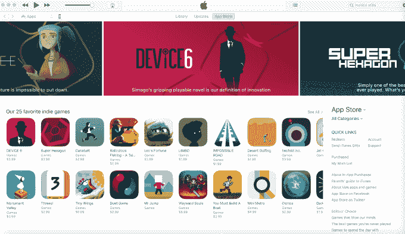

# 苹果在应用商店 TechCrunch 上给独立游戏玩家一个永久的家

> 原文：<https://web.archive.org/web/https://techcrunch.com/2017/03/17/apple-gives-indie-gamers-a-permanent-home-on-the-app-store/>

打入应用商店可能已经够困难了，但对于小规模的移动游戏开发商来说，这甚至是一个更大的挑战，因为他们要面对主宰排行榜的数十亿美元的全球发行商，如 Supercell、动视暴雪、Niantic、EA、腾讯和其他能够负担得起投资数百万美元营销预算和广告的发行商。苹果现在希望通过在 App Store 上给独立游戏一个新的、高度可见的家来稍微平衡一下竞争环境。

整整一周，苹果一直在 App Store 主页的一个专门区域强调独立游戏玩家的内容，这里经常有新发布的产品、最爱、员工推荐和其他推荐。

这个中心被称为“[庆祝独立游戏](https://web.archive.org/web/20221025222541/https://t.co/M7fhi8kU4D)”，包括许多独立游戏开发商的新发布和首次亮相，但也有一些最好的、有史以来最好的 iOS 游戏。在页面的更下方，独立游戏被进一步细分为类别焦点——例如，具有“难以置信的声音设计”或“难忘的故事”的列表。

这些选择是由 App Store 的编辑团队挑选的，包括付费和免费游戏。

最初，这个系列似乎只是另一个旨在推动独立作品的促销活动。苹果经常在它的应用程序商店上展示这样的精选系列，以展示新发布的产品、有趣的应用程序和其他独家内容。

在该中心推出之前，独立游戏还有其他促销活动，包括为新的独立游戏提供折扣和其他显著位置。苹果表示，从 3 月 9 日到 20 日，它将在整个月突出显示独立游戏。

然而，根据 App Store Games Twitter 账户周四发布的一条[推文](https://web.archive.org/web/20221025222541/https://twitter.com/AppStoreGames/status/842545079915106308)，在推广期结束后，独立游戏中心将成为 App Store 上的永久安装。今年 3 月，苹果公司表示将每天更新独立中心的内容，但当“庆祝独立游戏”的努力结束时，这一速度可能会放缓。

对于独立开发者来说——也就是那些小型的、自出版的和自投资的，根据苹果的[定义](https://web.archive.org/web/20221025222541/https://twitter.com/AppStoreGames/status/839973962276827136)——这种变化可能会极大地影响他们在应用商店的可发现性。专门寻找这些标题的部分为开发人员提供了一种方法，可以在潜在的新用户面前脱颖而出，而不必为应用商店搜索广告或脸书等网站上的其他广告付费。

游戏仍然是最受欢迎的应用类别之一，并占据了应用商店收入的大部分。根据传感塔的[数据，2016 年，苹果应用商店 80%以上的收入来自手机游戏。](https://web.archive.org/web/20221025222541/https://sensortower.com/blog/top-mobile-games-2016) [App Annie 的数据](https://web.archive.org/web/20221025222541/https://www.appannie.com/insights/market-data/gaming-apps-maintain-revenue-stronghold/)略低，占所有 App Store 收入的 75%。

新动物园的报告称，去年，移动游戏也将比个人电脑游戏占据更大份额，收入为 369 亿美元，全球增长 21.3%。

宣传工作似乎奏效了。目前，像 Botnicula、外科医生模拟器和 Prune 这样的游戏——所有这些游戏都在新的中枢中亮相——在应用商店的顶级付费应用排行榜上排名很高，分别排在第 7、1 和 5 位。