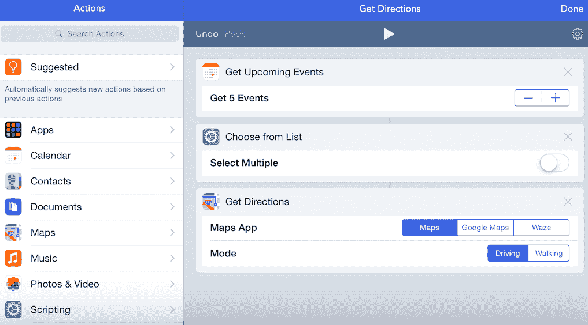
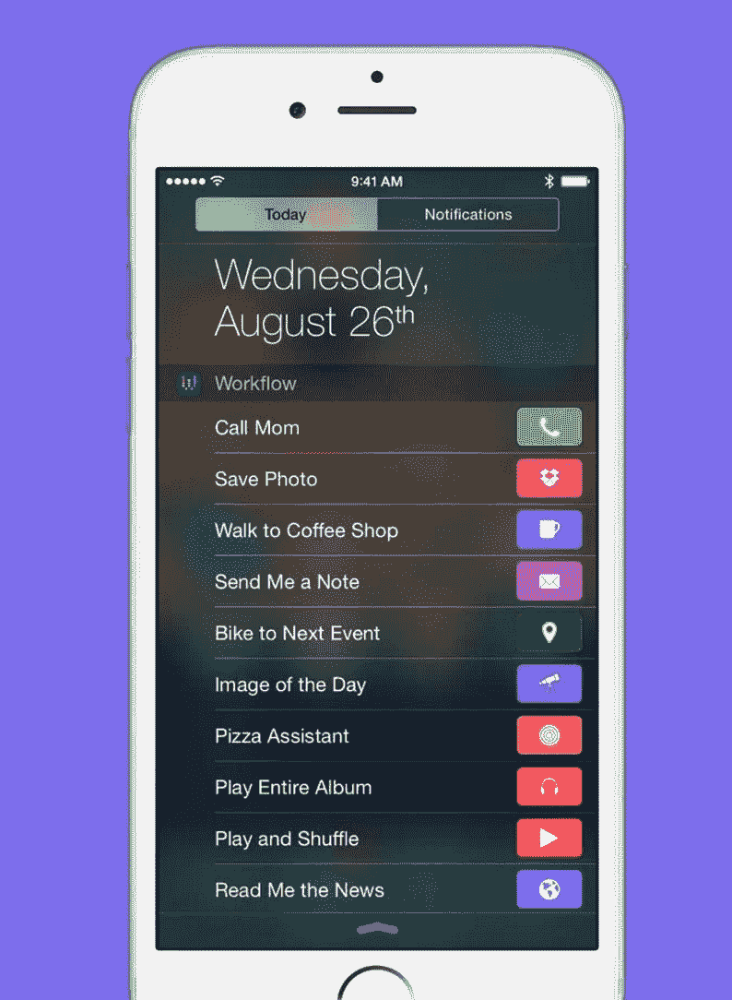

# 苹果收购了 Workflow，这是一款适用于 iPad 和 iPhone 的强大自动化工具

> 原文：<https://web.archive.org/web/https://techcrunch.com/2017/03/22/apple-has-acquired-workflow-a-powerful-automation-tool-for-ipad-and-iphone/>

苹果公司今天完成了收购 [Workflow](https://web.archive.org/web/20230328045549/https://itunes.apple.com/us/app/workflow-powerful-automation/id915249334?mt=8&ign-mpt=uo%3D4) 的交易——这是一种让你将应用程序和应用程序中的功能以命令串的形式挂钩以自动化任务的工具。我们已经追踪这个交易有一段时间了，但现在我们能够确认，就在我们说话的时候，交易的墨迹正在变干。

我还没有得到这笔交易的财务细节，但如果我得到了，我会更新。据我所知，这对团队来说是一个稳定的发薪日，对投资者来说是一个小小的提升。Workflow 已经从 Lowercase、Eniac 和 General Catalyst 筹集了数百万美元的种子资金。

该应用由一个小团队开发，其中包括前 iPhone 越狱者阿里·温斯坦。自从 iPod Linux 时代和几年前[报道他非常有用的 DeskConnect 应用](https://web.archive.org/web/20230328045549/https://techcrunch.com/2013/09/04/from-jailbreaks-to-app-store-awards-developers-grow-up-iphone/)以来，我一直在关注他的努力。

工作流已经[存在了几年](https://web.archive.org/web/20230328045549/https://techcrunch.com/2014/12/11/workflow-lets-you-automate-the-stuff-you-do-all-the-time-on-your-iphone/)，我们已经报道了它和它的[更新](https://web.archive.org/web/20230328045549/https://techcrunch.com/2015/08/27/workflow-lets-you-put-shortcuts-to-frequent-actions-right-in-ioss-notification-center/)。它与 IFTTT 服务有一些相似之处，因为它允许人们将一系列动作组合在一起，这些动作允许他们通过一次点击来执行复杂的任务。在过去的几年里，它积累了大量的用户和下载量。

这款应用将被收购，同时被收购的还有由[温斯坦](https://web.archive.org/web/20230328045549/https://twitter.com/AriX)、[康拉德·克莱默](https://web.archive.org/web/20230328045549/https://twitter.com/conradev)、[绚香·诺娜卡](https://web.archive.org/web/20230328045549/https://twitter.com/ayanonagon)和[尼克·弗雷](https://web.archive.org/web/20230328045549/https://twitter.com/nickfrey)组成的团队。对于苹果来说，这是一个有点不寻常的举动，该应用程序将继续在 App Store 上提供，并将于今天晚些时候免费提供。

“我们很高兴加入苹果，”温斯坦在一份声明中说。“我们从一开始就与苹果密切合作，从在 WWDC 上学时创办我们的公司，到开发和推出 Workflow 并在 App Store 上看到它惊人的成功。我们迫不及待地想在苹果公司将我们的工作提升到一个新的水平，并为感动全世界人民的产品做出贡献。”

这不是工作流中的“纯粹的收购”,不仅仅是人才，而是在这笔交易中购买的。这很有意义，我很高兴看到这一点，因为工作流本身就是一个很好的例子，说明了如何在 iOS 生态系统中找到需求，以有趣的方式解决它，并聪明地执行它，关注平台的荣誉。简单来说就是超级智能，设计真的很好，非常好用。

Workflow 在 2015 年获得了一项苹果设计奖；苹果无障碍工程师迪恩·哈德森[对其处理无障碍的方式欣喜若狂](https://web.archive.org/web/20230328045549/https://developer.apple.com/videos/play/wwdc2015/103/)。“当我第一次看到这款应用时，我就像人类一样，这种可访问性非常好。这太离谱了！”

苹果公司证实了这笔交易，并对工作流程做了如下说明:

“工作流应用程序因其对 iOS 辅助功能的出色使用而入选 2015 年苹果设计奖，特别是对 VoiceOver 的出色实现，具有清晰的标签项目、周到的提示和拖放通知，使盲人或弱视者可以使用和快速访问该应用程序。”

Workflow 的可访问性功能令人印象深刻，尤其是对于一个构建复杂宏的工具来说。说“嘿，这是为重度用户准备的，也许我们不需要确保它 100%可访问——但他们没有，他们因为他们的麻烦赢得了一堆奖项(和一个退出),这可能会容易得多。

Workflow 与应用程序的现有集成非常广泛，并将继续更新。你可以在 Federico Viticci 的这篇文章中看到该应用程序的一些非常强大的功能，他是一个工作流狂人。

对于你们这些超级书呆子来说，这个消息可能是一个好消息，因为苹果自动化沙皇传奇人物萨尔·萨戈伊恩最近在[离职，他的职位也被取消。一些人认为这是苹果对自动化类别不再感兴趣的信号。](https://web.archive.org/web/20230328045549/https://twitter.com/Ihnatko/status/798989619245133825)

Workflow 的特别之处在于，它使用户能够进入单个应用程序的特定“深度链接”功能，并将这些操作连接成一串无缝的、不可见的命令。如果这听起来很熟悉，你可能会想到萌芽中的 Siri API——随着时间的推移，它只会越来越强大。

如果你在这里展开线程，不难看出工作流正在与 Siri 紧密集成，现在团队可以访问苹果的私有 API，这比目前公开的 Siri 更强大，允许更加无缝的激活和合成动作。

这里也有很好的机会为 iPad 生态系统提供增值的“超级用户”功能。苹果让人们看到 iPhone、iPad 甚至 Apple Watch 生态系统可以用于许多轻中度任务的努力可以在这里得到支持。

Apple Watch 的工作流应用程序特别聪明，而且非常有机——我一直支持 Apple Watch 的“ [1.5 秒或半身像](https://web.archive.org/web/20230328045549/https://techcrunch.com/2015/09/21/the-apple-watch-and-the-smartphones-second-act/)”交互模式。工作流的“端点”是一个简单的点击或自动操作，可以“隐藏”复杂的命令或交互系统，非常适合 Apple Watch。

Workflow 的收购是在这个服务时代变得更加混乱的应用程序成功的一个相当鲜明的例子。一个小而聪明的团队(曾经获得过 WWDC 学生奖学金的人)开发了一个在 iOS 上非常有用的工具，以至于苹果公司自己都承认他们不能做得更好并买下了它。看看它从这里走向何方将会很有趣。