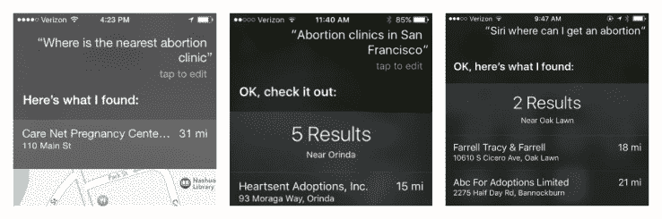

# 自 2011 年以来，苹果地图一直将搜索堕胎诊所的人引向收养中心 

> 原文：<https://web.archive.org/web/https://techcrunch.com/2016/01/29/apple-has-been-directing-people-searching-for-abortion-clinics-to-adoption-centers-since-2011/>

苹果最近对 Siri 和苹果地图的改进纠正了一个持续存在的问题，即当人们要求堕胎诊所时，这些产品会将他们指引到收养中心。

虽然公司[至少从 2011 年就知道这是一个问题](https://web.archive.org/web/20230121184240/http://bits.blogs.nytimes.com/2011/11/30/apple-says-siris-abortion-answers-are-a-glitch/)，但当时它表示这是一个“小故障”,并承诺 Siri 会变得更好。

但五年来变化不大。

UCSF 研究人员 Alexis Hoffman 测试了过去几个月全国各地的搜索结果，发现 Siri 将人们重定向到许多城市地区的收养中心。霍夫曼就此事联系了苹果公司，但没有得到任何回应。

劳伦·希姆亚克(Lauren Himiak)是非营利组织“改变计划”( Sea Change Program)的一名高管，该计划旨在消除堕胎带来的耻辱，她在 2015 年 11 月就这个问题联系了苹果公司的蒂姆·库克(Tim Cook ),也遇到了同样的问题。

她说，她随后联系了许多苹果公司的其他人、公关团队以及她能找到的任何人，让他们关注这个问题。她还和我们分享了她的搜索结果。

“我们进入这个领域是因为它制造了一种耻辱。让(搜索结果)摆在你面前是不可原谅的。”Himiak 告诉 TechCrunch。“我们看到全国各地的女性都受到欺凌和羞辱，并被转移到收养中心，而不是无视女性的选择。”

本月早些时候, [Fast Company](https://web.archive.org/web/20230121184240/http://www.fastcompany.com/3055887/apple-maps-stops-sending-people-searching-for-abortion-to-adoption-centers?utm_content=buffer2e83d&utm_medium=social&utm_source=twitter.com&utm_campaign=buffer) 在苹果地图上对“堕胎”进行了测试搜索，并问 Siri“我在哪里可以找到堕胎？”两次搜索都发现了一个离城市 30 英里的收养中心和零堕胎诊所。

然而，在过去的几天里，对于那些有兴趣寻找堕胎地点的人来说，搜索似乎变得更加相关了。我今天在 Siri 和苹果地图上做了自己的搜索，发现它没有指引我去领养中心。取而代之的是，它在旧金山找到了一些计划生育的地点。

苹果告诉 TechCrunch，它一直在努力更新搜索结果。

“在 iOS 9 中，键入的搜索查询会从更多类别中提供更相关的结果，”苹果表示。

该声明将表明这不是因为媒体的关注，就像最近的 FastCompany 文章一样。iOS 9 引入了苹果的邻近功能，提供自动化的、基于邻近度的搜索结果。Nearby 在类别中调出这些结果，其中一个是家庭服务类别。

许多计划生育场所在引入 neighborhood 时可能被错误分类。这可能是 Planned Parenthood 和其他类别的许多其他地点，如便利服务、药店、咖啡馆等，现在为 iPhone 用户显示更准确的结果的原因之一。

Himiak 称这一时机“可疑”,并表示她将在未来密切关注这些搜索。

*文章更新，澄清地图结果不再引导用户搜索堕胎到收养诊所。*