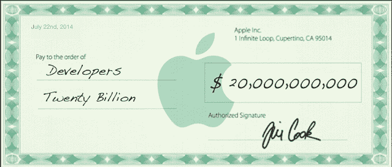

# 苹果向 iOS 开发者支付了 200 亿美元，其中一半是在去年支付的

> 原文：<https://web.archive.org/web/https://techcrunch.com/2014/07/22/apple-has-paid-20-billion-to-ios-devs-half-of-it-in-the-past-year/>

# 苹果已经向 iOS 开发者支付了 200 亿美元，其中一半是在去年支付的

对于那些跟踪 iOS 开发者资金列车运行状况的人来说，一个快速更新:截至今天早上的收益电话会议，[苹果](https://web.archive.org/web/20221207183006/http://www.crunchbase.com/organization/apple)已经向 iOS 开发者支付了超过 200 亿美元。

然而，比总数更令人惊讶的是资金流入的速度。自从 2008 年[应用商店](https://web.archive.org/web/20221207183006/http://www.crunchbase.com/product/app-store)推出以来，支付了 200 亿美元，其中“将近一半”是在过去 12 个月支付的。

截至今年 1 月，苹果[已经支付了 150 亿美元](https://web.archive.org/web/20221207183006/https://beta.techcrunch.com/2014/01/07/apple-10b-in-app-store-sales-in-2013-15b-paid-out-to-developers-to-date/)。这意味着在过去的六个月里支付了大约 50 亿美元。相比之下，谷歌在 I/O 提到，他们在过去的一年里向开发者支付了 50 亿美元。

(对于那些对苹果的分成感到好奇的人，快速计算一下:苹果的份额是 30%，开发者拿走 70%。200 亿美元是大约 285.7 亿美元的 70%，这意味着苹果迄今为止已经从应用销售中获得了大约 85 亿美元。)