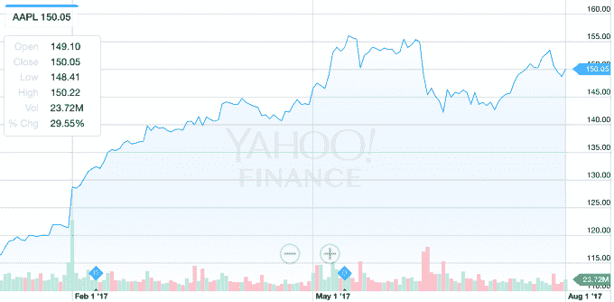

# 苹果创下历史新高，似乎离成为一家价值 1 万亿美元的公司只有一步之遥

> 原文：<https://web.archive.org/web/https://techcrunch.com/2017/08/01/apple-hits-an-all-time-high-and-is-seemingly-in-striking-distance-of-being-a-1-trillion-company/>

# 苹果创下历史新高，似乎离成为一家价值 1 万亿美元的公司只有一步之遥

苹果经历了一个半井喷的季度——尽管，事实上，[这个故事是关于下一个*季度*](https://web.archive.org/web/20221201214147/https://beta.techcrunch.com/2017/08/01/apple-is-signaling-a-huge-fourth-quarter-and-wall-street-is-loving-it/)*发生的事情——将股价推至历史新高。*

 *这一飞跃意味着苹果现在是一家价值超过 8000 亿美元的公司。就市值而言，似乎就在不太久以前，谷歌可能有机会成为比苹果更大的公司，但现在苹果正在稳步上升。这种持续的增长意味着该公司可能在不久的将来成为一家价值 1 万亿美元的公司。

苹果公司的报告以其指引标志着第四季度的巨大成就，在盘后交易中股价上涨超过 5%。今年，苹果公司的股价稳步攀升。在这份收益报告发布之前，股价今年已经上涨了近 30%。这种高潮似乎正在建立到苹果作为一家价值 1 万亿美元的公司破土而出的时刻，因为下个季度或多或少将决定公司的成败，决定它是否继续是一个巨大的增长故事。

苹果公司(Apple)预计将推出一款全新的 iPhone，它将像 iPhone 6 一样释放用户需求，当时它增加了手机的尺寸。在苹果牛市的情况下，它可能会解锁更多。苹果的产品组合中有很多积极的信号，比如 iPad 的同比增长或其服务的强劲增长。但 iPhone 现在是，在可预见的未来也将是，苹果最大的增长动力——所有人都在关注今年第四季度。

今天的出色表现为该公司建立了许多良好的意愿，因为对下一季度的预期和对下一代 iPhone 的首次关注有所增加。苹果不得不应对下一代 iPhone 的大量细节泄露。这似乎降低了对其现有手机的需求，这意味着其核心增长引擎正在熄火。如果苹果能够实现——这也不是不可能的——我们可能会看到该公司在明年以某种方式突破 1 万亿美元大关。

诚然，1 万亿美元可能还很遥远。苹果公司的股价今年上涨了 30%，但如果该公司要跨过这个半虚荣的关口，仍需要大幅攀升。但是，如果苹果能够交付——这也不是不可能的——我们可能最终会看到该公司发现自己的市值又多了一个零。*