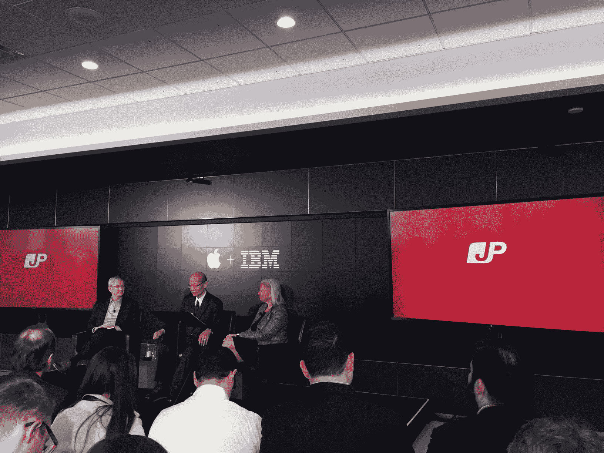
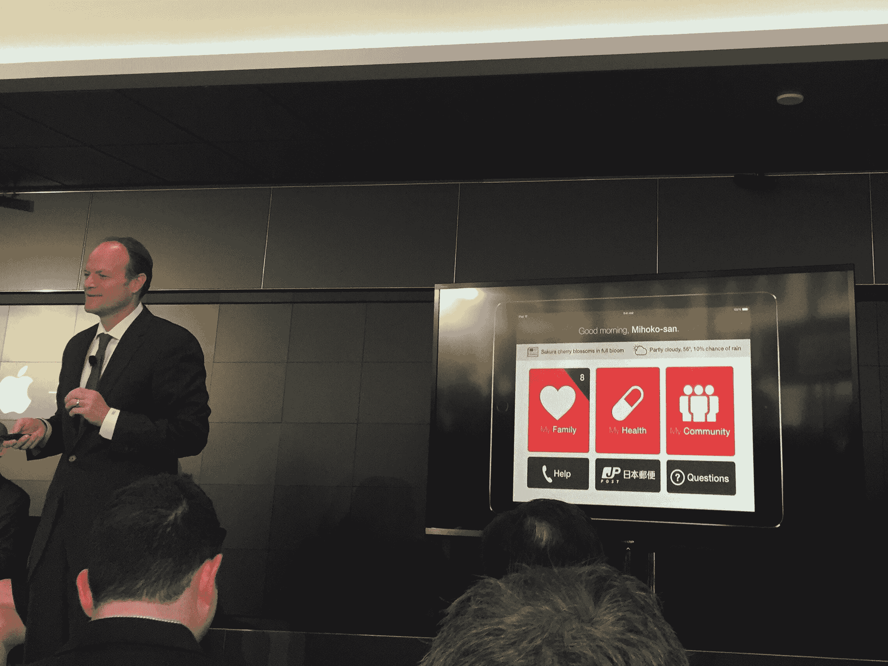
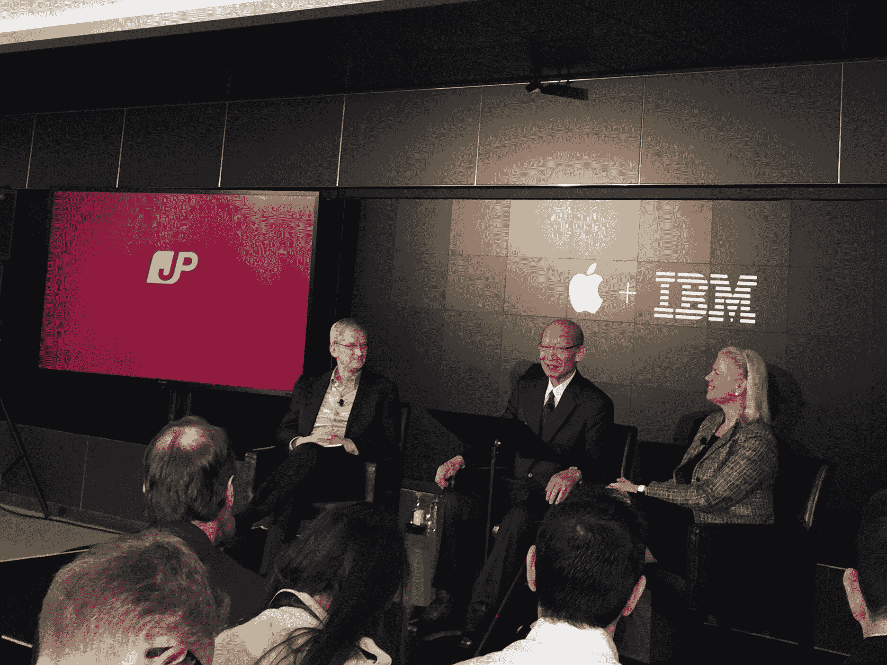

# 苹果和 IBM 与日本邮政合作解决人口老龄化的需求 

> 原文：<https://web.archive.org/web/https://techcrunch.com/2015/04/30/apple-ibm-japan-post/>

日本邮政首席执行官西室泰三(Taizo Nishimuro)今天上午与苹果首席执行官蒂姆·库克(Tim Cook)和 IBM 首席执行官吉妮·罗梅蒂(Ginni Rometty)一起上台宣布了一项新的联合倡议，并强调了 IBM/苹果企业合作伙伴关系的一些成果。

通过这种合作关系(去年夏天宣布)，IBM 正在为大型企业开发软件和支持，并帮助向企业客户提供苹果硬件。日本邮政正在利用这种合作来应对日本人口老龄化带来的一些挑战。

西室在开幕式上谈到了国有的日本邮政如何在今年年底上市。它还打算转变为一个更加“一体化的生活方式支持集团”，这意味着日本邮政机构(也是一家保险提供商)正在寻求扩大其在该公司医疗保健中的作用(根据西室的说法，它自 1871 年以来一直以某种身份提供服务)，并将在 IBM 和苹果的帮助下这样做。

日本的老龄化人口为这种转变提供了充足的动力，预计 65 岁以上的人口将从 2006 年的 20%增加到 2055 年的 38%。日本邮政正在使用两种主要方法来扩展其高级支持服务的范围，而 iPad 是第一种方法的关键组成部分。

该公司将设计基于 iPad 的体验，这些体验“对老年人来说非常容易使用”，西室今天告诉观众，iPad 是“著名的”，他们将利用 IBM 的帮助来开发应用分析和围绕这些应用的云服务。这些应用程序旨在帮助日本数百万老年人与医疗保健服务社区及其家人联系起来，目标是到 2020 年为 400 万至 500 万个家庭提供服务。日本邮政计划的第二部分是将上述服务与现有产品整合。

西室说，老龄化问题“在日本最为尖锐——我们需要真正的解决方案”。罗梅蒂在随后的评论中回应了这一声明，她指出，老龄人口也将是美国和世界需要解决的一个问题。罗梅蒂说，到 2050 年，世界人口的 21%将进入“高龄”类别，64 个国家的 30%的人口将达到这一水平。

她概述了 IBM 与日本邮政合作解决这一需求的三个目标。

首先，他们将致力于“生活质量应用程序”，通过自己构建一些应用程序和整合其他应用程序，所有这些都将首先以可访问性为目标。主要目标将是 iOS，因为这是一个移动优先的战略，符合我们已经改变的计算习惯。第二，他们正致力于开发目前尚不可用的其他辅助功能，第三，他们正在帮助日本邮政提供向老年人提供这些功能所需的服务层。

蒂姆·库克称这一倡议是“开创性的”，他说这“不仅对日本很重要，而且具有全球影响”。我们三个人和所有在我们身后辛勤工作的团队一起，将极大地改善数百万人的生活。”他补充说，“Taizo-san 和日本邮政率先在这方面表现出的勇气、胆识和雄心令人难以置信地值得称赞。”

对于库克来说，日本邮报的这一举措显示了苹果/IBM 合作伙伴关系的“巨大潜力”，他还深入探讨了苹果在用户健康方面的更广泛目标。他提到了 HealthKit 和 ResearchKit 的例子，并补充说，日本邮政的这一计划完全符合这些现有倡议的目标。

这位苹果公司的首席执行官谈到了公司的目标是如何“帮助那些在某种程度上被边缘化的人，并让他们能够做其他人都可以做的事情。”他引用了加州大学欧文分校的一项研究，该研究详细描述了远程监控和通过 iPad 与亲人联系如何帮助老年人培养自信和独立感。他还说，他相信这些公司在日本所做的事情也可以在世界范围内推广。

日本邮政提供的演示展示了 iPad 如何扩展日本邮政员工检查高级客户的当前做法。在演示中，一名员工与一位年长的客户坐在一起，帮助她设置 iPad 的功能，并预约医生，安排处方和取包裹。

还有一个问题按钮，看起来有点像亚马逊为 Kindle 平板电脑提供的五月天服务。服务供应商也包括在内，每个供应商都经过预先筛选，可以提供管道之类的服务。

当被问及苹果在视觉障碍方面的声誉是否是日本邮政选择使用他们产品的原因时，Nishimuro 承认，苹果在视觉和听觉障碍无障碍功能方面的良好记录确实是其决定的因素。事实上，有了 Taptic feedback 这样的东西(苹果在 Apple Watch 上推出了 tap TIC feedback，很可能会扩展到 iPad 和其他设备)，该公司的可访问性声誉只会有所改善。

Romety 说，IBM Watson Health 是连接到该系统的一个关键平台，我们将看到世界各地在其他地方如何开展类似工作方面的差异。她说，在日本，日本邮政是一个很好的合作伙伴，但其他人可能包括政府和其他类型的私营公司。

一位提问者特别指出，在美国，人们可能会对人寿保险提供商掌权感到不安。罗梅蒂补充说，人们将能够选择加入或退出他们想要分享的内容，并且数据可以匿名，这使得潜在的大规模研究具有无创性的优势。

事实是，老年人护理和老年人服务在未来几年将是一个蓬勃发展的市场，苹果和 IBM 今天已经制定了一项计划，以大规模应对这个市场。日本邮政是一个完美的推出客户，因为该国的人口老龄化问题更加严重。但毫无疑问，这只是一项计划的第一步，该计划还可能有助于解决过去几个季度苹果 iPad 增长停滞的问题。

库克说，类似的美国项目可能会由地区性公司合作完成，但这仍是一条出路。就更广泛的 IBM/苹果合作伙伴关系而言，他说，除了迄今为止从这一安排中产生的 22 个应用程序外，他们目前有望在今年年底前将 100 个应用程序推向市场。