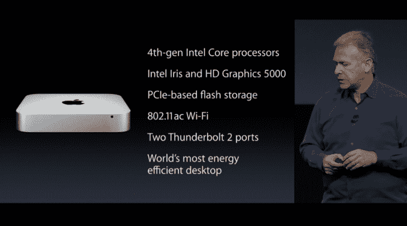
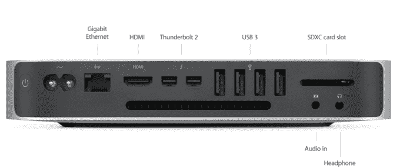

# 苹果推出新款 Mac Mini，基价降至 499 美元 

> 原文：<https://web.archive.org/web/https://techcrunch.com/2014/10/16/apple-introduces-a-new-mac-mini-drops-the-base-price-to-499/>

# 苹果推出新款 Mac Mini，将基本价格降至 499 美元

惊喜！我们都知道新的 iPads 和 Mac 电脑即将到来，但苹果在今天发布会的最后偷偷透露了一点消息:新的 Mac Minis。

有什么新鲜事吗？最明显的变化是价格，基本款从 599 美元降至 499 美元。这意味着一代比一代降价近 20%。

看起来他们也放弃了 Firewire 端口，代之以…第二个 Thunderbolt 2 端口。它有两个 Thunderbolt 2 端口、四个 USB 端口、以太网、一个内置 SDXC 插槽和一个 HDMI 输出。

像其大多数产品一样，苹果将 Wi-Fi 芯片提升到 802.11ac(而不是 802.11n)，使 Wi-Fi 的最大理论速度达到每秒 866 兆比特(当然，假设你的路由器符合标准)。

它有三种型号:

*   499 美元:1.4 Ghz CPU、500GB 旋转硬盘、4GB 内存、英特尔高清显卡 5000
*   699 美元:2.6 GHz CPU、1TB 旋转硬盘、8GB 内存、英特尔 Iris 显卡
*   999 美元:2.8 Ghz CPU、1TB 固态硬盘、8GB 内存、英特尔 Iris 显卡

值得注意的是，虽然它非常便宜，但 499 美元的基本型号并不完全是…尖端，即使是在它的同行中。虽然“前沿”不一定是购买市场上最便宜的 Mac 的人所寻求的，但它是从上面的型号上惊人地大幅度下降。仅在基本型号中发现的英特尔 HD 5000 芯片已经使用了两年多。CPU 呢？它的速度大约是下一个型号的一半。换句话说:你可能至少想要中级型号。

新款 Mac Minis 今天开始发货。

