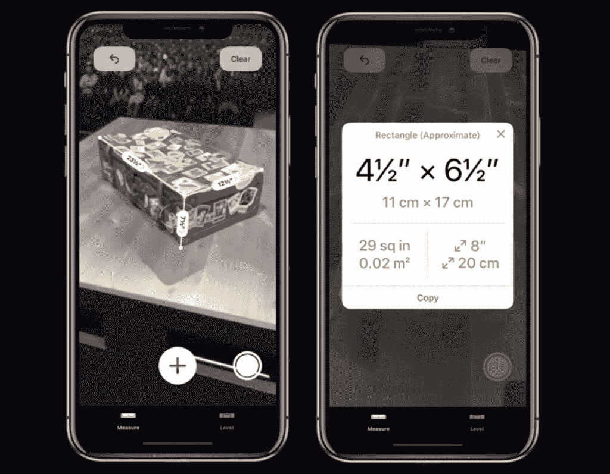
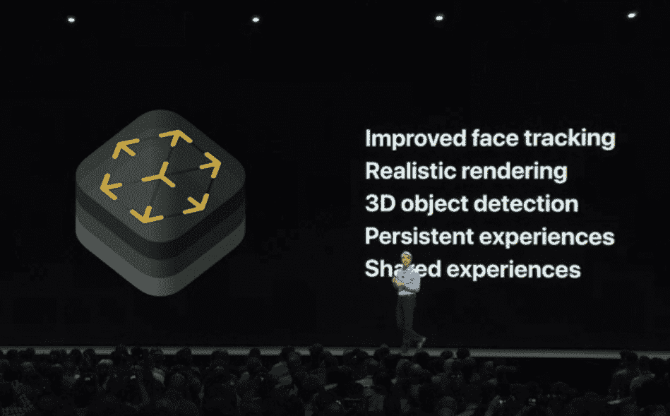
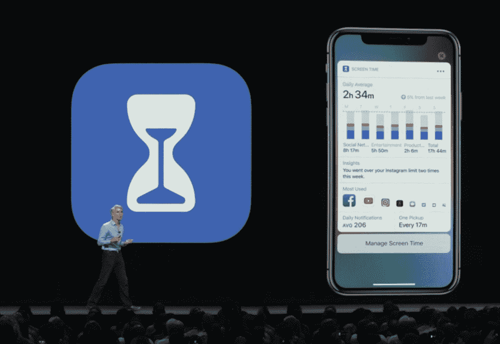
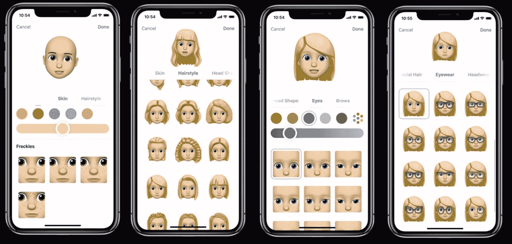
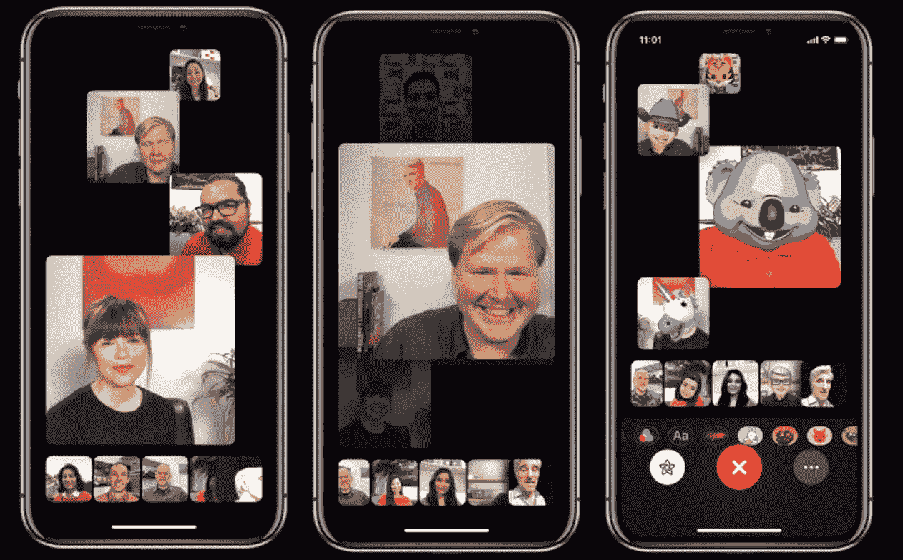

# 苹果推出 iOS 12 

> 原文：<https://web.archive.org/web/https://techcrunch.com/2018/06/04/apple-introduces-ios-12/>

苹果在 WWDC 开发者大会上宣布了下一个版本的 iOS。虽然 iOS 12 不会在秋季之前推出，但先睹为快下一个版本的 iOS 总是很有趣。

苹果软件工程高级副总裁克雷格·费德里吉(Craig Federighi)首先谈到了一些数字。81%的 iOS 用户目前正在运行 iOS 11。6%的 Android 用户目前使用的是最新版本。

 “对于 iOS 12，我们在性能上加倍努力，”费德里吉说。iOS 12 将在目前支持 iOS 11 的所有设备上可用。

Federighi 谈到 iPhone 6 Plus 上的 iOS 12 很有意思。应用程序启动速度加快 40%，键盘启动速度加快 50%，打开相机速度加快 70%。

你明白了，iOS 12 最大的新特性是**性能和优化**。

但不代表苹果没有想过新功能。苹果已经为增强现实创建了一种新的文件格式**，叫做 USDZ。Adobe CTO Abhay Parasnis 谈了几分钟，宣布 Adobe apps 将支持 USDZ。**

苹果公司正在推出一款新的应用程序来教育人们关于增强现实的知识。这款应用名为 Measure，其工作原理与流行的第三方应用 [MeasureKit](https://web.archive.org/web/20230307140326/https://measurekit.com/) 非常相似。虽然苹果公司表示 USDZ 是一种用于增强现实的文件格式，但 Federighi 也在苹果新闻文章中展示了一个 USDZ 3D 文件。

该公司还在用多人增强现实更新 ARKit 。你可以通过多种设备获得相同的增强现实体验。公司邀请了乐高的马丁·桑德斯来谈谈 ARKit。你可以用 iPad 对准乐高积木添加虚拟建筑和物体，再造一个小小的城市。

“每年有超过一万亿张照片被 iPhone 捕获，”Federighi 说。苹果正在用 iOS 12 更新搜索。虽然你可以搜索物体或类别，如汽车、狗、海滩和徒步旅行，但很难找到。苹果公司将增加建议来改进发现。

苹果公司重新利用了苹果音乐的创意，增加了“为你”标签。它会向您展示旧相册、回忆、与您关心的人的照片等等。对于你也可以建议你与朋友和家人分享照片。当你分享它们时，它看起来像是创建了一个链接，你可以在 iMessage 中发送。对方也会收到分享照片的建议。这就像共享相册，但有点精致。

至于 **Siri** ，苹果正在推出快捷方式。不仅仅是语音，苹果还在锁定屏幕或搜索屏幕上增加了快捷方式。如果你开会要迟到了，你会得到一个给对方发短信的建议。锁定屏幕上的快捷方式就像应用程序建议，但有更多具体的操作。

苹果将向第三方开发者开放快捷方式来存储信息或设置快捷方式。开发者可以在他们的应用程序中添加一个“添加到 Siri”按钮。例如，你可以在“飞往波特兰”快捷方式下存储你的航班信息。所以如果你问 Siri 这个短语，你会得到你的航班信息。

工作流团队一直在开发快捷方式应用程序。这就像苹果几年前收购的自动化应用工作流一样。但是您也可以使用快捷方式配置连接的设备，并使用 HomePod 触发快捷方式。所以，你看，苹果公司带着这个新的快捷方式生态系统回到了语音助手的游戏中。

苹果也在重新设计**苹果新闻**和**股票应用**。新闻应用中有一个新的侧边栏来改进导航。你还可以在股票应用程序中获得类似雅虎财经的信息，包括股价、头条新闻和盘后定价。股票应用也将登陆 iPad。

至于 **iBooks** ，传言是对的。苹果正在向 iBooks 添加有声书(并从音乐应用中移除它们)。该公司还将 iBooks 更名为 Apple Books。最后，苹果在 CarPlay 中增加了对**第三方导航应用的支持。**

在对苹果的新应用程序进行了快速总结后，费德里基展示了 iOS 12 的另一个支柱——**更智能的通知，勿扰改进**。如果你在晚上打开了“请勿打扰”,如果你想在半夜查看时间，你不会收到一墙的通知。您也可以设定“请勿打扰”,直到您移到另一个地方。

当 Federighi 展示分组通知时，开发人员疯狂欢呼。这是一个堆叠来自同一个应用程序的相似通知的好方法。您将能够直接从主屏幕配置通知。

许多人指责苹果没有关注智能手机的成瘾性。有了**屏幕时间**，你的手机可以给你一个你用手机做的事情的概览，这样你就不用浪费太多时间无意识地浏览提要了。例如，你还可以设置一个时间限制，以便在你登录 Instagram 一段时间后收到通知。显然，屏幕添意味着更好的家长控制。你可以限制某些应用程序，跟踪你孩子的使用情况等。

不过先说 iOS 最重要的功能——animo jis。苹果正在增加新的角色——幽灵、考拉、老虎、霸王龙。你的手机会追踪你的舌头。

更重要的是，你可以创造自己的记忆。苹果基本上是在抄袭 Snap 的 Bitmoji(或者 Xbox 头像或者任天堂的 Miis……)。可以创建自己的头像，添加配饰，换衣服。

在“信息”中，有一些新的相机效果，有点像 Instagram 或 Messenger 的滤镜，将你的 Memoji 融合在你的脸上。

稍微改变一下方式，苹果正在改革 FaceTime。您现在可以创建一个 32 人的 FaceTime 群组。您现在可以从 iMessage 对话切换到视频聊天，而无需打开另一个应用程序。早就该这样了，豪斯派对不会高兴的。音频部分也可以在 macOS 和 Apple Watch 上运行。

