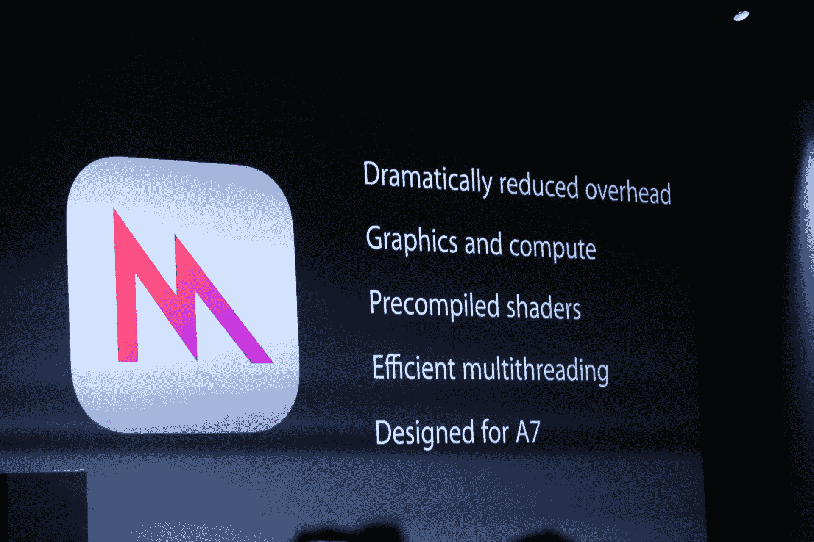
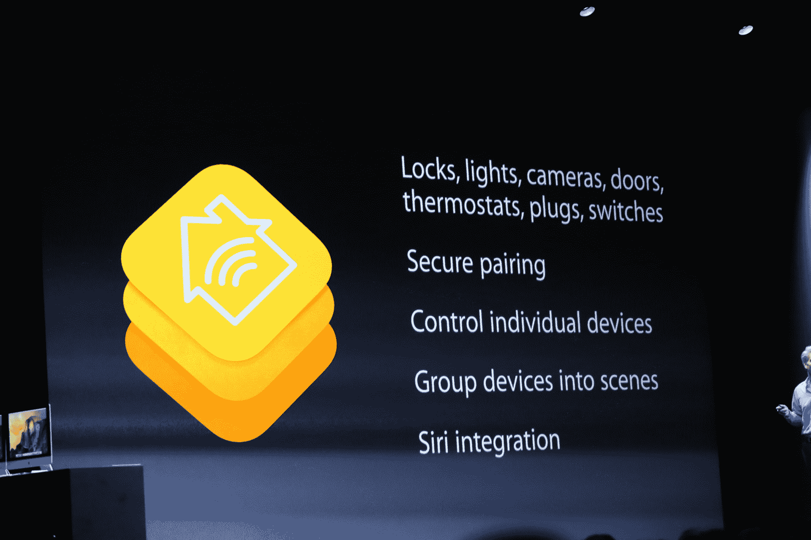
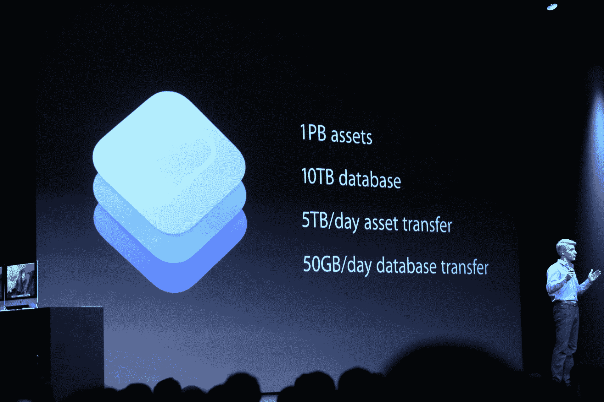

# 苹果 iOS 8 SDK 让开发人员能够访问更快的 3D 图形、触控 ID 等技术

> 原文：<https://web.archive.org/web/https://techcrunch.com/2014/06/02/apple-ios-8-sdk-gives-developers-access-to-faster-3d-graphics-touch-id-and-more/>

随着 iOS 8 的推出，苹果今天为其移动操作系统发布了许多新的开发者工具。新的 iOS SDK 被苹果首席执行官蒂姆·库克称为“自 App Store 推出以来最大的版本”，包括超过 4000 个新的开发者 API 和变化。

除了新的 [Swift 编程语言](https://web.archive.org/web/20221007025644/https://beta.techcrunch.com/2014/06/02/apple-launches-swift-a-new-programming-language-for-writing-ios-and-os-x-apps/)之外，开发者会喜欢这个版本的一个东西是苹果称之为“金属”这使得苹果 A7 处理器上的图形和计算硬件更加直接。该公司表示，它大幅降低了开销，并采用了更高效的多线程技术，为 iPhone 和 iPad 带来了控制台级别的图形。据苹果公司称，这项新功能允许在绘图调用速度上比 iOS 7 提高 10 倍。

游戏开发者的其他新功能包括 SceneKit，适用于那些希望在 2D 和 3D 中构建休闲游戏的人，以及对现有 SpriteKit 框架的增强，现在包括力场和每像素物理以及反向运动学。

正如预期的那样，苹果今天推出了一款 iOS 健康应用，同时还推出了 HealthKit，这为开发者提供了一种在应用和苹果新的健康应用之间安全交换数据的方式。

此次 SDK 发布的其他引人注目的部分包括 [HomeKit](https://web.archive.org/web/20221007025644/https://beta.techcrunch.com/2014/06/02/apple-wwdc-smart-home/) ，这是一个用于构建智能家居设备并将它们连接到 iOS 的新框架，以及 CloudKit，这是一个面向开发者的新云存储系统，实际上是免费的，具有大量免费存储和传输的功能。你可以在这里阅读更多关于 HomeKit [的内容。](https://web.archive.org/web/20221007025644/https://beta.techcrunch.com/2014/06/02/apple-wwdc-smart-home/)

CloudKit 将苹果置于基于云的后端市场，但与大多数服务不同，苹果可以免费让开发者访问大量的在线存储和后端。它配备了高达 1pb 的免费云存储，10TB 的数据库存储和 5TB 的每日资产转移。对于大多数开发人员来说，这个配额应该足以轻松地为所有用户提供服务。

苹果今天强调的其他功能包括通过应用程序扩展的可扩展性，允许不同的应用程序将其界面“投影”到其他应用程序中。这是通过沙箱处理的，以确保安全。例如，你可以通过它将照片编辑应用链接到 Mail，然后在 Mail 和照片编辑应用之间轻松切换。这也让 Safari 可以访问扩展。例如，苹果公司的克雷格·费德里吉在 Safari 中通过必应翻译演示了翻译。

第三方应用现在终于可以在通知中心定义自己的小部件了。这些部件现在也可以是交互式的。

触控 ID，苹果公司通过指纹认证用户的方法，现在也有了一个 API ，它让第三方应用程序能够让你访问你存储在这些应用程序中的数据。

开发人员通过 PhotoKit 获得了访问 iOS 照片功能的新功能，这是苹果用来构建自己的照片应用程序的相同框架。它的特点是支持非破坏性编辑和读写照片库的能力。对于照片应用程序的开发者来说，新的相机 API 也是新的，它为摄影应用程序的开发者提供了对焦点、白平衡和曝光的更多控制。

iOS 8 测试版和 SDK 现已在 developer.apple.com 向注册开发者开放。