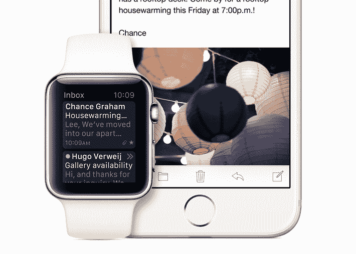

# 由于超大尺寸 6 和 6 Plus ，苹果 2015 年在 Q1 销售了 7450 万部超大尺寸 iPhones

> 原文：<https://web.archive.org/web/https://techcrunch.com/2015/01/27/apple-iphone-sales-q1-2015/>

iPhone 6 和 6 Plus 帮助苹果公司在 2015 财年第一季度[卖出了惊人的 7450 万部 iPhone。这比他们在一个季度内售出的 iPhone 都多，高于去年同期](https://web.archive.org/web/20230331192708/https://techcrunch.com/2015/01/27/apple-q1-2015/)[报道的 5100 万部 iPhone 销售记录](https://web.archive.org/web/20230331192708/https://techcrunch.com/2014/01/27/apple-q1-2014-iphone-ipad-mac/)，也高于[每华尔街分析师约 6700 万部的普遍估计](https://web.archive.org/web/20230331192708/http://fortune.com/2015/01/27/spreadsheet-of-the-day-final-estimates-for-apples-fiscal-q1/)。iPhone 的销量同比增长了 41%。苹果在本季度还售出了 2140 万台 iPads，低于去年的 2600 万台。

这个破纪录的数字不仅意义重大，因为它为苹果赢得了吹嘘的权利——这是对批评者的一个非常响亮、非常明确的回答，这些批评者声称苹果正在为其智能手机部门寻找增长机会。这也表明苹果在最近一次更新中解决显示屏尺寸问题的决定是正确的，因为更大的 iPhone 6 和 6 Plus 似乎对 iPhone 的整体增长和破纪录的季度贡献很大。

iPhone 的巨大成功部分与它在包括大中华区在内的主要增长市场销售更多设备的能力有关。分析公司科纳仕公司今天早些时候报告称，苹果在中国的智能手机出货量首次超过任何其他智能手机制造商，其领先于三星和最近的霸主小米的激增必然会转化为区域设备销售的巨大增长。很难低估苹果引领这个市场的成就，以及它的强势地位对未来增长潜力的重要性。

iPhone 销量的飙升也有一些潜在的光环效应。撇开 iPhone 购买者也经常成为 Mac 购买者不谈，苹果正在继续推广其 Apple Pay 移动支付解决方案，该解决方案旨在刺激未来的设备购买。支持 Apple Pay 功能的设备越多，零售商和商家的兴趣就越大，这反过来会提高消费者的满意度(它能在更多地方工作)等等。

苹果公司还为一个关键产品的发布做好了准备，这就是苹果手表。由于手表需要一个配套的 iOS 设备来运行应用程序和发挥全部功能，更多的 iPhones 必然意味着苹果首次推出的可穿戴设备的潜在市场更大。这款手表在苹果的主要新产品发布中是独一无二的，因此 iPhone 销量的增长正值库比蒂诺的关键时刻。

可能有助于刺激 iPhone 销量如此之高的另一个因素是美国消费设备的升级周期。根据 comScore 的消息，苹果 iPhone 用户表达了在 iPhone 6 和 6 Plus 发布前升级他们设备的强烈意愿，而一大群 iPhone 4s、4s 和 5 用户恰好在更新到来时达成协议。

iPad 的销售继续令人失望，但该产品似乎将在今年进行一些更新，包括传闻中的更大版本，可能会配有触控笔，这可能会使该设备对商务和创意小众用户更具吸引力，[取决于其功能](https://web.archive.org/web/20230331192708/https://techcrunch.com/2014/12/30/apple-stylus-patent/)。iPad 仍然代表着任何竞争对手都可能羡慕的销售业务，但基于这些结果，其长期增长潜力仍然是一个问号。

然而，毫无疑问，iPhone 的表现超出了所有人的预期。在苹果公司的财报电话会议上，首席执行官蒂姆·库克(Tim Cook)对此进行了细分:“平均而言，我们在本季度的每一天，每小时售出超过 34，000 部 iPhones，”他说。本季度还标志着第 10 亿台 iOS 设备的销售，这是一台太空灰 64GB 的 iPhone 6 Plus，苹果公司将其保留在总部留给后代。

