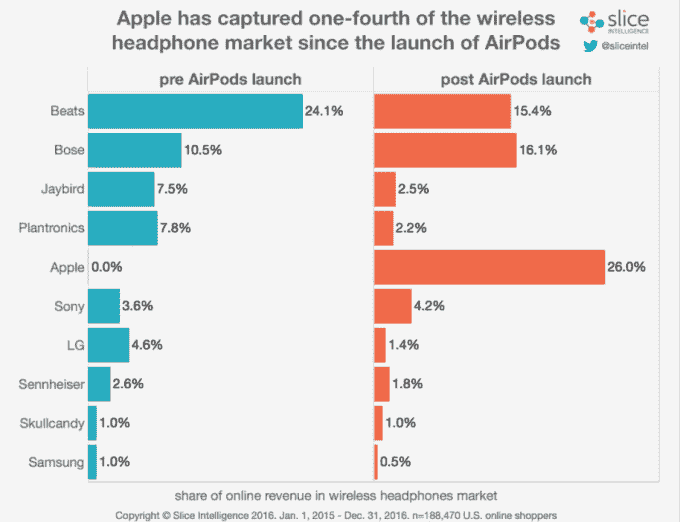

# 苹果已经凭借 ai rpods TechCrunch 赢得了无线耳机市场

> 原文：<https://web.archive.org/web/https://techcrunch.com/2017/01/11/apple-is-already-winning-the-wireless-headphones-market-with-airpods/>

# 苹果已经凭借 AirPods 赢得了无线耳机市场

尽管延迟，苹果的 AirPods 在过去几周的无线耳机在线消费的新[报告](https://web.archive.org/web/20221207144952/https://intelligence.slice.com/wireless-accounted-for-75-percent-of-headphones-sales-this-december/)显示，它度过了一个美好的假期。

Slice Intelligence 从数以亿计的匿名电子收据中收集数据，该公司的报告发现，自 12 月 13 日发布预购以来，159 美元的 AirPods 已占所有在线无线耳机收入的四分之一以上。

报告还发现，AirPods 预购发布会是今年在线耳机销售的最大一天，超过了网络星期一和黑色星期五的销售。毫无疑问，这其中的一个主要原因是，由于制造延迟导致供应不足，这款耳机在零售店的上市量非常有限。

在 AirPods 发布之前，苹果已经在无线耳机市场占据了重要地位，这要归功于该公司 Beats 耳机的各种无线型号。切片数据显示，在 2015 年和 2016 年，在线销售的无线耳机中约有 24%是 Beats 品牌的。

总的来说，耳机继续获得蓝牙连接，Slice 声称，今年假期在线购买的耳机中有近 75%是无线类型的。

在消费类硬件领域，今年的 CES 上出现了许多亮点，其中最明显的一个是无线耳塞将进入明年的明显增长期。随着越来越多的手机制造商计划放弃耳机插孔，这似乎是该行业不可避免的发展方向。AirPods 是目前可用的最完美的无线耳塞解决方案之一，实际上比大多数选择都要便宜一点，尽管它们仍然非常昂贵。

到目前为止，无线耳塞领域还没有任何来自传统音频公司的产品进入者，因此苹果的这一市场地位是否会持续取决于他们对产品类别本身的创新，因为他们寻求重新发明耳机的真正功能。