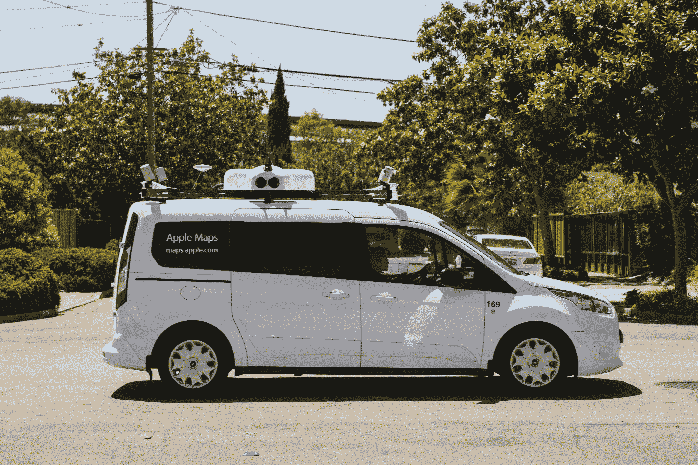
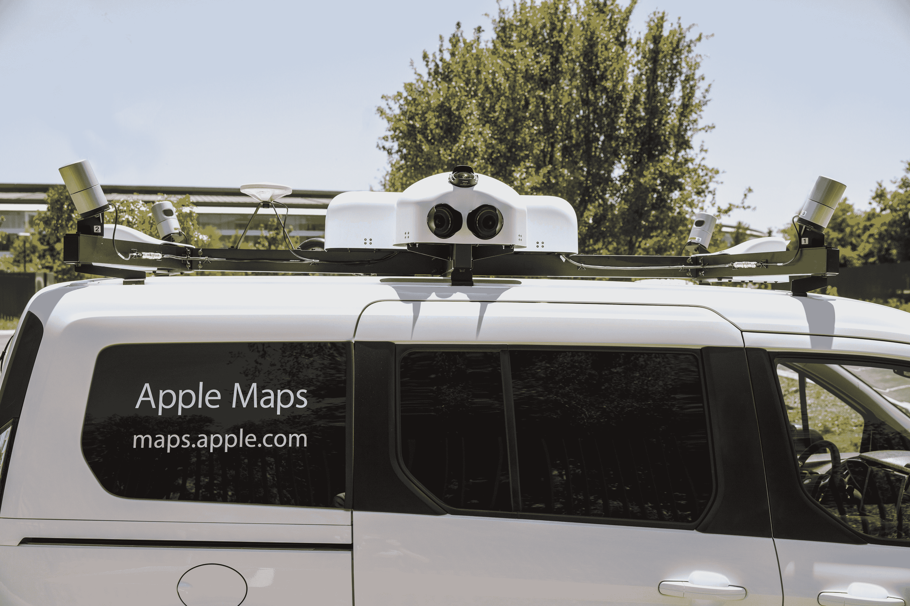
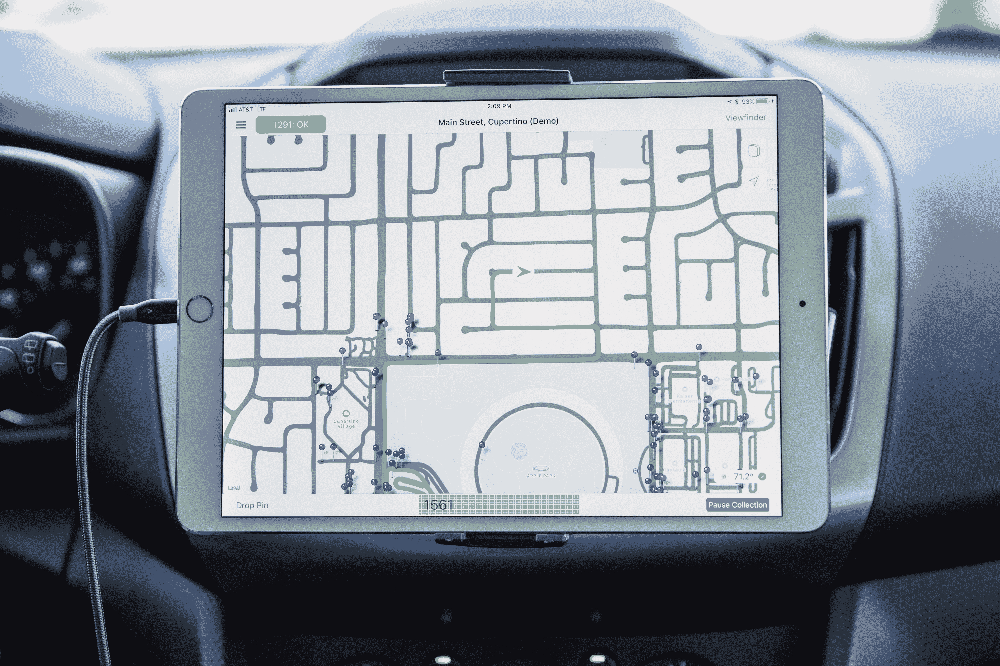
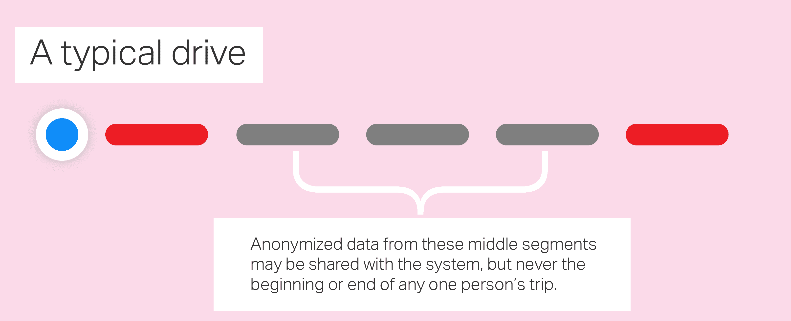
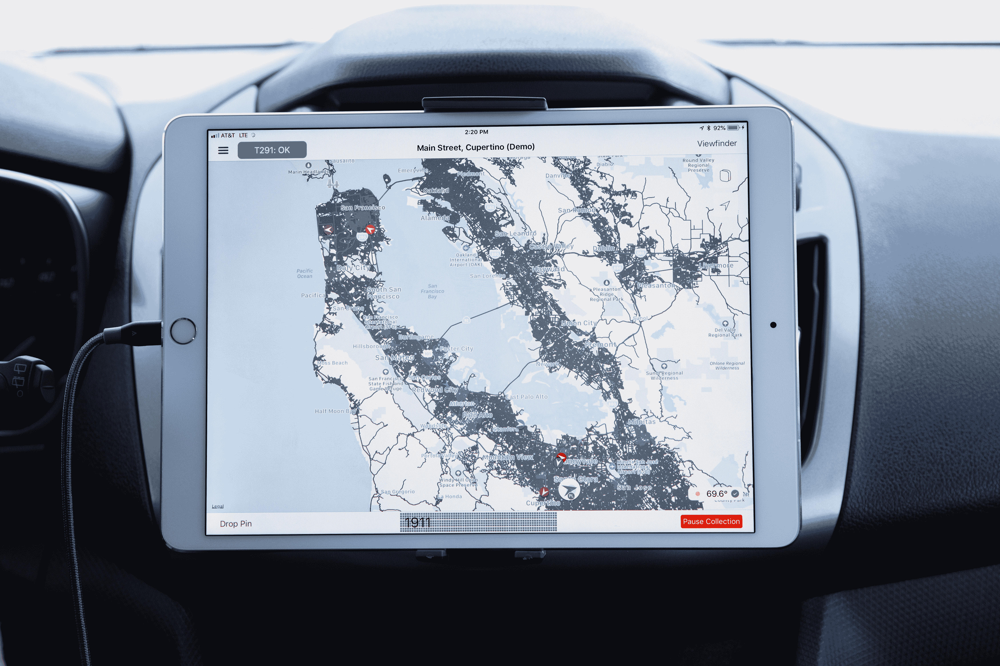
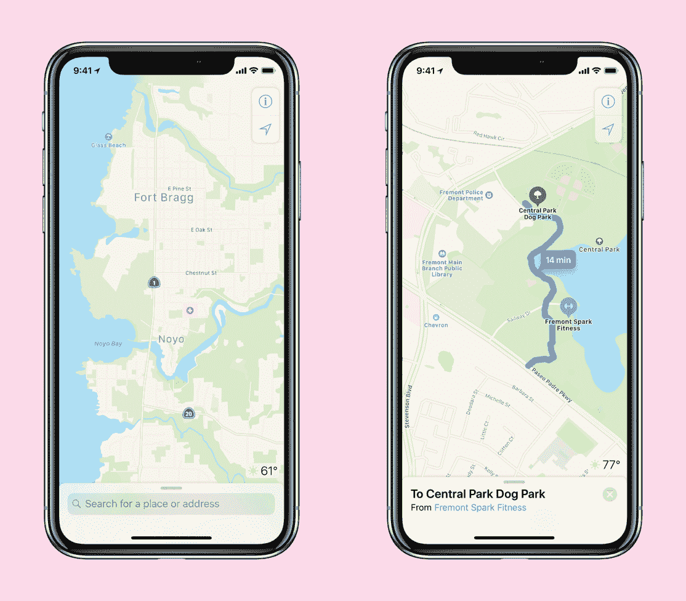

# 苹果正在从头开始重建地图

> 原文：<https://web.archive.org/web/https://techcrunch.com/2018/06/29/apple-is-rebuilding-maps-from-the-ground-up/>

我不确定你是否知道，苹果地图的发布并不顺利。在经历了[的粗暴](https://web.archive.org/web/20230407042048/https://techcrunch.com/2012/09/26/the-apple-ios-6-maps-fiasco-clarified-in-3-minutes/?_ga=2.183348326.1722593478.1530105519-1352618727.1511719279)第一[印象](https://web.archive.org/web/20230407042048/https://techcrunch.com/2012/09/20/welcome-to-apples-ios6-map-where-berlin-is-now-called-schoeneiche/)，CEO 的[道歉，几年来修补数据合作关系的漏洞，以及期待已久的](https://web.archive.org/web/20230407042048/https://techcrunch.com/2012/09/28/tim-cook-apologizes-for-apple-maps-points-to-competitive-alternatives/?_ga=2.225944922.1722593478.1530105519-1352618727.1511719279)[公交路线](https://web.archive.org/web/20230407042048/https://techcrunch.com/2015/06/08/yep-apple-maps-will-include-transit-directions-in-ios-9/)和[业务、停车和地点数据](https://web.archive.org/web/20230407042048/https://techcrunch.com/2016/08/01/apple-maps-adds-more-transit-and-parking-data-ahead-of-ios-10-redesign/)的改进之后，苹果地图仍然没有达到被认为是世界级服务的水平。

地图需要修改。

事实证明，苹果意识到了这一点，所以它正在重建地图的地图部分。

它是通过使用 iPhones 收集的第一方数据来做到这一点的，这些数据采用了隐私优先的方法，并拥有自己的车队，车上装有传感器和摄像头。新产品将在下一个 iOS 12 测试版中在旧金山和海湾地区推出，并将在秋季覆盖北加州。

每个版本的 iOS 最终都将获得更新的地图，它们将对道路和建筑的变化做出更好的响应，根据查看它们的特定环境在视觉上更加丰富，并具有更详细的地面覆盖物、树叶、水池、人行通道等。

这不亚于一套完整的地图，制作过程历时四年，也就是苹果开始开发其新的数据收集系统的时候。最终，苹果将不再依赖第三方数据为其地图提供基础，这从一开始就是其主要缺陷之一。

“自从我们六年前推出这款地图以来——我们不会重提推出时遇到的所有问题——我们已经进行了巨大的投资，以使地图达到标准，”苹果公司 SVP·艾迪·库伊在上周的一次采访中说，他现在拥有地图。  “当我们发布时，很多都是关于方向和到达某个地方。找到那个地方并得到去那个地方的方向。我们已经做了巨大的投资，进行了数百万次的改变，增加了数百万个地点，更新了地图，并更频繁地改变地图。所有这些事情都发生在过去的六年里。”

但是，库伊说，苹果有提高地图质量的空间，这是大多数用户都会同意的，即使是最近的进步。

“我们想把这个提升到一个新的水平，”库伊说。“我们一直在努力创造我们希望成为世界上最好的地图应用，并将其推向下一步。那就是从头开始建立我们自己的地图数据。”

除了 Cue 之外，本周我还在苹果位于加州的地图总部与苹果副总裁 Patrice Gautier 和十几名苹果地图团队成员谈论了苹果重建地图的努力，并以符合苹果在用户隐私方面非常公开的立场的方式进行。

如果你和我一样，想知道苹果在推出地图之前是否想过从头开始构建自己的地图，答案是肯定的。当时，它面临着是否想涉足地图业务的选择。鉴于移动设备的未来变得非常清晰，它知道地图将成为其设备几乎每个方面的核心，从照片到方向，再到为应用程序提供的位置服务。做出决定后，苹果勇往直前，依靠来自 TomTom、OpenStreetMap 和其他地理数据经纪人等合作伙伴的拼凑数据开发了一款产品。结果令人失望。

几乎在苹果推出地图后，它立即意识到它将需要帮助，并签约了一批额外的数据提供商，以填补位置、基础地图、兴趣点和商业数据方面的空白。

这还不够。

“四年前，我们决定这样做。我们说，‘我们想把地图带到哪里？“我们想在地图上做什么？”Cue 说:“我们意识到，考虑到我们想要做的事情和我们想要实现的目标，我们需要自己来做。

因为地图是如此多功能的核心，所以成功不仅仅局限于一个功能。地图需要在交通、驾驶和步行方面表现出色，但也要作为应用程序使用的定位服务和其他功能的实用工具。

库伊说，苹果需要拥有制作地图的所有数据，并从质量和隐私的角度控制这些数据。

当您与外部合作伙伴打交道时，还会有更正、更新和更改的问题，进入一个漫长的提交验证循环。地图团队必须能够在几天或更短时间内，而不是几个月内纠正道路、路径和其他更新功能。更不用说它可以从建立和更新数亿部 iPhones 的流量数据中获得潜在的竞争优势，而不是依赖合作伙伴的数据。

Cue 指出，运行 iOS 的设备激增，目前已超过 10 亿台，这是改变其流程的决定性因素。

“我们觉得，因为向设备的转变已经发生——以我们传统的方式构建地图，以我们正在做的方式构建地图——我们可以显著改善事情，并以不同的方式改善它们，”他说。“一是更加准确。二是能够根据数据和我们看到的东西更快地更新地图，而不是再次开车或从客户主动告诉我们的地方获取信息。如果我们能在所有这些事情发生之前看到它会怎么样？”

我问他地图更新的速度，以及这种新的地图理念是否意味着用户更快的变化。

“事实是，地图需要(更多地更新)，甚至今天也是如此，”库伊说。“在我们的新地图中，我们将更多地这样做，能够实时和经常地改变地图。我们今天每天都这样做。这扩展了我们，让我们可以在地图上的任何地方做这件事。今天，有些事情需要更长的时间来改变。

“例如，道路网络目前需要更长的时间来改变。在新的地图基础设施中，我们可以相对快速地改变这种情况。如果开辟了一条新的道路，我们可以立即看到这一点，并非常，非常迅速地改变它。在新的地图环境中进行更改要快得多。”

因此，一个新的努力被创造出来，开始生成自己的底图，这是任何真正好的制图系统的最基本的组成部分。在那之后，苹果将开始对生活位置数据、高分辨率卫星图像和从地面汽车收集的全新高分辨率图像数据进行分层，直到它拥有它认为是“同类最佳”的地图产品。

地球上只有一家大公司拥有完整的地图库:谷歌。

苹果知道它需要成为另一个。进入货车。

## 发现苹果货车

虽然整个项目开始得更早，但大多数人对苹果重新努力打造最好的地图产品的第一印象是 2015 年开始出现在路上的货车，侧面有“苹果地图”的标志。这些装有传感器和摄像头的货车出现在各个城市，引发了激烈的讨论和猜测。

新的苹果地图将是这些货车收集的数据首次实际用于构建和通知其地图。这是他们的出柜派对。

一些人评论说，苹果的设备看起来比其他测绘车辆上简单的 GPS +摄像头配置更强大——甚至可以说，它们看起来更像是可以用于自动驾驶汽车训练的东西。

苹果没有对自动驾驶汽车发表评论，但这种阵列看起来更先进是有原因的:它们确实如此。

本周早些时候，我乘坐其中一辆面包车，它沿着一条样本路线行驶，收集将用于构建新地图的数据。这是里面的东西。

除了屋顶上的增强型 GPS 装置、安装在角落的四个激光雷达阵列和拍摄重叠高分辨率图像的八个摄像头之外，还有连接到后轮的标准物理测量工具，可以精确跟踪距离和图像捕捉。在后方，令人惊讶的是缺少笨重的设备。相反，它是一个简单的 Mac Pro，固定在地板上，连接着一系列固态硬盘进行存储。一根 USB 电缆连接到仪表盘，实际的地图捕捉软件在 iPad 上运行。

绘制地图时，驾驶员……驾驶，而操作员负责路线，确保已分配的覆盖区域完全行驶，并监控图像捕捉。每个驱动器捕捉数千幅图像以及完整的点云(由代表表面的点定义的 3D 空间地图)和 GPS 数据。我后来查看了 3D 显示的原始数据，它看起来绝对像是你开始训练自动驾驶汽车所需的数据质量。

关于苹果为什么需要这种数据细节的更多信息。

当图像和数据被捕获后，它们会被即时加密并记录到固态硬盘上。一旦满了，固态硬盘就被取出，放回原处，装进一个盒子里，送到苹果的数据中心，在那里一套软件从图像中删除私人信息，如人脸、车牌和其他信息。从捕获到销毁，它们都是用货车上的一个密钥和数据中心的另一个密钥加密的。技术人员和软件是从那里开始的地图绘制工作的一部分，他们永远不会看到未整理的数据。

这只是苹果关注其在新地图中使用的数据隐私的一个因素。

## 探测数据和隐私

在我一天中与任何团队成员的每一次谈话中，隐私都被提出来，*被强调。*这显然是故意的，因为作为记者，苹果想让我知道它确实非常认真地对待这件事，但这并不能改变它显然是从头开始构建的事实，我在任何技术声明或我的谈话中都找不到错误的注释。

事实上，从数据安全人员到实际工作是让地图更好工作的人，不断重复的说法是，苹果*没有感觉到*因为没有尽可能地收集、存储和解析每一条客户丰富的数据而受到任何阻碍。

一致的信息是，该团队认为它可以提供高质量的导航、定位和地图产品*，而无需其他平台使用的直接个人数据。*

“我们明确地不收集数据，即使是从 A 点到 B 点，”Cue 指出。“我们收集数据——当我们这样做时——以匿名的方式，在整体的子部分中，所以我们甚至不能说有一个人从 A 点到 b 点。我们正在收集它的片段。你可以想象，这一直是做这件事的关键部分。老实说，我们不认为它能给我们带来什么(收集更多的东西)。我们这样做不会损失任何特性或功能。”

他所指的片段是从任何给定的人的导航会话中分割出来的。任何旅行的开始或结束都不会传送给苹果。发送给苹果的任何数据或请求都被分配了旋转标识符，而不是个人信息，苹果用 iPhones 发回的“探测数据”增强了自己的地图绘制工具提供的“地面真相”数据。

因为只发送任何人的随机数据片段，而且这些数据是完全匿名的，所以没有办法判断任何旅行是否是一个人的。本地系统对 ID 进行签名，只有它知道该 ID 指的是谁。苹果在这里非常努力地不去了解它的用户。这种隐私不能在最后添加，它必须在底层编织。

因为苹果的商业模式并不依赖于它为你提供服务，比如说，你路线上的雪佛龙广告，它甚至不需要将广告标识符与用户联系起来。

任何个性化或 Siri 请求都由 iOS 设备的处理器在板上处理。因此，如果你收到一个开车通知，告诉你是时候出发去上班了，这是本地学习、记忆和传递的，*而不是*来自苹果的服务器。

这并不新鲜，但考虑到这里要带走的新东西，值得注意的是:苹果正在利用数百万部 iPhones 被动和主动实时改进其地图数据的能力。

简而言之:在苹果地图中，交通、实时路况、道路系统、新建筑和人行道的变化都将变得更好。

这里的秘方是苹果所谓的探测数据。基本上，代表方向和速度的少量矢量数据传输回苹果，完全匿名，无法将其与特定用户甚至任何给定的旅行联系起来。相反，它从数百万用户那里获取少量数据，在不损害用户隐私的情况下，给它一个整体的、实时的画面。

如果你在开车、走路或骑自行车，你的 iPhone 已经可以知道这一点。现在，如果它知道你在开车，它还可以在这些匿名的信息条中发送相关的交通和路线数据，以改善整个服务。这种情况只会发生在你的地图应用已经激活的情况下，比如你查看地图、寻找方向等等。如果你经常使用 GPS 进行步行或驾驶，那么更新会更精确，并有助于步行的改善，如绘制穿过公园的新行人路径-提高地图的整体质量。

当然，所有这一切都取决于你是否选择了定位服务，并且可以使用设置的隐私部分中的地图位置切换来关闭。

苹果表示，这对电池寿命或数据使用几乎没有影响，因为当任何探测数据被共享时，你已经在使用“地图”功能，而这只是这些活动所消耗的电力的一小部分。

## 从点云向上

但是地图不能仅仅依靠地面事实和移动数据。苹果还在收集新的高分辨率卫星数据，以结合其地面真实数据，形成一个坚实的基础地图。然后在此基础上叠加卫星图像，以更好地确定树叶、路径、体育设施、建筑形状和路径。

在下游数据被清理掉车牌和人脸后，它会通过一系列计算机视觉编程来提取地址、街道标志和其他感兴趣的点。这些数据与公开可用的数据相互参照，如城市持有的地址和来自城市规划部门的社区或道路的新建筑。

但苹果公司正在向地图工具组合中添加的一个特殊的调味汁是一个完整的点云，它可以在地图车周围以 3D 方式绘制世界地图。这让他们有各种机会更好地理解什么是路牌物品(离地面约 15 英尺的反光矩形物体？可能是街道标志)或停止标志或限速标志。

它似乎还可以在 3D 空间定位导航箭头，用于 AR 导航，但苹果拒绝评论这类事情的“任何未来计划”。

苹果还使用语义分割和深度朗伯网络来分析点云，以及汽车和同步高分辨率卫星捕捉的图像数据。这允许对物体、标志、交通车道和建筑物进行 3D 识别，并将其分成可以突出显示以便于发现的类别。

来自汽车和卫星的高分辨率图像数据加上 3D 点云的结合，使得苹果现在能够制作带有纹理的城市街道的完全正交重建。这是非常高的分辨率，更容易看到，视觉上。它与来自汽车的“全景”图像、卫星视图和原始数据同步。这些技术用于自动驾驶应用，因为它们提供了汽车周围发生的事情的真正整体视图。但是，正射视图可以为数据的人类查看者做更多的事情，允许他们透过通常会遮挡道路、建筑物和地址的灌木丛或树木“看”。

当谈到苹果争夺极其精确和有用的地图的下一步时，这一点非常重要:人类编辑。

苹果有一个工具开发团队专门开发一个工具包，人类编辑可以用它来逐个街道地审查和解析数据。编辑器套件包括允许人类编辑为天桥建筑分配特定几何形状的工具(想想 Salesforce tower 独特的脊形穹顶)，这使它们能够被立即识别。它让编辑们看到汽车拍摄的街道标志的真实图像，旁边是场景的 3D 重建和相同标志的计算机视觉检测，立即识别它们是否准确。

另一个工具可以纠正地址，让编辑快速将地址移动到建筑物的中心，确定它们是否放错了位置，并将其移动。它还允许设置接入点，使苹果地图在你旅程的“最后 50 英尺”更加智能。你已经到达了大楼，但是入口实际上在哪条街上？你怎么进入车道？只需几次点击，编辑就可以让它永久可见。

“当你从这个角度看旧金山或大城市时，”库伊说，“你有地址，地址名称是某条街，但实际上，大楼的入口在另一条街上。他们这样做是因为他们想要更好的街道名称。这就是我们的新地图真正要展示的东西。我们要确保我们带你去的是正确的地方，而不是一个很近的地方。"

由于新的计算机视觉和卫星图像应用，水、游泳池(对地图来说完全是新的)、运动场和植被现在变得更加突出和丰富。所以苹果也不得不为它们开发编辑工具。

除了苹果已经拥有的数千名从事地图工作的员工之外，数百名编辑将使用这些工具，但这些工具必须首先构建，因为苹果不再依赖第三方来审查和纠正问题。

该团队还必须建立计算机视觉和机器学习工具，使其能够确定是否有问题需要发现。

来自 iPhones 的匿名探测数据被可视化后，看起来就像成千上万的点，在街道和人行道的网络上起伏，就像一个发光的彩色网络。起初，一片混乱。然后，模式出现了。一条街道开始营业，附近的血管将橙色血液注入新的动脉。一个标志被触发，一个编辑器查看一条新的道路是否需要指定一个名称。

一个新的交叉路口被添加到 web 中，一个编辑器被标记以确保左转车道正确连接方向交通的重叠图层。这有一个额外的好处，即在新的苹果地图中大大改善了车道导航。

苹果正指望这种人类和人工智能标记的结合，允许编辑首先制作底图，然后在不断变化的生物量对道路、地址和偶尔的公园造成严重破坏时维护它们。

## 这是 Helvetica

苹果的新地图，像许多其他数字地图一样，根据比例尺的不同，显示效果也大不相同。如果你缩小，你得到的细节会更少。如果你放大，你会得到更多。但苹果公司有一个制图团队，他们在更多的文化、地区和艺术层面上工作，以确保其地图可读、可识别和有用。

这些团队的目标既具体又有点与众不同——这是苹果追求技术与艺术相结合的最佳传统。

地图需要是可用的，但是它们也需要在文化层面上实现认知目标，这超出了任何给定用户可能知道他们需要的。例如，在美国，即使在中等缩放比例下，地图的细节级别也相对较低是很常见的。然而，在日本，地图在相同的缩放比例下绝对挤满了细节，因为增加的信息密度正是用户所期望的。

这是细节部。他们重建了数百个真实路标的复制品，以确保你导航屏幕上的盾牌与你在高速公路路标上看到的相符。说到公共交通，苹果许可了你在你最喜欢的地铁系统上看到的所有字体，比如 Helvetica 代表纽约。线路编号的顺序和你在站台指示牌上看到的完全一样。

这一切都是为了减少将你必须导航的物理世界转化为地图所代表的数字世界的认知负荷。

## 结果

苹果地图的新版本将于下周预览，仅加州湾区上线。它将被无缝地拼接到“当前”版本的地图中，但根据我目前所见，质量水平的差异应该是显而易见的。

更好的道路网络，更多的行人信息，棒球场和篮球场等运动区域，地图上显示的更多土地覆盖，包括草地和树木，以及更准确的建筑物、建筑物形状和大小。一张感觉更像你正在穿越的真实世界的地图。

搜索也正在改进，以确保您获得比以往更多的相关结果(在正确的大陆上)。导航，尤其是行人导航，也得到了很大的提升。停车场和建筑细节，让你最后几英尺到达你的目的地，也包括在内。

你现在看不到的是一个完整的视觉重新设计。

“你不会在地图上看到巨大的设计变化，”库伊说。“我们不想同时将这两者结合起来，因为这会造成很多混乱。”

苹果地图得到了期待已久的关注，这是它真正应得的。通过完全拥有该项目的所有权，苹果承诺从一开始就实际创建用户期望的地图。这一直是 iPhones 上挥之不去的阴影，特别是在谷歌地图等替代品提供了更强大的功能集的情况下，这些功能集很容易与原生应用程序进行比较，但不可能在深层系统级别访问。

这种说法已经令人生厌，但值得重申的是，如果苹果认为地图足够重要，应该拥有它。这就是它现在正在努力做的。

“我们认为没有人做我们正在做的这种水平的工作，”库伊补充道。“我们还没有宣布这一点。我们没有告诉任何人这件事。这是我们能够保守秘密的事情之一。没有人真正知道这件事。我们很期待它的发布。在接下来的一年里，我们将在美国一部分一部分地推广它。”