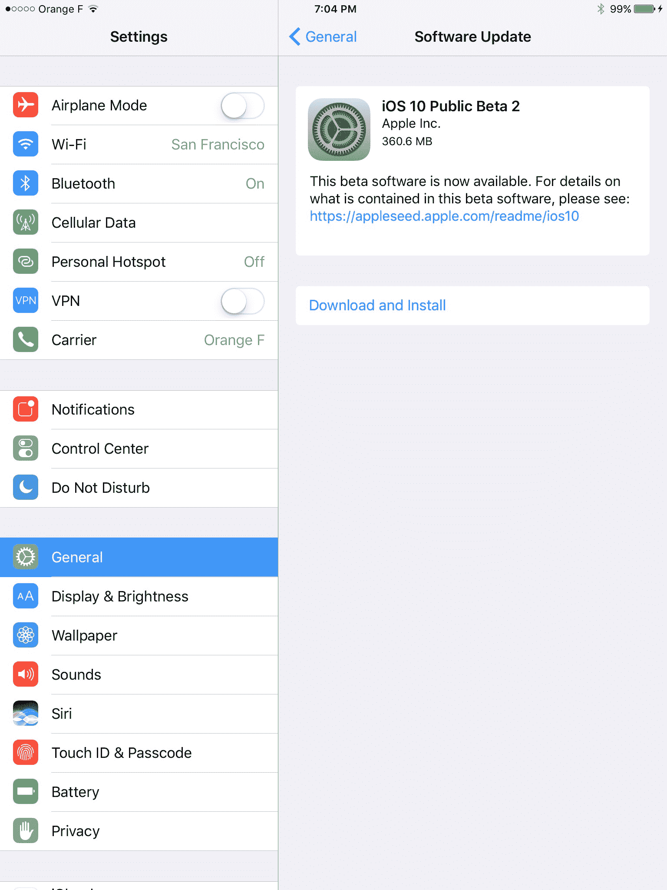

# 苹果刚刚为你们这些疯狂的测试者推出了另一个 iOS 10 公开测试版

> 原文：<https://web.archive.org/web/https://techcrunch.com/2016/07/20/apple-just-dropped-another-ios-10-public-beta-for-you-crazy-testers/>

# 苹果刚刚为你们这些疯狂的测试者推出了另一个 iOS 10 公测版

那没花多长时间。就在发布[第三个 iOS 10 开发者测试版](https://web.archive.org/web/20221025222737/https://beta.techcrunch.com/2016/07/18/apple-releases-new-betas-for-ios-macos-watchos-and-yes-even-tvos/)的一天后，iOS 10 的第二个公测版现在[可以下载](https://web.archive.org/web/20221025222737/https://beta.apple.com/)。今天还发布了 macOS Sierra 的第二个公测版。当然，你不必为一个开发者账户每年支付 99 美元。但是在这个阶段事情还很粗糙，所以我不建议你把它安装在你的主手机上。

iOS 10 到底有什么新功能？即将推出的操作系统具有大规模的 Siri 更新和第三方集成。虽然在测试期间很难看到最终结果，因为第三方开发者尚未发布 iOS 10 应用，但它可能会对你使用 iPhone 的方式产生很大影响。

苹果还推出了一个完全重新设计的锁屏，具有丰富的通知，可以显示微小的实时部件，以及一个巨大的照片应用程序更新，具有人脸识别、深度学习分类和智能相册。苹果地图、苹果音乐、HomeKit 和手机应用也在更新。最后，该公司正在用许多许多新功能彻底改造 Messages 应用程序——表情功能、消息效果、类似 Slack 的消息反馈、丰富的链接预览和第三方扩展。

然而，苹果计划在今年秋天发布 iOS 10，这通常意味着 9 月份。所以我们离最终发布还有几个月的时间。如果你迫不及待地想看看它的样子，我给[写了一个预览](https://web.archive.org/web/20221025222737/https://beta.techcrunch.com/2016/07/07/ios-10-preview/)，这样你就不用毁了你的手机。

